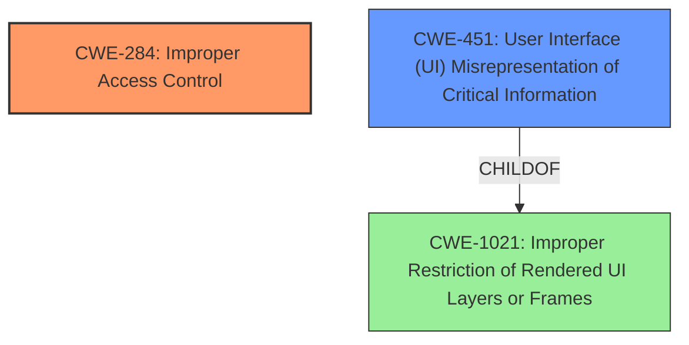

# Analysis Report for CVE-2025-4051

# Vulnerability Analysis Report: CVE-2025-4051

## Description

**Insufficient data validation** in DevTools in Google Chrome prior to 136.0.7103.59 allowed a remote attacker who convinced a user to engage in specific UI gestures to bypass discretionary access control via a crafted HTML page. (Chromium security severity Medium)

## Vulnerability Description Key Phrases

- **Rootcause:** Insufficient data validation
- **Impact:** bypass discretionary access control
- **Vector:** crafted HTML page
- **Attacker:** remote attacker
- **Product:** Google Chrome
- **Version:** prior to 136.0.7103.59
- **Component:** DevTools

## Analysis (with Relationship Data)

# Summary
| CWE ID | CWE Name | Confidence | CWE Abstraction Level | CWE Vulnerability Mapping Label | CWE-Vulnerability Mapping Notes |
|---|---|---|---|---|---|
| CWE-284 | Improper Access Control | 0.7 | Class |  | Allowed-with-Review |
| CWE-451 | User Interface (UI) Misrepresentation of Critical Information | 0.5 | Class |  | Allowed-with-Review |

## Evidence and Confidence

*   **Confidence Score:** 0.7
*   **Evidence Strength:** MEDIUM

## Relationship Analysis
The primary CWE is CWE-284, which is a Class-level CWE. CWE-451 is a peer and ChildOf to CWE-1021. The relationship analysis influenced the decision to include the UI related CWE, although the primary driver of the vulnerability seems to be access control.



## Vulnerability Chain
The chain of events is as follows:
1.  **Insufficient data validation** (Root Cause).
2.  Bypass discretionary access control (Impact).

The vulnerability chain starts with **insufficient data validation**, which leads to the bypass of discretionary access control. The description does not provide enough information to map the **insufficient data validation** to a more specific CWE.

## Summary of Analysis
The initial assessment identified **insufficient data validation** as the root cause, leading to a bypass of discretionary access control. The Retriever Results pointed to CWE-416 (Use After Free), CWE-451 (User Interface (UI) Misrepresentation of Critical Information), and others. However, based on the vulnerability description and the guidance provided, CWE-284 (Improper Access Control) is the most appropriate primary CWE. The phrase "bypass discretionary access control" points to a problem with access control in general. The **insufficient data validation** facilitates this bypass.

CWE-451 is included as a secondary CWE since the vulnerability involves UI gestures, even though the primary issue is **insufficient data validation** leading to access control bypass.

The selected CWEs are at the optimal level of specificity, given the information available. More specific CWEs related to data validation could be considered if more details were provided.

Relevant CWE Information:

# Enhanced Context (25 CWEs)
The following CWEs were identified as potentially relevant to this vulnerability:

## CWE-451: User Interface (UI) Misrepresentation of Critical Information
**Abstraction Level**: Class
**Similarity Score**: 0.79
**Source**: dense

**Description**:
The user interface (UI) does not properly represent critical information to the user, allowing the information - or its source - to be obscured or spoofed. This is often a component in phishing attacks.

**Mapping Guidance**:
- Usage: Allowed-with-Review
- Rationale: This CWE entry is a Class and might have Base-level children that would be more appropriate

## CWE-284: Improper Access Control
**Abstraction Level**: Class
**Similarity Score**: N/A
**Source**: N/A

**Description**:
The product does not adequately control access to resources or data, allowing an attacker to violate intended restrictions.

**Mapping Guidance**:
- Usage: Allowed-with-Review
- Rationale: CWE-284 is a high-level category used when access control failure exists but root cause is unclear.

## CWE-285: Improper Authorization
**Abstraction Level**: Class
**Similarity Score**: N/A
**Source**: N/A

**Description**:
The product does not perform or incorrectly performs an authorization check when an actor attempts to access a resource or perform an action.

**Mapping Guidance**:
- Usage: Discouraged
- Rationale: CWE-285 is high-level and lower-level CWEs can frequently be used instead. It is a level-1 Class (i.e., a child of a Pillar).

## CWE-862: Missing Authorization
**Abstraction Level**: Base
**Similarity Score**: N/A
**Source**: N/A

**Description**:
The application doesn't check whether the user is authorized at all.

**Mapping Guidance**:
- Usage: Allowed
- Rationale: This CWE entry is at the Base level of abstraction, which is a preferred level of abstraction for mapping to the root causes of vulnerabilities.

## CWE-863: Incorrect Authorization
**Abstraction Level**: Class
**Similarity Score**: N/A
**Source**: N/A

**Description**:
The product performs an authorization check when an actor attempts to access a resource or perform an action, but it does not correctly perform the check.

**Mapping Guidance**:
- Usage: Allowed-with-Review
- Rationale: This CWE entry is a Class and might have Base-level children that would be more appropriate

### CWE Selection Details:

*   **CWE-284 Improper Access Control:** This is the primary CWE. The vulnerability description states that the issue allows bypassing discretionary access control. This indicates a general failure in controlling access to resources. Since the root cause is **insufficient data validation**, and the impact is a bypass of access control, CWE-284 serves as a suitable high-level classification. Confidence: 0.7
*   **CWE-451 User Interface (UI) Misrepresentation of Critical Information:** The vulnerability requires a user to engage in specific UI gestures. Although the root cause isn't directly in the UI, the UI is part of the attack vector. This makes CWE-451 a reasonable secondary consideration. Confidence: 0.5

### CWEs Considered But Not Used:

*   **CWE-306, CWE-862, CWE-863, CWE-285:** These are related to authentication and authorization but are too specific for the given information. The problem is described as a bypass of "discretionary access control," which is a more general issue than just missing authentication or incorrect authorization checks.
*   **CWE-416 Use After Free, CWE-123 Write-what-where Condition, CWE-120 Buffer Copy without Checking Size:** These are memory corruption issues and don't directly relate to the **insufficient data validation** described in the vulnerability.
*   **CWE-1021 Improper Restriction of Rendered UI Layers or Frames:** This is a more specific UI-related issue, but the description mentions UI gestures being used to trigger the vulnerability, rather than problems with rendering layers or frames.
*   **CWE-134 Use of Externally-Controlled Format String:** This CWE is not applicable as there is no mention of format string vulnerabilities.
*   **CWE-366 Race Condition within a Thread:** This CWE is not applicable as there is no mention of a race condition.


## CWE Relationship Analysis

Current CWEs represent these abstraction levels: .


### Vulnerability Chain Analysis

**Chain starting from CWE-863:**
- 863 (Incorrect Authorization) - ROOT


**Chain starting from CWE-123:**
- 123 (Write-what-where Condition) - ROOT


### CWE Relationship Diagram

```mermaid
graph TD
    classDef primary fill:#f96,stroke:#333,stroke-width:2px
    classDef secondary fill:#69f,stroke:#333
    classDef tertiary fill:#9e9,stroke:#333
```


*Report generated on 2025-07-14 22:51:07*
