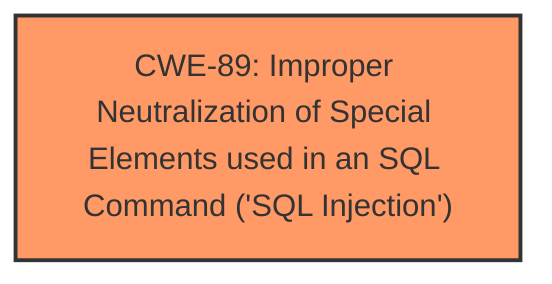

# Analysis Report for CVE-2025-4060

# Vulnerability Analysis Report: CVE-2025-4060

## Description

A vulnerability, which was classified as critical, has been found in PHPGurukul Notice Board System 1.0. This issue affects some unknown processing of the file /category.php. The manipulation of the argument catname leads to **sql injection**. The attack may be initiated remotely. The exploit has been disclosed to the public and may be used.

## Vulnerability Description Key Phrases

- **Weakness:** sql injection
- **Vector:** manipulation of the argument catname
- **Product:** PHPGurukul Notice Board System
- **Version:** 1
- **Component:** /category.php

## Analysis (with Relationship Data)

# Summary
| CWE ID  | CWE Name                                                                         | Confidence | CWE Abstraction Level | CWE Vulnerability Mapping Label | CWE-Vulnerability Mapping Notes |
| :-------- | :------------------------------------------------------------------------------- | :---------- | :---------------------- | :------------------------------ | :------------------------------ |
| CWE-89 | Improper Neutralization of Special Elements used in an SQL Command ('SQL Injection') | 1.0         | Base                    | Primary CWE                     | Allowed                       |

## Evidence and Confidence

*   **Confidence Score:** 1.0
*   **Evidence Strength:** HIGH

## Relationship Analysis

The primary relationship that influences the decision is that CWE-89 is a Base level CWE, and it accurately describes the **SQL Injection** vulnerability described. There are no parent-child or chain relationships necessary in this specific case.



## Vulnerability Chain

The vulnerability chain is straightforward: **Improper neutralization** of special elements leads directly to **SQL injection**.

## Summary of Analysis

The vulnerability description clearly states that the manipulation of the `catname` argument leads to **SQL injection** in `/category.php`. The Retriever Results confirm that CWE-89 is the most relevant CWE, with a score of 1.0. CWE-89 (Improper Neutralization of Special Elements used in an SQL Command ('SQL Injection')) directly addresses the root cause of the vulnerability. The description of CWE-89 aligns perfectly with the vulnerability description which involves constructing an SQL command using externally-influenced input without proper neutralization.

CWEs considered but not used:

*   CWE-79 (Improper Neutralization of Input During Web Page Generation ('Cross-site Scripting')): While XSS is an injection issue, the description explicitly mentions SQL injection, making CWE-79 less relevant.
*   CWE-117 (Improper Output Neutralization for Logs): This CWE is related to log injection, which is not the case here.
*   CWE-434 (Unrestricted Upload of File with Dangerous Type): This CWE is related to file uploads, and not relevant to the **SQL injection** described.
*   CWE-1336 (Improper Neutralization of Special Elements Used in a Template Engine): This CWE is for template injection.
Relevant CWE Information:


## CWE Relationship Analysis

Current CWEs represent these abstraction levels: .


### Vulnerability Chain Analysis

**Chain starting from CWE-89:**
- 89 (Improper Neutralization of Special Elements used in an SQL Command ('SQL Injection')) - ROOT


**Chain starting from CWE-79:**
- 79 (Improper Neutralization of Input During Web Page Generation ('Cross-site Scripting')) - ROOT


### CWE Relationship Diagram

```mermaid
graph TD
    classDef primary fill:#f96,stroke:#333,stroke-width:2px
    classDef secondary fill:#69f,stroke:#333
    classDef tertiary fill:#9e9,stroke:#333
```


*Report generated on 2025-07-14 22:52:25*
