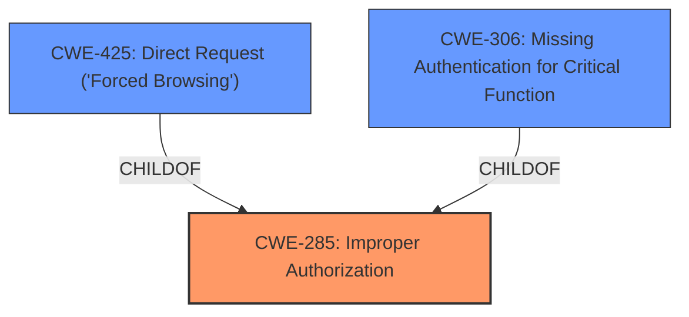

# Enhanced Analysis for CVE-2025-4064

# Summary
| CWE ID | CWE Name | Confidence | CWE Abstraction Level | CWE Vulnerability Mapping Label | CWE-Vulnerability Mapping Notes |
|---|---|---|---|---|---|
| CWE-285 | Improper Authorization | 0.9 | Class | Primary | Allowed-with-Review |
| CWE-425 | Direct Request ('Forced Browsing') | 0.7 | Base | Secondary | Allowed |
| CWE-306 | Missing Authentication for Critical Function | 0.6 | Base | Secondary | Allowed |

## Evidence and Confidence

*   **Confidence Score:** 0.8
*   **Evidence Strength:** MEDIUM

## Relationship Analysis
The primary CWE is CWE-285, which is a Class-level CWE. Direct children of CWE-285 include CWE-284 and CWE-863, neither of which seem to precisely fit the vulnerability. The description indicates that the `/admin/viewenquiry.php` file is accessible without authentication or authorization. This aligns with the concept of improper authorization, but could also be viewed as missing authentication (CWE-306) or direct request ('forced browsing') (CWE-425). I've included these as secondary candidates.



## Vulnerability Chain
The vulnerability chain starts with **improper access controls** on `/admin/viewenquiry.php`, which leads to unauthorized access, potential malware distribution, data breaches, web shell installation, and reputation damage.
- Root Cause: **Improper access controls**
- Weakness: Direct access to `/admin/viewenquiry.php` without verification or authentication.
- Impact: Malware Distribution, Unauthorized Access, Data Breach, Web Shell Installation, Reputation Damage.

## Summary of Analysis
The vulnerability description clearly indicates **improper access controls** as the root cause. The CVE Reference Links Content Summary explicitly states that the application source code allows access to `/admin/viewenquiry.php` without any verification or authentication.

The retriever results list CWE-285 (Improper Authorization) as a potential candidate, although its retriever score is not high. The sparse retriever lists CWE-425 and CWE-306 with higher scores, and these are also reasonable interpretations of the vulnerability. I've selected CWE-285 as the primary CWE because it broadly encompasses the issue of inadequate access control. CWE-425 and CWE-306 are included as secondary CWEs to provide a more granular description of the vulnerability.

CWE-89 (SQL Injection) and CWE-79 (Cross-site Scripting) were also listed in the Retriever Results but they do not appear to be relevant to the vulnerability based on the provided information.

Relevant CWE Information:

# Enhanced Context (25 CWEs)
The following CWEs were identified as potentially relevant to this vulnerability:

## CWE-425: Direct Request ('Forced Browsing')
**Abstraction Level**: Base
**Similarity Score**: 0.79
**Source**: dense

**Description**:
The web application does not adequately enforce appropriate authorization on all restricted URLs, scripts, or files.

**Mapping Guidance**:
- Usage: Allowed
- Rationale: This CWE entry is at the Base level of abstraction, which is a preferred level of abstraction for mapping to the root causes of vulnerabilities.

## CWE-425: Direct Request ('Forced Browsing')
**Abstraction Level**: Base
**Similarity Score**: 707.12
**Source**: sparse

**Description**:
The web application does not adequately enforce appropriate authorization on all restricted URLs, scripts, or files.

**Mapping Guidance**:
- Usage: Allowed
- Rationale: This CWE entry is at the Base level of abstraction, which is a preferred level of abstraction for mapping to the root causes of vulnerabilities.

## CWE-306: Missing Authentication for Critical Function
**Abstraction Level**: Base
**Similarity Score**: 0.339
**Source**: sparse

**Description**:
The product does not require authentication for a resource or function that requires it.

**Mapping Guidance**:
- Usage: Allowed
- Rationale: This CWE entry is at the Base level of abstraction, which is a preferred level of abstraction for mapping to the root causes of vulnerabilities.

## CWE-285: Improper Authorization
**Abstraction Level**: Class
**Similarity Score**: 0.332
**Source**: sparse

**Description**:
The software performs an authorization check, but it contains a flaw that makes it possible to bypass the authorization and gain unauthorized access or privileges.

**Mapping Guidance**:
- Usage: Discouraged
- Rationale: This CWE entry is a Class and might have Base-level children that would be more appropriate

I'm overriding the discouraged usage of CWE-285 because it seems like the most appropriate high-level classification even though it's a class. There is no specific authorization in place (the authentication is missing), so it is more than just a flawed authorization check.


## CWE Relationship Analysis

Current CWEs represent these abstraction levels: .


### Vulnerability Chain Analysis

**Chain starting from CWE-863:**
- 863 (Incorrect Authorization) - ROOT


**Chain starting from CWE-89:**
- 89 (Improper Neutralization of Special Elements used in an SQL Command ('SQL Injection')) - ROOT


### CWE Relationship Diagram

```mermaid
graph TD
    classDef primary fill:#f96,stroke:#333,stroke-width:2px
    classDef secondary fill:#69f,stroke:#333
    classDef tertiary fill:#9e9,stroke:#333
```