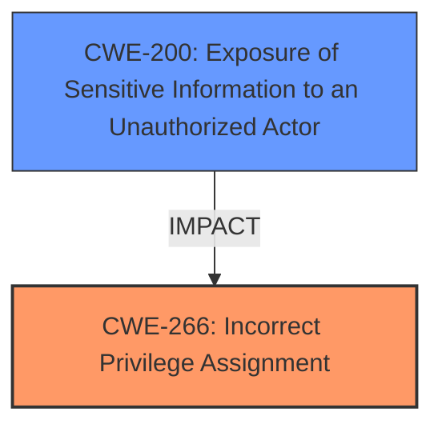

# Analysis Report for CVE-2025-4085

# Vulnerability Analysis Report: CVE-2025-4085

## Description

An attacker with control over a content process could potentially leverage the privileged UITour actor to leak sensitive information or escalate privileges. This vulnerability affects Firefox < 138 and Thunderbird < 138.

## Vulnerability Description Key Phrases

- **Product:** ['Firefox', 'Thunderbird']
- **Impact:** leak sensitive information or escalate privileges
- **Version:** < 138

## Analysis (with Relationship Data)

# Summary
| CWE ID | CWE Name | Confidence | CWE Abstraction Level | CWE Vulnerability Mapping Label | CWE-Vulnerability Mapping Notes |
|---|---|---|---|---|---|
| CWE-266 | Incorrect Privilege Assignment | 0.8 | Base | Allowed | Primary CWE |
| CWE-200 | Exposure of Sensitive Information to an Unauthorized Actor | 0.6 | Class | Discouraged | Secondary Candidate |

## Evidence and Confidence

*   **Confidence Score:** 0.7
*   **Evidence Strength:** MEDIUM

## Relationship Analysis
The primary relationship influencing the decision is the parent-child relationship between CWE-200 (Exposure of Sensitive Information to an Unauthorized Actor) and more specific CWEs. While information leakage is a potential impact, the root cause appears to be related to privilege assignment. Therefore, CWE-266 (Incorrect Privilege Assignment) is chosen as the primary weakness. CWE-200 is considered as a secondary candidate, acknowledging the potential impact, but is not the root cause.



## Vulnerability Chain
The vulnerability chain starts with an **Incorrect Privilege Assignment** (CWE-266), where an attacker gains control over a content process and can leverage a privileged actor (UITour). This leads to the **Exposure of Sensitive Information to an Unauthorized Actor** (CWE-200) or privilege escalation.

## Summary of Analysis
Based on the provided information, the root cause of the vulnerability is that an attacker can leverage a privileged UITour actor due to **incorrect privilege assignment**. The vulnerability description explicitly states "an attacker with control over a content process could potentially leverage the privileged UITour actor." This points to a problem with how privileges are assigned or managed, making CWE-266 (Incorrect Privilege Assignment) the most appropriate primary CWE. The impact of this vulnerability is that an attacker could then leak sensitive information (CWE-200) or escalate privileges.

The selection of CWE-266 is further supported by the "Privileges vs Permissions Guidance," which highlights CWE-266 as a potential mapping when a user is assigned the wrong role or group.

The evidence is based on the CVE Reference Links Content Summary that states "The root cause for CVE-2025-4085 is that an attacker with control over a content process could potentially leverage the privileged UITour actor."

CWE-200 is considered a secondary candidate because it describes the potential impact of the vulnerability. However, it is not the direct root cause.

The selected CWEs are at the optimal level of specificity, with CWE-266 being a Base-level CWE that accurately captures the root cause.

Other CWEs Considered but Not Used:

*   CWE-787 (Out-of-bounds Write): While this is a top result from the retriever, there's no evidence in the description to suggest a memory corruption issue.
*   CWE-668 (Exposure of Resource to Wrong Sphere): This is a Class-level CWE and is less specific than CWE-266. The vulnerability description clearly points to a problem with privilege assignment rather than a general exposure of resources.
*   CWE-285 (Improper Authorization): Although related, the description focuses more on leveraging an already privileged actor, suggesting an assignment problem rather than a flawed authorization check.
*   CWE-306 (Missing Authentication for Critical Function): This CWE addresses missing authentication, which is not the case here. The issue is related to the improper assignment of privileges, not the absence of authentication.


## CWE Relationship Analysis

Current CWEs represent these abstraction levels: .


### Vulnerability Chain Analysis

**Chain starting from CWE-787:**
- 787 (Out-of-bounds Write) - ROOT


**Chain starting from CWE-306:**
- 306 (Missing Authentication for Critical Function) - ROOT


### CWE Relationship Diagram

```mermaid
graph TD
    classDef primary fill:#f96,stroke:#333,stroke-width:2px
    classDef secondary fill:#69f,stroke:#333
    classDef tertiary fill:#9e9,stroke:#333
```


*Report generated on 2025-07-14 22:59:53*
