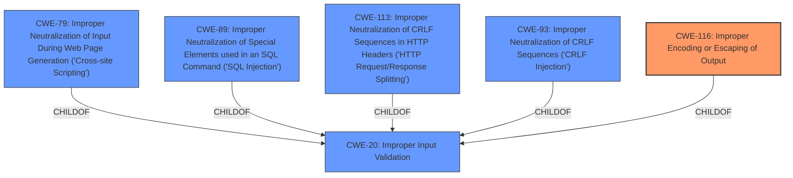

# Analysis Report for CVE-2025-4089

# Vulnerability Analysis Report: CVE-2025-4089

## Description

Due to **insufficient escaping of special characters** in the copy as cURL feature, an attacker could trick a user into using this command, potentially leading to local code execution on the users system. This vulnerability affects Firefox < 138 and Thunderbird < 138.

## Vulnerability Description Key Phrases

- **Rootcause:** insufficient escaping of special characters
- **Vector:** copy as cURL feature
- **Product:** Firefox, Thunderbird
- **Impact:** local code execution
- **Attacker:** attacker
- **Version:** < 138

## Analysis (with Relationship Data)

# Summary
| CWE ID | CWE Name | Confidence | CWE Abstraction Level | CWE Vulnerability Mapping Label | CWE-Vulnerability Mapping Notes |
|---|---|---|---|---|---|
| **CWE-116** | **Improper Encoding or Escaping of Output** | 0.8 | Class | Allowed-with-Review | **Primary CWE** |
| CWE-79 | Improper Neutralization of Input During Web Page Generation ('Cross-site Scripting') | 0.5 | Base | Allowed | Secondary Candidate |
| CWE-89 | Improper Neutralization of Special Elements used in an SQL Command ('SQL Injection') | 0.4 | Base | Allowed | Secondary Candidate |
| CWE-113 | Improper Neutralization of CRLF Sequences in HTTP Headers ('HTTP Request/Response Splitting') | 0.4 | Variant | Allowed | Secondary Candidate |
| CWE-93 | Improper Neutralization of CRLF Sequences ('CRLF Injection') | 0.4 | Base | Allowed | Secondary Candidate |

## Evidence and Confidence

*   **Confidence Score:** 0.8
*   **Evidence Strength:** HIGH

## Relationship Analysis
The primary CWE is CWE-116, which is a Class, and has Base-level children that would be more appropriate. This highlights the need to consider more specific children of CWE-116 if the evidence supports it. Other CWEs considered relate to various injection issues (SQL, CRLF, XSS), reflecting a common theme of improper neutralization. These are children of CWE-138. The graph helps visualize how different neutralization failures can lead to different types of injection vulnerabilities.



## Vulnerability Chain
The vulnerability chain starts with **insufficient escaping of special characters** (CWE-116), which allows an attacker to trick a user. This can potentially lead to local code execution on the user's system.

## Summary of Analysis
The analysis is heavily based on the provided evidence, particularly the phrases "**insufficient escaping of special characters**" and "local code execution". The retriever results also support this direction. The primary CWE is CWE-116, "Improper Encoding or Escaping of Output," because the root cause of the vulnerability is described as "**insufficient escaping of special characters**". The other CWEs are considered as secondary candidates since they represent specific types of injection vulnerabilities, which could be potential consequences of the **insufficient escaping**.
The choice of CWE-116 as the primary weakness is also influenced by the fact that the vulnerability involves the "copy as cURL" feature. The retriever results show similar CVE descriptions.

Relevant CWE Information:

# Enhanced Context (25 CWEs)

## CWE-116: Improper Encoding or Escaping of Output
**Abstraction Level**: Class
**Similarity Score**: 0.76
**Source**: dense

**Description**:
The product prepares a structured message for communication with another component, but encoding or escaping of the data is either missing or done incorrectly. As a result, the intended structure of the message is not preserved.

**Mapping Guidance**:
- Usage: Allowed-with-Review
- Rationale: This CWE entry is a Class and might have Base-level children that would be more appropriate

**Justification:**
The vulnerability description explicitly mentions "**insufficient escaping of special characters**", which directly aligns with the description of CWE-116. While the CWE is a Class, it directly reflects the root cause and a more specific Base or Variant was not evidently present in the description.

## CWE-79: Improper Neutralization of Input During Web Page Generation ('Cross-site Scripting')
**Abstraction Level**: Base
**Similarity Score**: 0.74
**Source**: dense

**Description**:
The product does not neutralize or incorrectly neutralizes user-controllable input before it is placed in output that is used as a web page that is served to other users.

**Mapping Guidance**:
- Usage: Allowed
- Rationale: This CWE entry is at the Base level of abstraction, which is a preferred level of abstraction for mapping to the root causes of vulnerabilities.

**Justification:**
This is a possible consequence if the **insufficient escaping** leads to the injection of malicious scripts into a web page. However, the vulnerability description does not explicitly mention web page generation.

## CWE-89: Improper Neutralization of Special Elements used in an SQL Command ('SQL Injection')
**Abstraction Level**: Base
**Similarity Score**: 689.33
**Source**: sparse

**Description**:
The product constructs all or part of an SQL command using externally-influenced input from an upstream component, but it does not neutralize or incorrectly neutralizes special elements that could modify the intended SQL command when it is sent to a downstream component. Without sufficient removal or quoting of SQL syntax in user-controllable inputs, the generated SQL query can cause those inputs to be interpreted as SQL instead of ordinary user data.

**Mapping Guidance**:
- Usage: Allowed
- Rationale: This CWE entry is at the Base level of abstraction, which is a preferred level of abstraction for mapping to the root causes of vulnerabilities.

**Justification:**
This could be a consequence if the **insufficient escaping** affects SQL commands. However, the description doesn't explicitly mention SQL.

## CWE-113: Improper Neutralization of CRLF Sequences in HTTP Headers ('HTTP Request/Response Splitting')
**Abstraction Level**: Variant
**Similarity Score**: 0.74
**Source**: dense

**Description**:
The product receives data from an HTTP agent/component (e.g., web server, proxy, browser, etc.), but it does not neutralize or incorrectly neutralizes CR and LF characters before the data is included in outgoing HTTP headers.

**Mapping Guidance**:
- Usage: Allowed
- Rationale: This CWE entry is at the Variant level of abstraction, which is a preferred level of abstraction for mapping to the root causes of vulnerabilities.

**Justification:**
If the **insufficient escaping** involves CR and LF characters in HTTP headers, this CWE could apply. However, it is not explicitly stated.

## CWE-93: Improper Neutralization of CRLF Sequences ('CRLF Injection')
**Abstraction Level**: Base
**Similarity Score**: 0.73
**Source**: dense

**Description**:
The product uses CRLF (carriage return line feeds) as a special element, e.g. to separate lines or records, but it does not neutralize or incorrectly neutralizes CRLF sequences from inputs.

**Mapping Guidance**:
- Usage: Allowed
- Rationale: This CWE entry is at the Base level of abstraction, which is a preferred level of abstraction for mapping to the root causes of vulnerabilities.

**Justification:**
Similar to CWE-113, if the **insufficient escaping** involves CRLF sequences, this CWE could be relevant.


## CWE Relationship Analysis

Current CWEs represent these abstraction levels: .


### Vulnerability Chain Analysis

**Chain starting from CWE-89:**
- 89 (Improper Neutralization of Special Elements used in an SQL Command ('SQL Injection')) - ROOT


**Chain starting from CWE-116:**
- 116 (Improper Encoding or Escaping of Output) - ROOT


### CWE Relationship Diagram

```mermaid
graph TD
    classDef primary fill:#f96,stroke:#333,stroke-width:2px
    classDef secondary fill:#69f,stroke:#333
    classDef tertiary fill:#9e9,stroke:#333
```


*Report generated on 2025-07-14 23:00:12*
