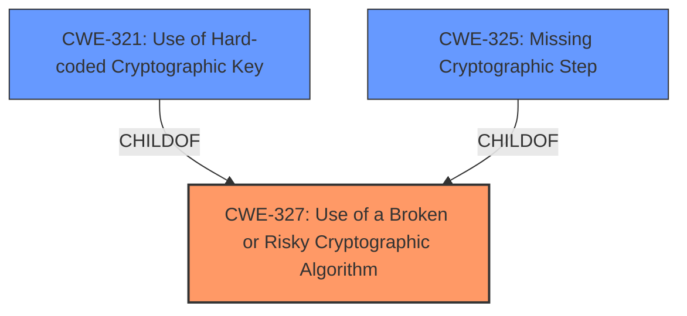

# Analysis Report for CVE-2025-41377

# Vulnerability Analysis Report: CVE-2025-41377

## Description

Cryptographic vulnerability in Iridium Certus 700. This vulnerability allows a user to retrieve the encryption key, resulting in the loading of malicious firmware.

## Vulnerability Description Key Phrases

- **Rootcause:** cryptographic vulnerability
- **Product:** Iridium Certus 700
- **Impact:** retrieve encryption key, load malicious firmware
- **Attacker:** user

## Analysis (with Relationship Data)

# Summary

| CWE ID  | CWE Name                                                      | Confidence | CWE Abstraction Level | CWE Vulnerability Mapping Label | CWE-Vulnerability Mapping Notes |
|---------|---------------------------------------------------------------|------------|-----------------------|---------------------------------|-----------------------------------|
| CWE-327 | Use of a Broken or Risky Cryptographic Algorithm            | 0.8        | Class                 | Primary CWE                      | Allowed-with-Review              |
| CWE-321 | Use of Hard-coded Cryptographic Key                         | 0.6        | Variant               | Secondary Candidate              | Allowed                          |
| CWE-325 | Missing Cryptographic Step                                    | 0.5        | Base                  | Secondary Candidate              | Allowed                          |

## Evidence and Confidence

*   **Confidence Score:** 0.7
*   **Evidence Strength:** MEDIUM

## Relationship Analysis
The primary CWE selected is CWE-327, a Class-level CWE that serves as a parent to several more specific Base and Variant level CWEs. This was chosen because the vulnerability description indicates a general cryptographic issue without specifying the exact flaw. CWE-321 and CWE-325 were considered as secondary candidates. The relationship analysis helps to narrow down potential causes while maintaining an appropriate level of abstraction based on the available evidence.



## Vulnerability Chain
The vulnerability chain begins with a **cryptographic vulnerability** (CWE-327), leading to the retrieval of the encryption key and ultimately enabling the loading of malicious firmware. The chain is as follows:

1.  **Root Cause:** CWE-327 - Use of a Broken or Risky Cryptographic Algorithm
2.  Impact: Retrieval of encryption key
3.  Impact: Loading of malicious firmware

## Summary of Analysis
The initial vulnerability description is vague, referring to a general "cryptographic vulnerability." However, the CVE Reference Links Content Summary provides more context, specifying that the vulnerability allows retrieval of the encryption key, which can then be used to load malicious firmware. Given the limited information, I've chosen CWE-327 "Use of a Broken or Risky Cryptographic Algorithm" as the primary CWE. This is a Class-level CWE and seems appropriate given the high-level description. I considered child CWEs like CWE-321 "Use of Hard-coded Cryptographic Key" and CWE-325 "Missing Cryptographic Step" as secondary candidates since hardcoded keys and missing steps can cause cryptographic vulnerabilities.

The evidence supporting CWE-327 is:
*   "**rootcause:** **cryptographic vulnerability**" from the Vulnerability Description Key Phrases.
*   "**CVE-2025-41377**: cryptographic vulnerability allowing retrieval of the encryption key, leading to potential malicious firmware loading." from the CVE Reference Links Content Summary.

The other CWEs were considered but not used as primary because the description lacks the specificity to confirm the exact nature of the cryptographic issue.

# Enhanced Context (25 CWEs)
The following CWEs were identified as potentially relevant to this vulnerability:

## CWE-321: Use of Hard-coded Cryptographic Key
**Abstraction Level**: Variant
**Similarity Score**: 0.76
**Source**: dense

**Description**:
The use of a hard-coded cryptographic key significantly increases the possibility that encrypted data may be recovered.

**Mapping Guidance**:
- Usage: Allowed
- Rationale: This CWE entry is at the Variant level of abstraction, which is a preferred level of abstraction for mapping to the root causes of vulnerabilities.


## CWE-345: Insufficient Verification of Data Authenticity
**Abstraction Level**: Class
**Similarity Score**: 0.75
**Source**: dense

**Description**:
The product does not sufficiently verify the origin or authenticity of data, in a way that causes it to accept invalid data.

**Mapping Guidance**:
- Usage: Discouraged
- Rationale: This CWE entry is a level-1 Class (i.e., a child of a Pillar). It might have lower-level children that would be more appropriate


## CWE-1391: Use of Weak Credentials
**Abstraction Level**: Class
**Similarity Score**: 0.75
**Source**: dense

**Description**:
The product uses weak credentials (such as a default key or hard-coded password) that can be calculated, derived, reused, or guessed by an attacker.

**Mapping Guidance**:
- Usage: Allowed-with-Review
- Rationale: This CWE entry is a Class and might have Base-level children that would be more appropriate


## CWE-319: Cleartext Transmission of Sensitive Information
**Abstraction Level**: Base
**Similarity Score**: 0.74
**Source**: dense

**Description**:
The product transmits sensitive or security-critical data in cleartext in a communication channel that can be sniffed by unauthorized actors.

**Mapping Guidance**:
- Usage: Allowed
- Rationale: This CWE entry is at the Base level of abstraction, which is a preferred level of abstraction for mapping to the root causes of vulnerabilities.


## CWE-330: Use of Insufficiently Random Values
**Abstraction Level**: Class
**Similarity Score**: 0.74
**Source**: dense

**Description**:
The product uses insufficiently random numbers or values in a security context that depends on unpredictable numbers.

**Mapping Guidance**:
- Usage: Discouraged
- Rationale: This CWE entry is a level-1 Class (i.e., a child of a Pillar). It might have lower-level children that would be more appropriate


## CWE-203: Observable Discrepancy
**Abstraction Level**: Base
**Similarity Score**: 0.74
**Source**: dense

**Description**:
The product behaves differently or sends different responses under different circumstances in a way that is observable to an unauthorized actor, which exposes security-relevant information about the state of the product, such as whether a particular operation was successful or not.

**Mapping Guidance**:
- Usage: Allowed
- Rationale: This CWE entry is at the Base level of abstraction, which is a preferred level of abstraction for mapping to the root causes of vulnerabilities.


## CWE-312: Cleartext Storage of Sensitive Information
**Abstraction Level**: Base
**Similarity Score**: 0.73
**Source**: dense

**Description**:
The product stores sensitive information in cleartext within a resource that might be accessible to another control sphere.

**Mapping Guidance**:
- Usage: Allowed
- Rationale: This CWE entry is at the Base level of abstraction, which is a preferred level of abstraction for mapping to the root causes of vulnerabilities.


## CWE-311: Missing Encryption of Sensitive Data
**Abstraction Level**: Class
**Similarity Score**: 0.73
**Source**: dense

**Description**:
The product does not encrypt sensitive or critical information before storage or transmission.

**Mapping Guidance**:
- Usage: Discouraged
- Rationale: CWE-311 is high-level with more precise children available. It is a level-1 Class (i.e., a child of a Pillar).


## CWE-325: Missing Cryptographic Step
**Abstraction Level**: Base
**Similarity Score**: 0.73
**Source**: dense

**Description**:
The product does not implement a required step in a cryptographic algorithm, resulting in weaker encryption than advertised by the algorithm.

**Mapping Guidance**:
- Usage: Allowed
- Rationale: This CWE entry is at the Base level of abstraction, which is a preferred level of abstraction for mapping to the root causes of vulnerabilities.


## CWE-798: Use of Hard-coded Credentials
**Abstraction Level**: Base
**Similarity Score**: 0.73
**Source**: dense

**Description**:
The product contains hard-coded credentials, such as a password or cryptographic key.

**Mapping Guidance**:
- Usage: Allowed
- Rationale: This CWE entry is at the Base level of abstraction, which is a preferred level of abstraction for mapping to the root causes of vulnerabilities.


## CWE-327: Use of a Broken or Risky Cryptographic Algorithm
**Abstraction Level**: Class
**Similarity Score**: 783.37
**Source**: sparse

**Description**:
The product uses a broken or risky cryptographic algorithm or protocol.

**Mapping Guidance**:
- Usage: Allowed-with-Review
- Rationale: This CWE entry is a Class and might have Base-level children that would be more appropriate


## CWE-321: Use of Hard-coded Cryptographic Key
**Abstraction Level**: Variant
**Similarity Score**: 754.74
**Source**:


## CWE Relationship Analysis

Current CWEs represent these abstraction levels: .


### Vulnerability Chain Analysis

**Chain starting from CWE-321:**
- 321 (Use of Hard-coded Cryptographic Key) - ROOT


**Chain starting from CWE-203:**
- 203 (Observable Discrepancy) - ROOT


### CWE Relationship Diagram

```mermaid
graph TD
    classDef primary fill:#f96,stroke:#333,stroke-width:2px
    classDef secondary fill:#69f,stroke:#333
    classDef tertiary fill:#9e9,stroke:#333
```


*Report generated on 2025-07-14 23:11:33*
