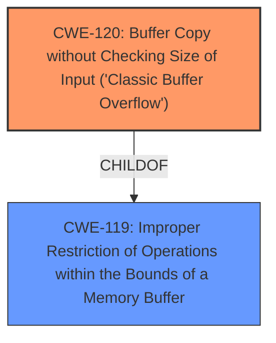

# Enhanced Analysis for CVE-2025-4146

# Summary
| CWE ID | CWE Name | Confidence | CWE Abstraction Level | CWE Vulnerability Mapping Label | CWE-Vulnerability Mapping Notes |
|---|---|---|---|---|---|
| CWE-120 | Buffer Copy without Checking Size of Input ('Classic Buffer Overflow') | 0.9 | Base | Primary | Allowed-with-Review |
| CWE-119 | Improper Restriction of Operations within the Bounds of a Memory Buffer | 0.7 | Class | Secondary | Discouraged |

## Evidence and Confidence

*   **Confidence Score:** 0.9
*   **Evidence Strength:** HIGH

## Relationship Analysis
The primary relationship is that CWE-120 is a more specific type of CWE-119. CWE-120 directly describes the **buffer overflow** due to copying without checking size. CWE-119 is a more general case of improper restriction of operations within memory bounds.



## Vulnerability Chain
The vulnerability chain starts with **buffer overflow** due to the **missing size check** when copying data into the 'host' argument of the 'sub_41940' function, leading to a potential crash or arbitrary code execution.

## Summary of Analysis
The vulnerability description clearly states that a **buffer overflow** occurs when manipulating the `host` argument of the `sub_41940` function in Netgear EX6200. This is a classic case of copying data into a buffer without proper bounds checking.

CWE-120 "Buffer Copy without Checking Size of Input ('Classic Buffer Overflow')" is the most appropriate primary CWE because it directly addresses the root cause: a buffer copy operation that lacks input size validation, resulting in a **buffer overflow**. The description for CWE-120 states, "This CWE entry is only appropriate for 'Buffer Copy' operations (not buffer reads), in which where there is no 'Checking [the] Size of Input', and (by implication of the copy) writing past the end of the buffer." This perfectly matches the vulnerability description.

CWE-119 "Improper Restriction of Operations within the Bounds of a Memory Buffer" is a broader category that encompasses various memory safety issues, including buffer overflows. While applicable, it's less specific than CWE-120. The mapping guidance for CWE-119 discourages its use when more specific CWEs are available.

Other CWEs considered but not selected:

*   CWE-121 "Stack-based Buffer Overflow" and CWE-122 "Heap-based Buffer Overflow": The description doesn't specify whether the buffer is on the stack or heap, so these are too specific to be the primary CWE.
*   CWE-190 "Integer Overflow or Wraparound": This is related to integer handling, not buffer overflows directly.
*   CWE-77 "Improper Neutralization of Special Elements used in a Command ('Command Injection')" and CWE-78 "Improper Neutralization of Special Elements used in an OS Command ('OS Command Injection')": These are related to command injection, not buffer overflows.
*   CWE-89 "Improper Neutralization of Special Elements used in an SQL Command ('SQL Injection')": This is related to SQL injection, not buffer overflows.

Relevant CWE Information:

# Enhanced Context (25 CWEs)
The following CWEs were identified as potentially relevant to this vulnerability:

## CWE-134: Use of Externally-Controlled Format String
**Abstraction Level**: Base
**Similarity Score**: 0.72
**Source**: dense

**Description**:
The product uses a function that accepts a format string as an argument, but the format string originates from an external source.

**Mapping Guidance**:
- Usage: Allowed
- Rationale: This CWE entry is at the Base level of abstraction, which is a preferred level of abstraction for mapping to the root causes of vulnerabilities.

*This CWE is not a match because the vulnerability is a **buffer overflow**, not a format string issue.*

## CWE-497: Exposure of Sensitive System Information to an Unauthorized Control Sphere
**Abstraction Level**: Base
**Similarity Score**: 0.71
**Source**: dense

**Description**:
The product does not properly prevent sensitive system-level information from being accessed by unauthorized actors who do not have the same level of access to the underlying system as the product does.

**Mapping Guidance**:
- Usage: Allowed
- Rationale: This CWE entry is at the Base level of abstraction, which is a preferred level of abstraction for mapping to the root causes of vulnerabilities.

*This CWE is not a match because the vulnerability is a **buffer overflow**, not information exposure.*

## CWE-121: Stack-based Buffer Overflow
**Abstraction Level**: Variant
**Similarity Score**: 0.71
**Source**: dense

**Description**:
A stack-based buffer overflow condition is a condition where the buffer being overwritten is allocated on the stack (i.e., is a local variable or, rarely, a parameter to a function).

**Mapping Guidance**:
- Usage: Allowed
- Rationale: This CWE entry is at the Variant level of abstraction, which is a preferred level of abstraction for mapping to the root causes of vulnerabilities.

*This CWE is not a match because the vulnerability description does not indicate stack allocation, and we can select a more general CWE without this qualifier.*

## CWE-77: Improper Neutralization of Special Elements used in a Command ('Command Injection')
**Abstraction Level**: Class
**Similarity Score**: 0.71
**Source**: dense

**Description**:
The product constructs all or part of a command using externally-influenced input from an upstream component, but it does not neutralize or incorrectly neutralizes special elements that could modify the intended command when it is sent to a downstream component.

**Mapping Guidance**:
- Usage: Allowed-with-Review
- Rationale: CWE-77 is often misused when OS command injection (CWE-78) was intended instead [REF-1287].

*This CWE is not a match because the vulnerability is a **buffer overflow**, not command injection.*

## CWE-755: Improper Handling of Exceptional Conditions
**Abstraction Level**: Class
**Similarity Score**: 0.70
**Source**: dense

**Description**:
The product does not handle or incorrectly handles an exceptional condition.

**Mapping Guidance**:
- Usage: Discouraged
- Rationale: This CWE entry is a level-1 Class (i.e., a child of a Pillar). It might have lower-level children that would be more appropriate

*This CWE is too generic.*

## CWE-790: Improper Filtering of Special Elements
**Abstraction Level**: Class
**Similarity Score**: 0.70
**Source**: dense

**Description**:
The product receives data from an upstream component, but does not filter or incorrectly filters special elements before sending it to a downstream component.

**Mapping Guidance**:
- Usage: Allowed-with-Review
- Rationale: This CWE entry is a Class and might have Base-level children that would be more appropriate

*This CWE is not a match because the vulnerability is a **buffer overflow**, not a filtering issue.*

## CWE-131: Incorrect Calculation of Buffer Size
**Abstraction Level**: Base
**Similarity Score**: 0.70
**Source**: dense

**Description**:
The product does not correctly calculate the size to be used when allocating a buffer, which could lead to a buffer overflow.

**Mapping Guidance**:
- Usage: Allowed
- Rationale: This CWE entry is at the Base level of abstraction, which is a preferred level of abstraction for mapping to the root causes of vulnerabilities.

*This is a related CWE, but CWE-120 is a better fit because it directly describes the **buffer overflow** due to missing size check during the copy operation.*

## CWE-74: Improper Neutralization of Special Elements in Output Used by a Downstream Component ('Injection')
**Abstraction Level**: Class
**Similarity Score**: 0.70
**Source**: dense

**Description**:
The product constructs all or part of a command, data structure, or record using externally-influenced input from an upstream component, but it does not neutralize or incorrectly neutralizes special elements that could modify how it is parsed or interpreted when it is sent to a downstream component.

**Mapping Guidance**:
- Usage: Discouraged
- Rationale: CWE-74 is high-level and often misused when lower-level weaknesses are more appropriate.

*This CWE is not a match because the vulnerability is a **buffer overflow**, not a general injection issue.*

## CWE-78: Improper Neutralization of Special Elements used in an OS Command ('OS Command Injection')
**Abstraction Level**: Base
**Similarity Score**: 0.70
**Source**: dense

**Description**:
The product constructs all or part of an OS command using externally-


## CWE Relationship Analysis

Current CWEs represent these abstraction levels: .


### Vulnerability Chain Analysis

**Chain starting from CWE-89:**
- 89 (Improper Neutralization of Special Elements used in an SQL Command ('SQL Injection')) - ROOT


**Chain starting from CWE-121:**
- 121 (Stack-based Buffer Overflow) - ROOT


### CWE Relationship Diagram

```mermaid
graph TD
    classDef primary fill:#f96,stroke:#333,stroke-width:2px
    classDef secondary fill:#69f,stroke:#333
    classDef tertiary fill:#9e9,stroke:#333
```