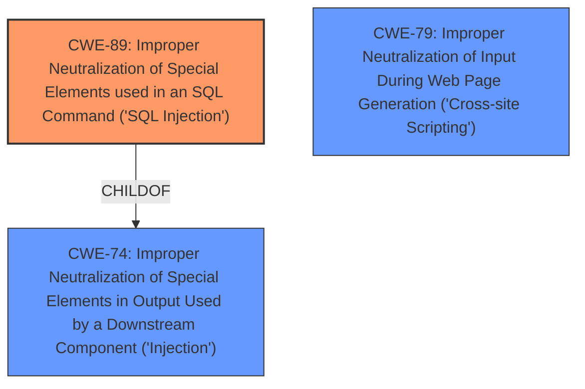

# Raw Analyzer Response for CVE-2025-4151

# Summary
| CWE ID | CWE Name | Confidence | CWE Abstraction Level | CWE Vulnerability Mapping Label | CWE-Vulnerability Mapping Notes |
|---|---|---|---|---|---|
| CWE-89 | Improper Neutralization of Special Elements used in an SQL Command ('SQL Injection') | 1.0 | Base | Allowed | Primary CWE: The **root cause** is the **improper neutralization** of special elements in an SQL command. |

## Evidence and Confidence

*   **Confidence Score:** 1.0
*   **Evidence Strength:** HIGH

## Relationship Analysis
The primary relationship that influenced the decision was the direct match of the vulnerability description to the CWE-89 description. While other CWEs like CWE-79 (Cross-Site Scripting) and CWE-74 (Injection) were considered, CWE-89 directly addresses the **SQL injection** vulnerability described.

## Vulnerability Chain
The vulnerability chain is straightforward:
1.  **Root Cause:** **Improper neutralization** of special elements in SQL command (CWE-89) due to the **manipulation of the argument fromdate**.
2.  **Impact:** Unauthorized database access, sensitive data leakage, data tampering, comprehensive system control, and even service interruption.

## Summary of Analysis
The primary CWE identified is CWE-89 (Improper Neutralization of Special Elements used in an SQL Command ('SQL Injection')). This assessment is based on the clear evidence provided in the vulnerability description and the CVE reference links content summary.

The vulnerability description explicitly states "**sql injection**" as the weakness and highlights the manipulation of the `fromdate` argument as the attack vector. The CVE reference links content summary confirms that the root cause is due to attackers injecting malicious code from the `fromdate` parameter directly into SQL queries without proper cleaning or validation.

The retriever results also strongly support CWE-89 as the most relevant CWE, with a score of 1.0. The mapping guidance for CWE-89 allows its usage, and it is at the Base level of abstraction, which is preferred.

Other CWEs considered:

*   CWE-79 (Improper Neutralization of Input During Web Page Generation ('Cross-site Scripting')): While input neutralization is a factor, the specific vulnerability is **SQL injection**, not cross-site scripting.
*   CWE-74 (Improper Neutralization of Special Elements in Output Used by a Downstream Component ('Injection')): This is a more general CWE. CWE-89 is a specific type of injection and is therefore more appropriate. The usage is discouraged as well.
*   CWE-434 (Unrestricted Upload of File with Dangerous Type): Irrelevant as the vulnerability is not related to file uploads.

The selected CWE is at the optimal level of specificity because it precisely describes the **SQL injection** vulnerability arising from **improper neutralization** within SQL commands.