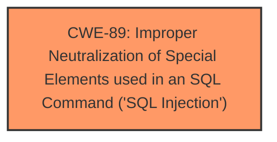

# Analysis for CVE-2025-4155

# Summary
| CWE ID | CWE Name | Confidence | CWE Abstraction Level | CWE Vulnerability Mapping Label | CWE-Vulnerability Mapping Notes |
|---|---|---|---|---|---|
| CWE-89 | Improper Neutralization of Special Elements used in an SQL Command ('SQL Injection') | 1.0 | Base | Primary | Allowed |

## Evidence and Confidence

*   **Confidence Score:** 1.0
*   **Evidence Strength:** HIGH

## Relationship Analysis
The primary relationship that influences the classification is the direct match of the vulnerability description to the definition of CWE-89. The other CWEs considered have less direct relationships. No parent-child or chain relationships are relevant in this case, as the description clearly points to a SQL Injection vulnerability.

## Vulnerability Chain
The vulnerability chain is simple:
1.  **Root Cause:** **Improper neutralization** of input leading to **SQL injection** (CWE-89).
2.  **Impact:** Unauthorized database access, data leakage, data tampering, system control, and service disruption.

## Summary of Analysis
The primary CWE selected is CWE-89, which directly matches the vulnerability description of **SQL injection** in the PHPGurukul Boat Booking System 1.0. The description explicitly states that the manipulation of the "bid" argument leads to **SQL injection**, and the provided CVE reference links confirm this with payload examples and root cause analysis. The evidence is strong, and the confidence level is high.

The selection is based on the explicit mention of "SQL injection" and supporting evidence from the CVE reference.

Relevant CWE Information:

# Enhanced Context (25 CWEs)
The following CWEs were identified as potentially relevant to this vulnerability:

## CWE-89: Improper Neutralization of Special Elements used in an SQL Command ('SQL Injection')
**Abstraction Level**: Base
**Similarity Score**: 0.78
**Source**: dense

**Description**:
The product constructs all or part of an SQL command using externally-influenced input from an upstream component, but it does not neutralize or incorrectly neutralizes special elements that could modify the intended SQL command when it is sent to a downstream component. Without sufficient removal or quoting of SQL syntax in user-controllable inputs, the generated SQL query can cause those inputs to be interpreted as SQL instead of ordinary user data.

**Mapping Guidance**:
- Usage: Allowed
- Rationale: This CWE entry is at the Base level of abstraction, which is a preferred level of abstraction for mapping to the root causes of vulnerabilities.

## CWE-89: Improper Neutralization of Special Elements used in an SQL Command ('SQL Injection')
**Abstraction Level**: Base
**Similarity Score**: 801.65
**Source**: sparse

**Description**:
The product constructs all or part of an SQL command using externally-influenced input from an upstream component, but it does not neutralize or incorrectly neutralizes special elements that could modify the intended SQL command when it is sent to a downstream component. Without sufficient removal or quoting of SQL syntax in user-controllable inputs, the generated SQL query can cause those inputs to be interpreted as SQL instead of ordinary user data.

**Mapping Guidance**:
- Usage: Allowed
- Rationale: This CWE entry is at the Base level of abstraction, which is a preferred level of abstraction for mapping to the root causes of vulnerabilities.

**CWE Selection Justification:**

CWE-89 is the most appropriate because the vulnerability description explicitly mentions **SQL injection**, and the CVE reference confirms this with details of the **root cause** being insufficient validation of the "bid" parameter. The provided payloads are SQL injection exploits. This CWE directly addresses the **improper neutralization** of special elements used in an SQL command. The confidence is high (1.0) due to the clear and direct evidence.

Other CWEs Considered but Not Used:

*   CWE-79 (Improper Neutralization of Input During Web Page Generation ('Cross-site Scripting')): While input is involved, the vulnerability is specifically related to SQL commands, not web page generation.
*   CWE-434 (Unrestricted Upload of File with Dangerous Type): This CWE is irrelevant as the vulnerability does not involve file uploads.
*   CWE-1336 (Improper Neutralization of Special Elements Used in a Template Engine): This is not related to template engines but rather direct SQL command construction.
*   CWE-425 (Direct Request ('Forced Browsing')): While access control might be a factor, the primary weakness is SQL injection.
*   CWE-74 (Improper Neutralization of Special Elements in Output Used by a Downstream Component ('Injection')): This is too general; CWE-89 is more specific and accurate.