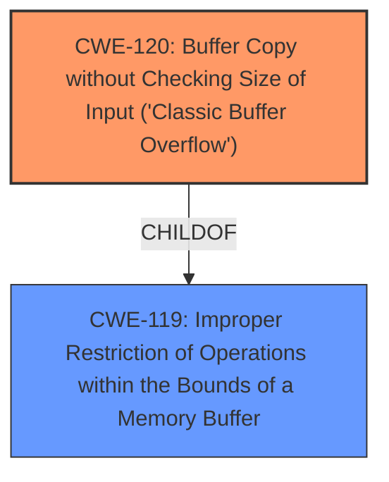

# Analysis for CVE-2025-4162

# Summary

| CWE ID  | CWE Name  | Confidence | CWE Abstraction Level | CWE Vulnerability Mapping Label | CWE-Vulnerability Mapping Notes |
|--------------|--------------------------------------------------------------------------------------------------------------------|------------|-----------------------|-----------------------------------|------------------------------------|
| CWE-120  | Buffer Copy without Checking Size of Input ('Classic Buffer Overflow') | 0.95  | Base  | Primary CWE  | Allowed-with-Review |
| CWE-119  | Improper Restriction of Operations within the Bounds of a Memory Buffer | 0.75  | Class  | Secondary Candidate  | Discouraged |

## Evidence and Confidence

*   **Confidence Score:** 0.90
*   **Evidence Strength:** HIGH

## Relationship Analysis

The primary relationship identified is that CWE-120 is a more specific type of CWE-119. CWE-120 focuses on buffer copies without size checking, directly leading to a buffer overflow. CWE-119 is a broader class that encompasses any improper restriction of operations within a memory buffer. The vulnerability description and reference material specifically mention the absence of input size validation during a buffer copy operation, making CWE-120 a more precise classification.

## Vulnerability Chain

The vulnerability chain starts with **Buffer Overflow** due to copying a buffer without checking its size.
- CWE-120: Buffer Copy without Checking Size of Input ('Classic Buffer Overflow') - Root cause: Lack of input size validation during buffer copy.

The overflow then leads to:
- Memory corruption and potential for arbitrary code execution.

## Summary of Analysis

The initial analysis focused on identifying the root cause of the vulnerability. The vulnerability description and the CVE reference link content summary clearly point to a **buffer overflow** in the ASCII Command Handler of PCMan FTP Server. The key aspect is that the `ASCII` command doesn't properly validate the size of the input, leading to memory corruption.

CWE-120, "Buffer Copy without Checking Size of Input ('Classic Buffer Overflow')", is the most appropriate primary CWE because it precisely describes the **weakness**: a buffer copy operation without proper size validation, leading to an overflow. This aligns with the provided description and the detailed exploit information in the CVE reference link content summary.

CWE-119, "Improper Restriction of Operations within the Bounds of a Memory Buffer", was also considered because it is a more general class encompassing buffer overflows. However, because the evidence specifically highlights the lack of size checking during a buffer copy, CWE-120 is a more accurate and specific classification.

The relationships between CWEs influenced the decision. CWE-120 is a child of CWE-119, indicating that it's a more specific instance of the broader class. Given the available evidence, selecting the more specific CWE-120 is justified.

The mapping guidance for CWE-120 suggests "Allowed-with-Review" due to potential misuse of the term "buffer overflow". However, the detailed exploit information confirms that the vulnerability is indeed a classic buffer overflow caused by unchecked input size during a copy operation.

The final selection of CWE-120 is at the optimal level of specificity because it directly addresses the root cause of the vulnerability: the lack of input size validation during a buffer copy operation. This is based on the explicit evidence from the vulnerability description and the supporting details in the CVE reference link content summary.

Relevant CWE Information:

# Enhanced Context (25 CWEs)

## CWE-434: Unrestricted Upload of File with Dangerous Type
**Abstraction Level**: Base
**Similarity Score**: 0.73
**Source**: dense

**Description**:
The product allows the upload or transfer of dangerous file types that are automatically processed within its environment.

**Mapping Guidance**:
- Usage: Allowed
- Rationale: This CWE entry is at the Base level of abstraction, which is a preferred level of abstraction for mapping to the root causes of vulnerabilities.

## CWE-134: Use of Externally-Controlled Format String
**Abstraction Level**: Base
**Similarity Score**: 0.73
**Source**: dense

**Description**:
The product uses a function that accepts a format string as an argument, but the format string originates from an external source.

**Mapping Guidance**:
- Usage: Allowed
- Rationale: This CWE entry is at the Base level of abstraction, which is a preferred level of abstraction for mapping to the root causes of vulnerabilities.

## CWE-193: Off-by-one Error
**Abstraction Level**: Base
**Similarity Score**: 0.72
**Source**: dense

**Description**:
A product calculates or uses an incorrect maximum or minimum value that is 1 more, or 1 less, than the correct value.

**Mapping Guidance**:
- Usage: Allowed
- Rationale: This CWE entry is at the Base level of abstraction, which is a preferred level of abstraction for mapping to the root causes of vulnerabilities.

## CWE-131: Incorrect Calculation of Buffer Size
**Abstraction Level**: Base
**Similarity Score**: 0.72
**Source**: dense

**Description**:
The product does not correctly calculate the size to be used when allocating a buffer, which could lead to a buffer overflow.

**Mapping Guidance**:
- Usage: Allowed
- Rationale: This CWE entry is at the Base level of abstraction, which is a preferred level of abstraction for mapping to the root causes of vulnerabilities.

## CWE-125: Out-of-bounds Read
**Abstraction Level**: Base
**Similarity Score**: 0.71
**Source**: dense

**Description**:
The product reads data past the end, or before the beginning, of the intended buffer.

**Mapping Guidance**:
- Usage: Allowed
- Rationale: This CWE entry is at the Base level of abstraction, which is a preferred level of abstraction for mapping to the root causes of vulnerabilities.

## CWE-425: Direct Request ('Forced Browsing')
**Abstraction Level**: Base
**Similarity Score**: 0.71
**Source**: dense

**Description**:
The web application does not adequately enforce appropriate authorization on all restricted URLs, scripts, or files.

**Mapping Guidance**:
- Usage: Allowed
- Rationale: This CWE entry is at the Base level of abstraction, which is a preferred level of abstraction for mapping to the root causes of vulnerabilities.

## CWE-121: Stack-based Buffer Overflow
**Abstraction Level**: Variant
**Similarity Score**: 0.71
**Source**: dense

**Description**:
A stack-based buffer overflow condition is a condition where the buffer being overwritten is allocated on the stack (i.e., is a local variable or, rarely, a parameter to a function).

**Mapping Guidance**:
- Usage: Allowed
- Rationale: This CWE entry is at the Variant level of abstraction, which is a preferred level of abstraction for mapping to the root causes of vulnerabilities.

## CWE-119: Improper Restriction of Operations within the Bounds of a Memory Buffer
**Abstraction Level**: Class
**Similarity Score**: 0.71
**Source**: dense

**Description**:
The product performs operations on a memory buffer, but it reads from or writes to a memory location outside the buffer's intended boundary. This may result in read or write operations on unexpected memory locations that could be linked to other variables, data structures, or internal program data.

**Mapping Guidance**:
- Usage: Discouraged
- Rationale: CWE-119 is commonly misused in low-information vulnerability reports when lower-level CWEs could be used instead, or when more details about the vulnerability are available.

## CWE-191: Integer Underflow (Wrap or Wraparound)
**Abstraction Level**: Base
**Similarity Score**: 0.71
**Source**: dense

**Description**:
The product subtracts one value from another, such that the result is less than the minimum allowable integer value, which produces a value that is not equal to the correct result.

**Mapping Guidance**:
- Usage: Allowed
- Rationale: This CWE entry is at the Base level of abstraction, which is a preferred level of abstraction for mapping to the root causes of vulnerabilities.

## CWE-824: Access of Uninitialized Pointer
**Abstraction Level**: Base
**Similarity Score**: 0.71
**Source**: dense

**Description**:
The product accesses or uses a pointer that has not been initialized.

**Mapping Guidance**:
- Usage: Allowed
- Rationale: This CWE entry is at the Base level of abstraction, which is a preferred level of abstraction for mapping to the root causes of vulnerabilities.

## CWE-190: Integer Overflow or Wraparound
**Abstraction Level**: Base
**Similarity Score**: 955.62
**Source**: sparse

**Description**:
The product performs a calculation that can
produce an integer overflow