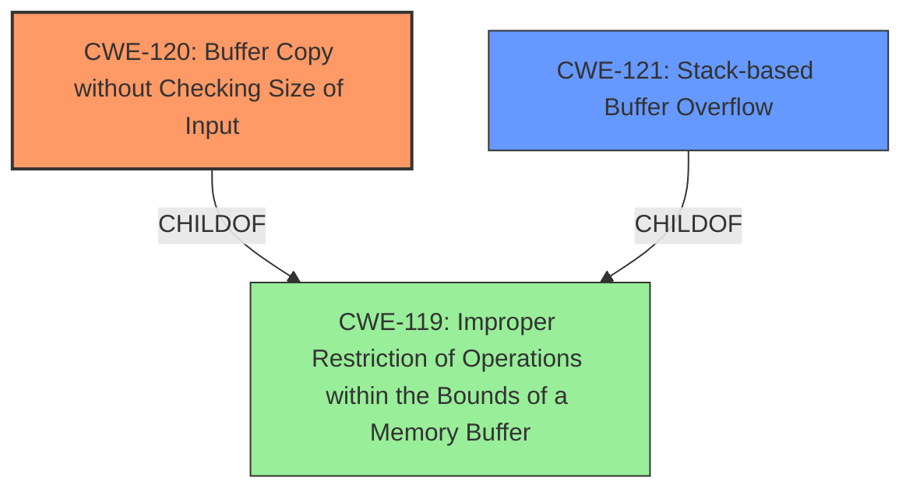

# Analysis for CVE-2025-4180

# Summary

| CWE ID | CWE Name | Confidence | CWE Abstraction Level | CWE Vulnerability Mapping Label | CWE-Vulnerability Mapping Notes |
|---|---|---|---|---|---|
| CWE-120 | Buffer Copy without Checking Size of Input ('Classic Buffer Overflow') | 0.9 | Base | Allowed-with-Review | Primary CWE. The vulnerability description and CVE details explicitly mention a buffer overflow due to the TRACE command handler **not checking the size of the input** before copying it to a buffer. |
| CWE-121 | Stack-based Buffer Overflow | 0.7 | Variant | Allowed | Secondary candidate. The description doesn't explicitly specify the buffer is stack-based, but it's a common scenario for local variables. This is a refinement of the base CWE-120 if more information is available to confirm. |
| CWE-119 | Improper Restriction of Operations within the Bounds of a Memory Buffer | 0.6 | Class | Discouraged | Secondary candidate. While technically correct, it's a broader category than CWE-120 or CWE-121. It applies because the buffer overflow is, by definition, an improper restriction of operations within memory bounds. |

## Evidence and Confidence

*   **Confidence Score:** 0.8
*   **Evidence Strength:** HIGH

## Relationship Analysis

The primary relationship is between CWE-119, CWE-120, and CWE-121. CWE-119 is a class-level CWE, while CWE-120 is a base-level CWE and CWE-121 is a variant-level CWE. CWE-120 and CWE-121 are both specific types of CWE-119. Given the information, CWE-120 is the best fit because it explicitly describes a buffer copy operation **without checking the size of the input**.

## Vulnerability Chain

The vulnerability chain starts with the **lack of input size validation** in the TRACE command handler (CWE-120), leading to a **buffer overflow**. This allows an attacker to overwrite memory and potentially execute arbitrary code. The chain is:

CWE-120 (Root Cause: **Buffer Copy without Checking Size**) -> Memory Corruption (Buffer Overflow) -> Arbitrary Code Execution (Impact)

## Summary of Analysis

The analysis is based on the vulnerability description and, more importantly, the detailed information provided in the CVE Reference Links Content Summary. The description highlights a buffer overflow in the TRACE command handler. The CVE summary explicitly states the root cause is a **buffer overflow** due to the `TRACE` command handling **not checking the size of the input**.

The retriever results also strongly suggest CWE-119, CWE-120, and CWE-121. However, CWE-119 is too broad, and CWE-121 requires more specific stack-based information not explicitly stated in the description.

The final decision to prioritize CWE-120 is based on the detailed CVE summary explicitly connecting the **buffer overflow** to the **lack of input size checking**.

Relevant CWE Information:

# Enhanced Context (25 CWEs)

## CWE-434: Unrestricted Upload of File with Dangerous Type
**Abstraction Level**: Base
**Similarity Score**: 0.73
**Source**: dense

**Description**:
The product allows the upload or transfer of dangerous file types that are automatically processed within its environment.

**Mapping Guidance**:
- Usage: Allowed
- Rationale: This CWE entry is at the Base level of abstraction, which is a preferred level of abstraction for mapping to the root causes of vulnerabilities.

**Why Not Used**: This CWE is not relevant because the vulnerability is related to a **buffer overflow** and not to file uploads.

## CWE-134: Use of Externally-Controlled Format String
**Abstraction Level**: Base
**Similarity Score**: 0.73
**Source**: dense

**Description**:
The product uses a function that accepts a format string as an argument, but the format string originates from an external source.

**Mapping Guidance**:
- Usage: Allowed
- Rationale: This CWE entry is at the Base level of abstraction, which is a preferred level of abstraction for mapping to the root causes of vulnerabilities.

**Why Not Used**: This CWE is not relevant because the vulnerability is related to a **buffer overflow** and not to a format string vulnerability.

## CWE-425: Direct Request ('Forced Browsing')
**Abstraction Level**: Base
**Similarity Score**: 0.72
**Source**: dense

**Description**:
The web application does not adequately enforce appropriate authorization on all restricted URLs, scripts, or files.

**Mapping Guidance**:
- Usage: Allowed
- Rationale: This CWE entry is at the Base level of abstraction, which is a preferred level of abstraction for mapping to the root causes of vulnerabilities.

**Why Not Used**: This CWE is not relevant because the vulnerability is related to a **buffer overflow** and not to authorization issues.

## CWE-193: Off-by-one Error
**Abstraction Level**: Base
**Similarity Score**: 0.72
**Source**: dense

**Description**:
A product calculates or uses an incorrect maximum or minimum value that is 1 more, or 1 less, than the correct value.

**Mapping Guidance**:
- Usage: Allowed
- Rationale: This CWE entry is at the Base level of abstraction, which is a preferred level of abstraction for mapping to the root causes of vulnerabilities.

**Why Not Used**: While an off-by-one error could contribute to a **buffer overflow**, the primary cause is the **lack of input size validation**, making CWE-120 a more accurate fit.

## CWE-131: Incorrect Calculation of Buffer Size
**Abstraction Level**: Base
**Similarity Score**: 0.72
**Source**: dense

**Description**:
The product does not correctly calculate the size to be used when allocating a buffer, which could lead to a buffer overflow.

**Mapping Guidance**:
- Usage: Allowed
- Rationale: This CWE entry is at the Base level of abstraction, which is a preferred level of abstraction for mapping to the root causes of vulnerabilities.

**Why Not Used**: The root cause is the **lack of input size validation** which means CWE-120 is more accurate.

## CWE-125: Out-of-bounds Read
**Abstraction Level**: Base
**Similarity Score**: 0.72
**Source**: dense

**Description**:
The product reads data past the end, or before the beginning, of the intended buffer.

**Mapping Guidance**:
- Usage: Allowed
- Rationale: This CWE entry is at the Base level of abstraction, which is a preferred level of abstraction for mapping to the root causes of vulnerabilities.

**Why Not Used**: The root cause is the **lack of input size validation** leading to writing past the buffer, so it is more accurate to classify this as a write.

## CWE-121: Stack-based Buffer Overflow
**Abstraction Level**: Variant
**Similarity Score**: 0.71
**Source**: dense

**Description**:
A stack-based buffer overflow condition is a condition where the buffer being overwritten is allocated on the stack (i.e., is a local variable or, rarely, a parameter to a function).

**Mapping Guidance**:
- Usage: Allowed
- Rationale: This CWE entry is at the Variant level of abstraction, which is a preferred level of abstraction for mapping to the root causes of vulnerabilities.

**Why Not Used**: It's a possibility, but there's no concrete evidence in the description to confirm it's specifically stack-based.

## CWE-119: Improper Restriction of Operations within the Bounds of a Memory Buffer
**Abstraction Level**: Class
**Similarity Score**: 0.71
**Source**: dense

**Description**:
The product performs operations on a memory buffer, but it reads from or writes to a memory location outside the buffer's intended boundary. This may result in read or write operations on unexpected memory locations that could be linked to other variables, data structures, or internal program data.

**Mapping Guidance**:
- Usage: Discouraged
- Rationale: CWE-119 is commonly misused in low-information vulnerability reports when lower-level CWEs could be used instead, or when more details about the vulnerability are available.

**Why Not Used**: Too broad. CWE-120 provides a more specific description of the vulnerability.

## CWE-790: Improper Filtering of Special Elements
**Abstraction Level**: Class
**Similarity