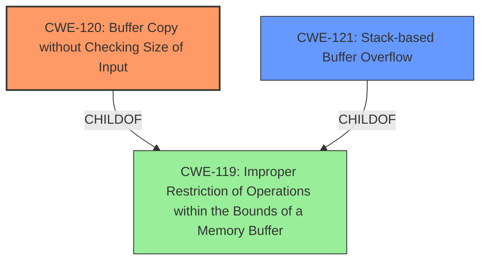

# Analysis Report for CVE-2025-4182

# Vulnerability Analysis Report: CVE-2025-4182

## Description

A vulnerability was found in PCMan FTP Server 2.0.7. It has been rated as critical. Affected by this issue is some unknown functionality of the component BELL Command Handler. The manipulation leads to **buffer overflow**. The attack may be launched remotely. The exploit has been disclosed to the public and may be used.

## Vulnerability Description Key Phrases

- **Weakness:** buffer overflow
- **Product:** PCMan FTP Server
- **Version:** 2.0.7
- **Component:** BELL Command Handler

## Analysis (with Relationship Data)

# Summary
| CWE ID | CWE Name | Confidence | CWE Abstraction Level | CWE Vulnerability Mapping Label | CWE-Vulnerability Mapping Notes |
|---|---|---|---|---|---|
| CWE-120 | Buffer Copy without Checking Size of Input ('Classic Buffer Overflow') | 0.9 | Base | Allowed-with-Review | Primary CWE. The **buffer overflow** is directly caused by copying data into a buffer without proper size validation. |
| CWE-121 | Stack-based Buffer Overflow | 0.7 | Variant | Allowed | Secondary CWE. The exploit content summary notes that the vulnerability was tested on Windows XP SP3 and overwrites EIP, which makes the buffer overflow stack based. |
| CWE-119 | Improper Restriction of Operations within the Bounds of a Memory Buffer | 0.5 | Class | Discouraged | Secondary CWE. This is a more general case of buffer overflow. Because there is sufficient information to narrow the classification to CWE-120 or CWE-121, this CWE is less preferred. |

## Evidence and Confidence

*   **Confidence Score:** 0.8
*   **Evidence Strength:** HIGH

## Relationship Analysis
The primary CWE is CWE-120, which is a base-level CWE describing the classic buffer overflow due to copying data without checking the size of the input. CWE-121, a variant of buffer overflow, specifies that it's stack-based, adding further specificity. CWE-119 is a class-level CWE, representing a more general case of improper memory buffer operation restrictions.



## Vulnerability Chain
The vulnerability chain starts with **improper input validation** on the `bell` command, leading to a **buffer overflow** (CWE-120) when the input is copied without checking its size. If the buffer is on the stack, it is a stack-based buffer overflow (CWE-121). The impact is remote code execution, as the attacker can overwrite memory and inject shellcode.

## Summary of Analysis
The primary weakness is a **buffer overflow** in the BELL Command Handler of PCMan FTP Server 2.0.7. The analysis strongly points to CWE-120, "Buffer Copy without Checking Size of Input," due to the vulnerability stemming from copying data into a buffer without validating its size. The exploit details confirm this, highlighting that the `bell` command does not properly validate input size, leading to memory corruption. The "CVE Reference Links Content Summary" explicitly states this as well: "Buffer Overflow: The `bell` command does not properly validate the size of the input, allowing an attacker to overwrite memory regions."

The selection of CWE-120 is further supported by the "Retriever Results," where CWE-120 is a top candidate. The evidence and high confidence allow for mapping to the base level CWE-120.

CWE-121 is also selected because the provided exploit description contains details that make it stack based. Specifically the EIP overwrite and testing on Windows XP SP3.

CWE-119 is considered but classified as a secondary CWE because it is too general.

Relevant CWE Information:

# Enhanced Context (25 CWEs)
The following CWEs were identified as potentially relevant to this vulnerability:

## CWE-134: Use of Externally-Controlled Format String
**Abstraction Level**: Base
**Similarity Score**: 0.72
**Source**: dense

**Description**:
The product uses a function that accepts a format string as an argument, but the format string originates from an external source.

**Mapping Guidance**:
- Usage: Allowed
- Rationale: This CWE entry is at the Base level of abstraction, which is a preferred level of abstraction for mapping to the root causes of vulnerabilities.

*Not Used:* This CWE is not applicable because the vulnerability is a buffer overflow, not a format string issue.

## CWE-131: Incorrect Calculation of Buffer Size
**Abstraction Level**: Base
**Similarity Score**: 0.72
**Source**: dense

**Description**:
The product does not correctly calculate the size to be used when allocating a buffer, which could lead to a buffer overflow.

**Mapping Guidance**:
- Usage: Allowed
- Rationale: This CWE entry is at the Base level of abstraction, which is a preferred level of abstraction for mapping to the root causes of vulnerabilities.

*Not Used:* This CWE is not the direct root cause. The issue is not necessarily an incorrect calculation, but the absence of any size checking during the copy operation.

## CWE-193: Off-by-one Error
**Abstraction Level**: Base
**Similarity Score**: 0.71
**Source**: dense

**Description**:
A product calculates or uses an incorrect maximum or minimum value that is 1 more, or 1 less, than the correct value.

**Mapping Guidance**:
- Usage: Allowed
- Rationale: This CWE entry is at the Base level of abstraction, which is a preferred level of abstraction for mapping to the root causes of vulnerabilities.

*Not Used:* This CWE does not fit because the vulnerability is not related to an off-by-one error. It is a straight buffer overflow.

## CWE-121: Stack-based Buffer Overflow
**Abstraction Level**: Variant
**Similarity Score**: 0.71
**Source**: dense

**Description**:
A stack-based buffer overflow condition is a condition where the buffer being overwritten is allocated on the stack (i.e., is a local variable or, rarely, a parameter to a function).

**Mapping Guidance**:
- Usage: Allowed
- Rationale: This CWE entry is at the Variant level of abstraction, which is a preferred level of abstraction for mapping to the root causes of vulnerabilities.

*Used:* The exploit content summary notes that the vulnerability was tested on Windows XP SP3 and overwrites EIP, which makes the buffer overflow stack based.

## CWE-346: Origin Validation Error
**Abstraction Level**: Class
**Similarity Score**: 0.71
**Source**: dense

**Description**:
The product does not properly verify that the source of data or communication is valid.

**Mapping Guidance**:
- Usage: Allowed-with-Review
- Rationale: This CWE entry is a Class and might have Base-level children that would be more appropriate

*Not Used:* This is not applicable as the vulnerability is not related to origin validation.

## CWE-918: Server-Side Request Forgery (SSRF)
**Abstraction Level**: Base
**Similarity Score**: 0.70
**Source**: dense

**Description**:
The web server receives a URL or similar request from an upstream component and retrieves the contents of this URL, but it does not sufficiently ensure that the request is being sent to the expected destination.

**Mapping Guidance**:
- Usage: Allowed
- Rationale: This CWE entry is at the Base level of abstraction, which is a preferred level of abstraction for mapping to the root causes of vulnerabilities.

*Not Used:* This CWE is not applicable because the vulnerability is a buffer overflow, not an SSRF issue.

## CWE-434: Unrestricted Upload of File with Dangerous Type
**Abstraction Level**: Base
**Similarity Score**: 0.70
**Source**: dense

**Description**:
The product allows the upload or transfer of dangerous file types that are automatically processed within its environment.

**Mapping Guidance**:
- Usage: Allowed
- Rationale: This CWE entry is at the Base level of abstraction, which is a preferred level of abstraction for mapping to the root causes of vulnerabilities.

*Not Used:* The vulnerability is not related to file uploads.

## CWE-425: Direct Request ('Forced Browsing')
**Abstraction Level**: Base
**Similarity Score**: 0.70
**Source**: dense

**Description**:
The web application does not adequately enforce appropriate authorization on all restricted URLs, scripts, or files.

**Mapping Guidance**:
- Usage: Allowed
- Rationale: This CWE entry is at the Base level of abstraction, which is a preferred level of abstraction for mapping to the root causes of vulnerabilities.

*Not Used:* This CWE is not related to authorization or forced browsing.

## CWE-119: Improper Restriction of Operations within the Bounds of a Memory Buffer
**Abstraction Level**: Class
**Similarity Score**: 0.70
**Source**: dense

**Description**:
The product performs operations on a memory buffer, but it reads from or writes to a memory location outside the buffer's intended boundary. This may result in read or write operations on unexpected memory locations that could be linked to other variables, data


## CWE Relationship Analysis

Current CWEs represent these abstraction levels: .


### Vulnerability Chain Analysis

**Chain starting from CWE-121:**
- 121 (Stack-based Buffer Overflow) - ROOT


**Chain starting from CWE-346:**
- 346 (Origin Validation Error) - ROOT


### CWE Relationship Diagram

```mermaid
graph TD
    classDef primary fill:#f96,stroke:#333,stroke-width:2px
    classDef secondary fill:#69f,stroke:#333
    classDef tertiary fill:#9e9,stroke:#333
```


*Report generated on 2025-07-14 23:24:25*
