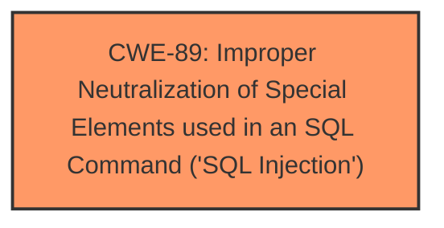

# Analysis Report for CVE-2025-4192

# Vulnerability Analysis Report: CVE-2025-4192

## Description

A vulnerability was found in itsourcecode Restaurant Management System 1.0. It has been classified as critical. This affects an unknown part of the file /admin/category_save.php. The manipulation of the argument Category leads to **sql injection**. It is possible to initiate the attack remotely. The exploit has been disclosed to the public and may be used.

## Vulnerability Description Key Phrases

- **Weakness:** sql injection
- **Product:** itsourcecode Restaurant Management System
- **Version:** 1.0
- **Component:** /admin/category_save.php

## Analysis (with Relationship Data)

# Summary
| CWE ID | CWE Name | Confidence | CWE Abstraction Level | CWE Vulnerability Mapping Label | CWE-Vulnerability Mapping Notes |
|---|---|---|---|---|---|
| CWE-89 | Improper Neutralization of Special Elements used in an SQL Command ('SQL Injection') | 1.0 | Base | Primary | Allowed |

## Evidence and Confidence

*   **Confidence Score:** 1.0
*   **Evidence Strength:** HIGH

## Relationship Analysis
The primary relationship is that CWE-89, as a Base level CWE, is appropriately specific for describing the **SQL Injection** vulnerability. There are no significant parent-child or chain relationships that influence the selection, as the description clearly points to **improper neutralization** within an SQL command. The abstraction level of Base is ideal, accurately representing the root cause.



## Vulnerability Chain
The vulnerability chain consists of a single point:
1.  **Root Cause:** **Improper Neutralization** of user-supplied input used in SQL queries (CWE-89). This leads directly to the impact.
2.  **Impact:** **SQL Injection** vulnerability allowing unauthorized database access.

## Summary of Analysis
The analysis is based on strong evidence from the vulnerability description and the CVE reference. The description clearly states that the vulnerability is due to **SQL Injection** via the 'Category' parameter in `/admin/category_save.php`. The CVE reference confirms that the **root cause** is the **lack of proper input validation and sanitization**, leading to direct use of malicious code in SQL queries.

The selection of CWE-89 is strongly supported by the following evidence:

*   Vulnerability Description Key Phrases: "**weakness:** **sql injection**"
*   CVE Reference Links Content Summary: "Attackers inject malicious code from the 'category' parameter and use it directly in SQL queries without appropriate cleaning or validation."
*   Retriever Results: CWE-89 has a score of 1.0 and is the top combined result.

CWE-89 is at the Base level of abstraction, representing the specific **root cause** of the vulnerability.

Other CWEs Considered:

*   CWE-79 (Improper Neutralization of Input During Web Page Generation ('Cross-site Scripting')): While neutralization is a factor, this is specific to web page generation, which is not the case here. The **injection** happens within the SQL query, not in the web page output.
*   CWE-434 (Unrestricted Upload of File with Dangerous Type): This is related to file uploads, which is not part of this vulnerability.
*   CWE-1336 (Improper Neutralization of Special Elements Used in a Template Engine): This is specific to template engines and not relevant here.
*    CWE-96 (Improper Neutralization of Directives in Statically Saved Code ('Static Code Injection')): This is specific to static code injection, not SQL queries.


## CWE Relationship Analysis

Current CWEs represent these abstraction levels: .


### Vulnerability Chain Analysis

**Chain starting from CWE-89:**
- 89 (Improper Neutralization of Special Elements used in an SQL Command ('SQL Injection')) - ROOT


**Chain starting from CWE-79:**
- 79 (Improper Neutralization of Input During Web Page Generation ('Cross-site Scripting')) - ROOT


### CWE Relationship Diagram

```mermaid
graph TD
    classDef primary fill:#f96,stroke:#333,stroke-width:2px
    classDef secondary fill:#69f,stroke:#333
    classDef tertiary fill:#9e9,stroke:#333
```


*Report generated on 2025-07-14 23:25:44*
