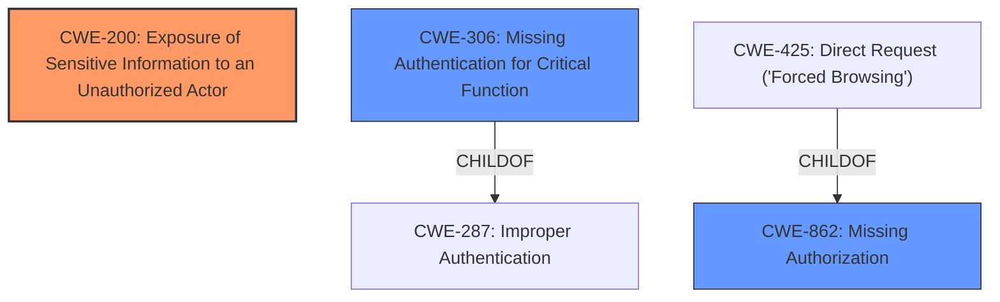

# Analysis Report for CVE-2025-4222

# Vulnerability Analysis Report: CVE-2025-4222

## Description

The Database Toolset plugin for WordPress is vulnerable to **Sensitive Information Exposure** in all versions up to, and including, 1.8.4 via backup files stored in a publicly accessible location. This makes it possible for unauthenticated attackers to extract sensitive data from database backup files. An index file is present, so a brute force attack would need to be successful in order to compromise any data.

## Vulnerability Description Key Phrases

- **Weakness:** Sensitive Information Exposure
- **Impact:** extract sensitive data
- **Vector:** backup files
- **Attacker:** unauthenticated attackers
- **Product:** Database Toolset plugin for WordPress
- **Version:** all versions up to and including 1.8.4

## Analysis (with Relationship Data)

# Summary
| CWE ID | CWE Name | Confidence | CWE Abstraction Level | CWE Vulnerability Mapping Label | CWE-Vulnerability Mapping Notes |
|---|---|---|---|---|---|
| CWE-200 | Exposure of Sensitive Information to an Unauthorized Actor | 0.9 | Class | Allowed-with-Review | Primary CWE. The product exposes sensitive information to an actor that is not explicitly authorized to have access to that information. |
| CWE-306 | Missing Authentication for Critical Function | 0.7 | Base | Allowed | Secondary candidate. The product does not perform any authentication for functionality that requires a provable user identity or consumes a significant amount of resources. |
| CWE-862 | Missing Authorization | 0.7 | Class | Allowed-with-Review | Secondary candidate. The product does not perform an authorization check when an actor attempts to access a resource or perform an action. |

## Evidence and Confidence

*   **Confidence Score:** 0.8
*   **Evidence Strength:** HIGH

## Relationship Analysis
The primary CWE is CWE-200, which is a Class-level weakness describing the exposure of sensitive information. CWE-306 and CWE-862 were also considered as potential weaknesses related to missing authentication and authorization respectively. CWE-306 is a Base level CWE and a child of CWE-287 (Improper Authentication), while CWE-862 is a Class level and a parent of CWE-425 (Direct Request ('Forced Browsing')). The relationships are not direct, however the unauthenticated access to the files is a clear indicator of missing authentication/authorization.



## Vulnerability Chain
The vulnerability chain starts with the **root cause**, which is the **Exposure of Sensitive Information** (CWE-200) due to the **lack of authentication/authorization** (CWE-306, CWE-862). This allows unauthenticated attackers to access the backup files and extract sensitive data, leading to a complete breach of confidentiality and potential website compromise.

## Summary of Analysis
The initial analysis strongly points towards CWE-200 (Exposure of Sensitive Information to an Unauthorized Actor) as the primary weakness, with supporting evidence from the vulnerability description and CVE reference links. The **root cause** is the **sensitive information exposure** via backup files in a publicly accessible location.

The vulnerability description states that the "Database Toolset plugin for WordPress is vulnerable to **Sensitive Information Exposure**... via backup files stored in a publicly accessible location." The CVE Reference Links Content Summary further elaborates that "The Database Toolset plugin stores database backups in a publicly accessible directory (/wp-content/uploads/export/database/) without any authentication or access control" which clearly supports the **Exposure of Sensitive Information**.

CWE-306 (Missing Authentication for Critical Function) and CWE-862 (Missing Authorization) were considered as supporting CWEs because the backup files were publicly accessible without any authentication or authorization checks. While they are not the direct root cause, they contribute to the overall vulnerability.

The final decision is to assign CWE-200 as the primary CWE, representing the core weakness of **sensitive information exposure**. CWE-306 and CWE-862 are secondary candidate CWEs that reflects the missing authentication/authorization aspect. This mapping aligns with the evidence and the abstraction levels are appropriate.

Other CWEs Considered but Not Used:

*   CWE-425 (Direct Request ('Forced Browsing')): While related to missing authorization, it is more specific and the description doesn't fit perfectly. It focuses on URLs, scripts, or files and doesn't quite capture the broader issue of publicly accessible backups.
*   CWE-434 (Unrestricted Upload of File with Dangerous Type): Irrelevant because the issue is not about uploading files.
*   CWE-538 (Insertion of Sensitive Information into Externally-Accessible File or Directory): It is related to sensitive information in publicly accessible location, but it is more about the insertion process rather than the exposure itself.
*   CWE-352 (Cross-Site Request Forgery (CSRF)): Irrelevant because the issue is not about CSRF.
*   CWE-471 (Modification of Assumed-Immutable Data (MAID)): Irrelevant because the issue is not about modification of data.


## CWE Relationship Analysis

Current CWEs represent these abstraction levels: .


### Vulnerability Chain Analysis

**Chain starting from CWE-471:**
- 471 (Modification of Assumed-Immutable Data (MAID)) - ROOT


**Chain starting from CWE-862:**
- 862 (Missing Authorization) - ROOT


### CWE Relationship Diagram

```mermaid
graph TD
    classDef primary fill:#f96,stroke:#333,stroke-width:2px
    classDef secondary fill:#69f,stroke:#333
    classDef tertiary fill:#9e9,stroke:#333
```


*Report generated on 2025-07-14 23:29:41*
