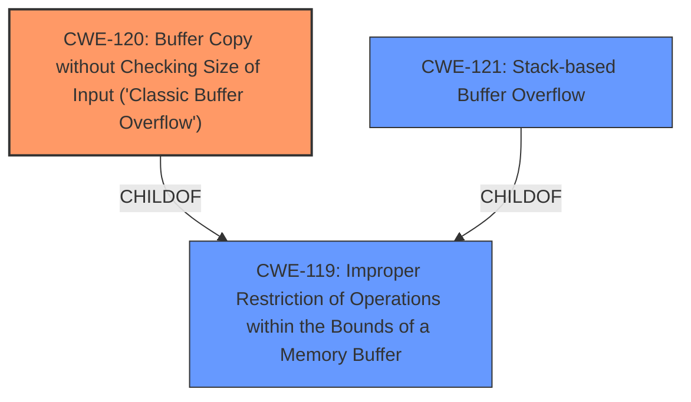

# Analysis Report for CVE-2025-4239

# Vulnerability Analysis Report: CVE-2025-4239

## Description

A vulnerability was found in PCMan FTP Server 2.0.7. It has been declared as critical. This vulnerability affects unknown code of the component TYPE Command Handler. The manipulation leads to **buffer overflow**. The attack can be initiated remotely. The exploit has been disclosed to the public and may be used.

## Vulnerability Description Key Phrases

- **Weakness:** buffer overflow
- **Product:** PCMan FTP Server
- **Version:** 2.0.7
- **Component:** TYPE Command Handler

## Analysis (with Relationship Data)

# Summary
| CWE ID | CWE Name | Confidence | CWE Abstraction Level | CWE Vulnerability Mapping Label | CWE-Vulnerability Mapping Notes |
|---|---|---|---|---|---|
| CWE-120 | Buffer Copy without Checking Size of Input ('Classic Buffer Overflow') | 1.0 | Base | Allowed-with-Review | Primary CWE |
| CWE-121 | Stack-based Buffer Overflow | 0.7 | Variant | Allowed | Secondary Candidate |
| CWE-119 | Improper Restriction of Operations within the Bounds of a Memory Buffer | 0.6 | Class | Discouraged | Secondary Candidate |

## Evidence and Confidence

*   **Confidence Score:** 0.9
*   **Evidence Strength:** HIGH

## Relationship Analysis
The primary CWE is CWE-120, which is a base-level CWE describing a buffer copy without checking the size of the input. CWE-120 is a child of CWE-119, which is a more general class describing improper restriction of operations within the bounds of a memory buffer. CWE-121, Stack-based Buffer Overflow, is a variant of CWE-119 and a more specific type of buffer overflow occurring on the stack. The relationships indicate that a more specific CWE is preferred if evidence supports it.



## Vulnerability Chain
The vulnerability chain starts with a **buffer overflow** due to **lack of input validation** in the `MLS` command, which leads to arbitrary code execution.

## Summary of Analysis
The initial assessment based on the vulnerability description and key phrases pointed to a **buffer overflow** (**weakness**). The CVE reference links content summary confirmed that the root cause is indeed a **buffer overflow** in the `MLS` command handler due to **lack of input validation**. The provided exploit attempts to redirect execution to a `JMP ESP` instruction and execute shellcode, demonstrating the potential for arbitrary code execution.

The Retriever Results suggested CWE-119, CWE-190, and CWE-120 as potential matches. Given the specific nature of the vulnerability involving a buffer copy operation without checking the size of the input, CWE-120 is the most appropriate primary CWE. CWE-121 (Stack-based Buffer Overflow) is considered since the vulnerability involves overwriting EIP which is on the stack, but there isn't enough information to definitively confirm it's a stack-based overflow versus other types of overflows.

*   **CWE-120: Buffer Copy without Checking Size of Input ('Classic Buffer Overflow')**: This CWE accurately describes the vulnerability, where the `MLS` command handler copies data into a buffer without validating the size of the input, leading to a buffer overflow. The "CVE Reference Links Content Summary" confirms this, stating: "The `MLS` command does not properly validate the length of the input, allowing an attacker to send a payload larger than the allocated buffer."
*   **CWE-121: Stack-based Buffer Overflow**: While the exploit overwrites the EIP register, which resides on the stack, the provided information does not explicitly confirm that the buffer is allocated on the stack. Therefore, assigning CWE-121 is considered a possible secondary candidate.
*   **CWE-119: Improper Restriction of Operations within the Bounds of a Memory Buffer**: This is a more general class of weakness, and while applicable, CWE-120 provides a more specific description of the vulnerability. The "CVE Reference Links Content Summary" also supports the selection of CWE-120 by mentioning the "buffer overflow" due to the lack of input validation.

CWEs considered but not used:

*   **CWE-190: Integer Overflow or Wraparound**: This CWE is not directly related to the described vulnerability, which focuses on a **buffer overflow** rather than integer manipulation.
*   **CWE-89: Improper Neutralization of Special Elements used in an SQL Command ('SQL Injection')**: This CWE is related to SQL injection vulnerabilities, which is not the case here.
*   **CWE-79: Improper Neutralization of Input During Web Page Generation ('Cross-site Scripting')**: This CWE is related to cross-site scripting vulnerabilities, which is not the case here.
*   **CWE-125: Out-of-bounds Read**: The vulnerability involves a write operation beyond the buffer's boundary, not a read operation.
*   **CWE-117: Improper Output Neutralization for Logs**: This CWE is specific to logging, which is not mentioned in the vulnerability description.
*   **CWE-434: Unrestricted Upload of File with Dangerous Type**: This CWE is related to file uploads, which is not the case here.
*   **CWE-128: Wrap-around Error**: This CWE is related to wrap-around errors, which is not the case here.


## CWE Relationship Analysis

Current CWEs represent these abstraction levels: .


### Vulnerability Chain Analysis

**Chain starting from CWE-89:**
- 89 (Improper Neutralization of Special Elements used in an SQL Command ('SQL Injection')) - ROOT


**Chain starting from CWE-121:**
- 121 (Stack-based Buffer Overflow) - ROOT


### CWE Relationship Diagram

```mermaid
graph TD
    classDef primary fill:#f96,stroke:#333,stroke-width:2px
    classDef secondary fill:#69f,stroke:#333
    classDef tertiary fill:#9e9,stroke:#333
```


*Report generated on 2025-07-14 23:31:31*
