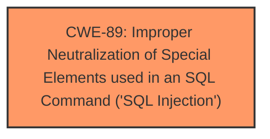

# Analysis Report for CVE-2025-4243

# Vulnerability Analysis Report: CVE-2025-4243

## Description

A vulnerability, which was classified as critical, has been found in code-projects Online Bus Reservation System 1.0. Affected by this issue is some unknown functionality of the file /print.php. The manipulation of the argument ID leads to sql injection. The attack may be launched remotely. The exploit has been disclosed to the public and may be used.

## Vulnerability Description Key Phrases

- **Component:** /print.php
- **Weakness:** sql injection, SQL injection
- **Product:** Online Bus Reservation System
- **Version:** 1.0

## Analysis (with Relationship Data)

# Summary
| CWE ID | CWE Name | Confidence | CWE Abstraction Level | CWE Vulnerability Mapping Label | CWE-Vulnerability Mapping Notes |
|---|---|---|---|---|---|
| CWE-89 | Improper Neutralization of Special Elements used in an SQL Command ('SQL Injection') | 1.0 | Base | Primary | Allowed |

## Evidence and Confidence

*   **Confidence Score:** 1.0
*   **Evidence Strength:** HIGH

## Relationship Analysis
The primary relationship impacting the decision is the direct match of the vulnerability description to CWE-89. There are no child or parent relationships directly relevant in refining this selection, as the description clearly points to SQL Injection. The abstraction level of Base is appropriate as it is the root cause.



## Vulnerability Chain
The vulnerability chain starts with **improper neutralization** of special elements in an SQL command, leading directly to **SQL injection**.

## Summary of Analysis
The vulnerability description explicitly states that the manipulation of the ID argument in the /print.php file leads to **SQL Injection** in Online Bus Reservation System 1.0. The "Retriever Results" also strongly suggest CWE-89 as the primary candidate.

The evidence from the "Vulnerability Description Key Phrases" explicitly indicates "**weakness:** **sql injection, SQL injection**".

Therefore, the selection of CWE-89 is based on clear evidence within the vulnerability description and aligns with the suggested mappings.

CWEs considered but not used:

*   CWE-79: Improper Neutralization of Input During Web Page Generation ('Cross-site Scripting') - While neutralization is involved, the description specifically mentions SQL injection, making CWE-89 more accurate.
*   CWE-434: Unrestricted Upload of File with Dangerous Type - This is not relevant to the described vulnerability.
*   CWE-117: Improper Output Neutralization for Logs - This is not relevant to the described vulnerability.
*   CWE-1336: Improper Neutralization of Special Elements Used in a Template Engine - This is not relevant to the described vulnerability.
*   CWE-99: Improper Control of Resource Identifiers ('Resource Injection') - This is not relevant to the described vulnerability.
*   CWE-352: Cross-Site Request Forgery (CSRF) - This is not relevant to the described vulnerability.
*   CWE-74: Improper Neutralization of Special Elements in Output Used by a Downstream Component ('Injection') - CWE-74 is a high-level injection class. Since SQL injection is specified, CWE-89 is more appropriate.
*   CWE-96: Improper Neutralization of Directives in Statically Saved Code ('Static Code Injection') - This is not relevant to the described vulnerability.
*   CWE-425: Direct Request ('Forced Browsing') - This is not relevant to the described vulnerability.

Relevant CWE Information:


## CWE Relationship Analysis

Current CWEs represent these abstraction levels: .


### Vulnerability Chain Analysis

**Chain starting from CWE-89:**
- 89 (Improper Neutralization of Special Elements used in an SQL Command ('SQL Injection')) - ROOT


**Chain starting from CWE-99:**
- 99 (Improper Control of Resource Identifiers ('Resource Injection')) - ROOT


### CWE Relationship Diagram

```mermaid
graph TD
    classDef primary fill:#f96,stroke:#333,stroke-width:2px
    classDef secondary fill:#69f,stroke:#333
    classDef tertiary fill:#9e9,stroke:#333
```


*Report generated on 2025-07-14 23:33:20*
