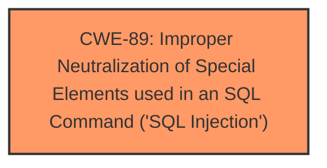

# Enhanced Analysis for CVE-2025-4244

# Summary
| CWE ID | CWE Name | Confidence | CWE Abstraction Level | CWE Vulnerability Mapping Label | CWE-Vulnerability Mapping Notes |
|---|---|---|---|---|---|
| CWE-89 | Improper Neutralization of Special Elements used in an SQL Command ('SQL Injection') | 1.0 | Base | Allowed | Primary CWE |

## Evidence and Confidence

*   **Confidence Score:** 1.0
*   **Evidence Strength:** HIGH

## Relationship Analysis
The primary relationship influencing the decision is the direct match of the vulnerability description to the definition of CWE-89. The other CWEs retrieved do not directly address the **SQL Injection** weakness described.



## Vulnerability Chain
The vulnerability chain consists of a single point:

1.  **Root Cause:** CWE-89 - **Improper Neutralization of Special Elements used in an SQL Command ('SQL Injection')** due to **lack of proper input validation** and sanitization when handling the ID parameter in the `/seatlocation.php` file.

## Summary of Analysis
The vulnerability description clearly states that the manipulation of the argument "ID" leads to **SQL Injection** in the `/seatlocation.php` file of the Online Bus Reservation System.

The most relevant CWE based on the description and retriever results is CWE-89 (**Improper Neutralization of Special Elements used in an SQL Command ('SQL Injection')**). This CWE directly addresses the root cause where the application fails to properly sanitize user-supplied input before using it in an SQL query. The retriever results confirm this with a score of 1.0 for alternate_terms.

The other CWEs were considered but deemed less relevant:

*   CWE-79 (**Improper Neutralization of Input During Web Page Generation ('Cross-site Scripting')**) is related to web page output and not SQL queries.
*   CWE-434 (**Unrestricted Upload of File with Dangerous Type**) is about file uploads, which is not part of this vulnerability.
*   CWE-117 (**Improper Output Neutralization for Logs**) is related to log injection, not SQL injection.
*   CWE-96 (**Improper Neutralization of Directives in Statically Saved Code ('Static Code Injection')**) is about injecting code into static files, not relevant here.

The final decision is based on the clear indication of **SQL Injection** in the vulnerability description and the high relevance score of CWE-89.

Relevant CWE Information:

# Enhanced Context (25 CWEs)
The following CWEs were identified as potentially relevant to this vulnerability:

## CWE-89: Improper Neutralization of Special Elements used in an SQL Command ('SQL Injection')
**Abstraction Level**: Base
**Similarity Score**: 0.79
**Source**: dense

**Description**:
The product constructs all or part of an SQL command using externally-influenced input from an upstream component, but it does not neutralize or incorrectly neutralizes special elements that could modify the intended SQL command when it is sent to a downstream component. Without sufficient removal or quoting of SQL syntax in user-controllable inputs, the generated SQL query can cause those inputs to be interpreted as SQL instead of ordinary user data.

**Mapping Guidance**:
- Usage: Allowed
- Rationale: This CWE entry is at the Base level of abstraction, which is a preferred level of abstraction for mapping to the root causes of vulnerabilities.

## CWE-89: Improper Neutralization of Special Elements used in an SQL Command ('SQL Injection')
**Abstraction Level**: Base
**Similarity Score**: 620.09
**Source**: sparse

**Description**:
The product constructs all or part of an SQL command using externally-influenced input from an upstream component, but it does not neutralize or incorrectly neutralizes special elements that could modify the intended SQL command when it is sent to a downstream component. Without sufficient removal or quoting of SQL syntax in user-controllable inputs, the generated SQL query can cause those inputs to be interpreted as SQL instead of ordinary user data.

**Mapping Guidance**:
- Usage: Allowed
- Rationale: This CWE entry is at the Base level of abstraction, which is a preferred level of abstraction for mapping to the root causes of vulnerabilities.


## CWE Relationship Analysis

Current CWEs represent these abstraction levels: .


### Vulnerability Chain Analysis

**Chain starting from CWE-89:**
- 89 (Improper Neutralization of Special Elements used in an SQL Command ('SQL Injection')) - ROOT


**Chain starting from CWE-79:**
- 79 (Improper Neutralization of Input During Web Page Generation ('Cross-site Scripting')) - ROOT


### CWE Relationship Diagram

```mermaid
graph TD
    classDef primary fill:#f96,stroke:#333,stroke-width:2px
    classDef secondary fill:#69f,stroke:#333
    classDef tertiary fill:#9e9,stroke:#333
```