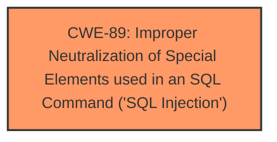

# Raw Analyzer Response for CVE-2025-4247

# Summary
| CWE ID | CWE Name | Confidence | CWE Abstraction Level | CWE Vulnerability Mapping Label | CWE-Vulnerability Mapping Notes |
|---|---|---|---|---|---|
| CWE-89 | Improper Neutralization of Special Elements used in an SQL Command ('SQL Injection') | 1.0 | Base | Allowed | Primary CWE: The vulnerability is due to **SQL injection**. |

## Evidence and Confidence

*   **Confidence Score:** 1.0
*   **Evidence Strength:** HIGH

## Relationship Analysis
The primary relationship to consider is the hierarchical structure. CWE-89 is a Base level CWE, which is the preferred level of abstraction. There are no relevant chain relationships in this case.

## Vulnerability Chain
The vulnerability chain is straightforward:
1.  **Root Cause:** **SQL Injection** due to improper sanitization of the `id` parameter.
2.  **Impact:** Potential access to a large amount of data or even server host privileges.

## Summary of Analysis
The primary CWE identified is CWE-89, which directly addresses the **SQL injection** vulnerability described. The evidence for this classification is strong, as the vulnerability description explicitly mentions **SQL injection** and the CVE Reference Links Content Summary provides details on how the `id` parameter is used unsafely in a database query.

The selection of CWE-89 is based on:
*   Explicit mention of "SQL injection" in the vulnerability description.
*   Details in the CVE Reference Links Content Summary that confirms the **lack of sanitization** of the `id` parameter leading to **SQL injection**.
*   The high relevance score in the Retriever Results for CWE-89.
*   CWE-89's Base level of abstraction, which is preferred for root cause analysis.

Other CWEs considered but not used:

*   CWE-79 (Improper Neutralization of Input During Web Page Generation ('Cross-site Scripting')): While input neutralization is a factor, the specific vulnerability is **SQL injection**, making CWE-89 more accurate.
*   CWE-434 (Unrestricted Upload of File with Dangerous Type): This CWE is not relevant as the vulnerability does not involve file uploads.
*   CWE-117 (Improper Output Neutralization for Logs): This CWE is not relevant as the vulnerability does not involve logging.
*   CWE-1336 (Improper Neutralization of Special Elements Used in a Template Engine): This CWE is not relevant as the vulnerability does not involve template engines.
*   CWE-352 (Cross-Site Request Forgery (CSRF)): This CWE is not relevant as the vulnerability does not involve CSRF.
*   CWE-99 (Improper Control of Resource Identifiers ('Resource Injection')): This CWE is not relevant as the vulnerability does not involve resource injection.
*   CWE-93 (Improper Neutralization of CRLF Sequences ('CRLF Injection')): This CWE is not relevant as the vulnerability does not involve CRLF injection.
*   CWE-96 (Improper Neutralization of Directives in Statically Saved Code ('Static Code Injection')): This CWE is not relevant as the vulnerability does not involve static code injection.
*   CWE-494 (Download of Code Without Integrity Check): This CWE is not relevant as the vulnerability does not involve downloading code without integrity checks.

The selected CWE is at the optimal level of specificity because it directly describes the **root cause** of the vulnerability.