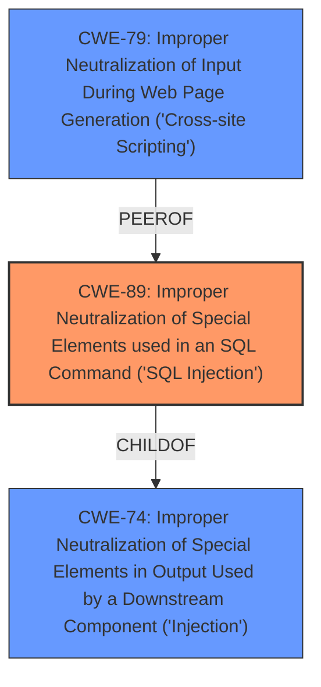

# Enhanced Analysis for CVE-2025-4248

# Summary
| CWE ID | CWE Name | Confidence | CWE Abstraction Level | CWE Vulnerability Mapping Label | CWE-Vulnerability Mapping Notes |
|---|---|---|---|---|---|
| CWE-89 | Improper Neutralization of Special Elements used in an SQL Command ('SQL Injection') | 1.0 | Base | Allowed | Primary CWE. The vulnerability description clearly states that the manipulation of the ID argument leads to **SQL Injection**. The CVE summary confirms that user input is not sanitized before being used in SQL queries. |

## Evidence and Confidence

*   **Confidence Score:** 1.0
*   **Evidence Strength:** HIGH

## Relationship Analysis
The primary CWE is CWE-89 (Base). There are other related CWEs, mainly involving the neutralization of input. However, the direct evidence points strongly to **SQL injection** as the root cause.



## Vulnerability Chain
The vulnerability chain starts with the **improper neutralization of input** leading to **SQL injection**. The chain is as follows:

1.  **Improper Neutralization of Input:** The application fails to sanitize user-provided input (ID argument).
2.  **SQL Injection (CWE-89):** The unsanitized input is directly used in an SQL query, allowing an attacker to inject malicious SQL code.

## Summary of Analysis
The analysis is strongly based on the provided evidence, particularly the vulnerability description key phrases ("**SQL injection**", "manipulation of argument ID") and the CVE reference content summary that pinpoints the **lack of sanitization** in `complete_task.php`. The retriever results also strongly suggest CWE-89 as the primary weakness.

The decision to select CWE-89 is based on its direct relevance to the vulnerability description, which explicitly mentions "SQL injection". The CWE description and its relationships with other CWEs (like CWE-74 and CWE-79) further support this choice. CWE-89 is also a Base level CWE, which is the preferred level of abstraction.

Other considered CWEs:

*   CWE-79 (Improper Neutralization of Input During Web Page Generation ('Cross-site Scripting')): While input neutralization is a concern, the specific vulnerability is SQL injection, making CWE-79 less relevant.
*   CWE-434 (Unrestricted Upload of File with Dangerous Type): This is not relevant as the vulnerability doesn't involve file uploads.
*   CWE-117 (Improper Output Neutralization for Logs): The vulnerability is not related to logging.
*   CWE-1336 (Improper Neutralization of Special Elements Used in a Template Engine): This is not relevant because the application is not using a template engine in a vulnerable manner.


## CWE Relationship Analysis

Current CWEs represent these abstraction levels: .


### Vulnerability Chain Analysis

**Chain starting from CWE-89:**
- 89 (Improper Neutralization of Special Elements used in an SQL Command ('SQL Injection')) - ROOT


**Chain starting from CWE-79:**
- 79 (Improper Neutralization of Input During Web Page Generation ('Cross-site Scripting')) - ROOT


### CWE Relationship Diagram

```mermaid
graph TD
    classDef primary fill:#f96,stroke:#333,stroke-width:2px
    classDef secondary fill:#69f,stroke:#333
    classDef tertiary fill:#9e9,stroke:#333
```