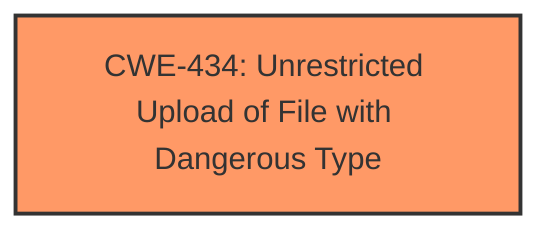

# Raw Analyzer Response for CVE-2025-4258

# Summary
| CWE ID | CWE Name | Confidence | CWE Abstraction Level | CWE Vulnerability Mapping Label | CWE-Vulnerability Mapping Notes |
|---|---|---|---|---|---|
| CWE-434 | Unrestricted Upload of File with Dangerous Type | 1.0 | Base | Allowed | Primary CWE |

## Evidence and Confidence

*   **Confidence Score:** 1.0
*   **Evidence Strength:** HIGH

## Relationship Analysis
The primary relationship that influenced the decision was the direct match of the vulnerability description to the definition of CWE-434. No other relationships (parent-child, chain, or peer) were directly relevant to the root cause, although potential consequences of unrestricted file upload could lead to other vulnerabilities. The base abstraction level is appropriate as it directly describes the weakness.

## Vulnerability Chain
The vulnerability chain starts with the **unrestricted upload** (**weakness**) which can directly lead to code execution or other impacts depending on the uploaded file and how it's processed.
  - CWE-434: **Unrestricted Upload of File with Dangerous Type** (Root Cause)

## Summary of Analysis
The analysis is based on the provided vulnerability description, which clearly states that the vulnerability is an **unrestricted upload** in the `Upload` function of `MediaController.java`. This directly aligns with the definition of CWE-434, "Unrestricted Upload of File with Dangerous Type." The retriever results also listed CWE-434 as a highly relevant candidate.
The evidence is the phrase "**unrestricted upload**" in the Vulnerability Description Key Phrases section.
The graph relationships show only the primary CWE.
CWE-434 is at the optimal level of specificity as it directly describes the weakness.

Relevant CWE Information:

# Enhanced Context (25 CWEs)
The following CWEs were identified as potentially relevant to this vulnerability:

## CWE-434: Unrestricted Upload of File with Dangerous Type
**Abstraction Level**: Base
**Similarity Score**: 0.80
**Source**: dense

**Description**:
The product allows the upload or transfer of dangerous file types that are automatically processed within its environment.

**Mapping Guidance**:
- Usage: Allowed
- Rationale: This CWE entry is at the Base level of abstraction, which is a preferred level of abstraction for mapping to the root causes of vulnerabilities.