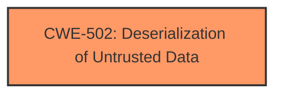

# Enhanced Analysis for CVE-2025-4260

# Summary

| CWE ID | CWE Name | Confidence | CWE Abstraction Level | CWE Vulnerability Mapping Label | CWE-Vulnerability Mapping Notes |
|---|---|---|---|---|---|
| CWE-502 | Deserialization of Untrusted Data | 1.0 | Base | Allowed | Primary CWE |

## Evidence and Confidence

*   **Confidence Score:** 1.0
*   **Evidence Strength:** HIGH

## Relationship Analysis
The primary identified weakness is **CWE-502 Deserialization of Untrusted Data**, which is a base level CWE. No child CWEs are more appropriate given the provided information. There are no clear relationships to other CWEs described in the provided vulnerability information.



## Vulnerability Chain
The vulnerability chain starts with the **deserialization** of untrusted data, leading directly to potential code execution or other security impacts, depending on the deserialization context.

## Summary of Analysis
The vulnerability description clearly states that the **root cause** is **deserialization** due to the manipulation of the `dataFile` argument.

The key phrase "manipulation of the argument dataFile leads to **deserialization**" directly supports the selection of **CWE-502 Deserialization of Untrusted Data**.

The Retriever Results also list **CWE-502 Deserialization of Untrusted Data** as a potential match.

I considered other CWEs from the Retriever Results, but they were not as directly relevant as **CWE-502 Deserialization of Untrusted Data**, as they focused on the consequences of the **deserialization** rather than the root cause.

The selection of **CWE-502 Deserialization of Untrusted Data** is at the optimal level of specificity, as it accurately captures the **root cause** of the vulnerability.


## CWE Relationship Analysis

Current CWEs represent these abstraction levels: .


### Vulnerability Chain Analysis

**Chain starting from CWE-502:**
- 502 (Deserialization of Untrusted Data) - ROOT


### CWE Relationship Diagram

```mermaid
graph TD
    classDef primary fill:#f96,stroke:#333,stroke-width:2px
    classDef secondary fill:#69f,stroke:#333
    classDef tertiary fill:#9e9,stroke:#333
```