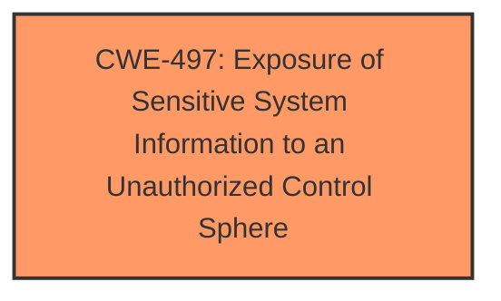

# Raw Analyzer Response for CVE-2025-4270

# Summary

| CWE ID | CWE Name | Confidence | CWE Abstraction Level | CWE Vulnerability Mapping Label | CWE-Vulnerability Mapping Notes |
|---|---|---|---|---|---|
| CWE-497 | Exposure of Sensitive System Information to an Unauthorized Control Sphere | 0.75 | Base | Allowed | Primary CWE |

## Evidence and Confidence

*   **Confidence Score:** 0.75
*   **Evidence Strength:** LOW

## Relationship Analysis

The primary CWE, CWE-497 [Exposure of Sensitive System Information to an Unauthorized Control Sphere], is a Base level CWE. There are no direct parent-child or chain relationships that significantly influence the selection in this case, as the evidence is limited. The selection is driven by the direct match of the vulnerability description to the CWE's characteristics.

## Vulnerability Chain

The vulnerability chain is relatively simple:

1.  The root cause is the **lack of proper access control** on the `/cgi-bin/cstecgi.cgi` Config Handler.
2.  This **lack of access control** leads to **information disclosure** because the `topicurl` parameter can be manipulated to retrieve sensitive system information.

## Summary of Analysis

The analysis is based on limited evidence from the vulnerability description. The key evidence is the **impact**, which is **information disclosure**, and the **vector**, which is the manipulation of the `topicurl` argument. The vulnerability allows for remote exploitation.

The primary CWE selected is CWE-497 [Exposure of Sensitive System Information to an Unauthorized Control Sphere]. This CWE aligns well with the vulnerability description, as it involves the product not properly preventing sensitive system-level information from being accessed by unauthorized actors.

The other CWEs considered from the Retriever Results were mostly related to input validation and sanitization issues (e.g., CWE-79 [Improper Neutralization of Input During Web Page Generation ('Cross-site Scripting')], CWE-89 [Improper Neutralization of Special Elements used in an SQL Command ('SQL Injection')], CWE-78 [Improper Neutralization of Special Elements used in an OS Command ('OS Command Injection')]). While these could potentially be related, the primary issue described is the **exposure of sensitive information** due to **inadequate access control**, making CWE-497 [Exposure of Sensitive System Information to an Unauthorized Control Sphere] the most appropriate choice.

The selection of CWE-497 [Exposure of Sensitive System Information to an Unauthorized Control Sphere] is at the optimal level of specificity, as it directly addresses the core issue of sensitive information being exposed without proper authorization.