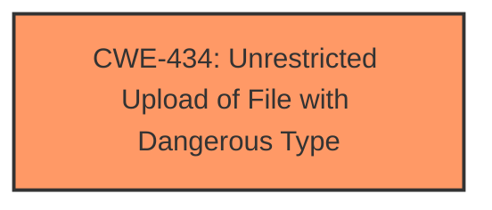

# Raw Analyzer Response for CVE-2025-4310

# Summary
| CWE ID | CWE Name | Confidence | CWE Abstraction Level | CWE Vulnerability Mapping Label | CWE-Vulnerability Mapping Notes |
|---|---|---|---|---|---|
| CWE-434 | Unrestricted Upload of File with Dangerous Type | 1.0 | Base | Allowed | Primary CWE |

## Evidence and Confidence

*   **Confidence Score:** 1.0
*   **Evidence Strength:** HIGH

## Relationship Analysis
The primary relationship considered was the lack of proper restrictions on file uploads, which directly leads to the **Unrestricted Upload of File with Dangerous Type (CWE-434)**. No other hierarchical or chain relationships strongly influenced the decision because the provided information is focused on the immediate **weakness** of allowing any file type to be uploaded without validation. The abstraction level is Base, which is appropriate as it directly identifies the root cause.

## Vulnerability Chain
The chain of the vulnerability is straightforward:

1.  **Root Cause:** **Unrestricted Upload** due to **lack of sanitization or filtering** of uploaded files. (CWE-434)
2.  **Impact:** Potential Remote Code Execution (RCE) due to the ability to upload and execute dangerous file types.

## Summary of Analysis
The vulnerability description clearly indicates an **unrestricted upload** issue, supported by the CVE reference summary stating the web application "doesn't sanitize or filter the uploaded files," leading to the ability to "upload and execute dangerous file types." This directly corresponds to **CWE-434 (Unrestricted Upload of File with Dangerous Type)**.

The decision is based heavily on the explicit evidence of an **unrestricted upload** and the ability to execute arbitrary files. The relationship analysis confirms that the primary issue is directly related to the **unrestricted upload**, without a complex chain of dependencies or prerequisites.

The provided CWE candidates like SQL Injection (CWE-89) or Cross-Site Scripting (CWE-79) are not relevant because the core issue is not related to injecting code into SQL queries or web pages, but rather uploading malicious files. Similarly, Missing Authentication (CWE-306) and Path Traversal (CWE-22) are not applicable without further evidence.

Relevant CWE Information:

# Enhanced Context (25 CWEs)
The following CWEs were identified as potentially relevant to this vulnerability:

## CWE-434: Unrestricted Upload of File with Dangerous Type
**Abstraction Level**: Base
**Similarity Score**: 0.85
**Source**: dense

**Description**:
The product allows the upload or transfer of dangerous file types that are automatically processed within its environment.

**Mapping Guidance**:
- Usage: Allowed
- Rationale: This CWE entry is at the Base level of abstraction, which is a preferred level of abstraction for mapping to the root causes of vulnerabilities.