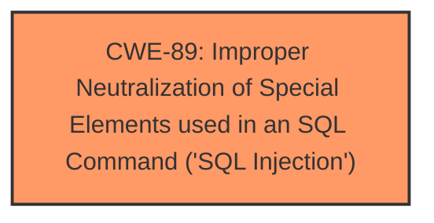

# Analysis Report for CVE-2025-4312

# Vulnerability Analysis Report: CVE-2025-4312

## Description

A vulnerability, which was classified as critical, has been found in SourceCodester Advanced Web Store 1.0. This issue affects some unknown processing of the file /productdetail.php. The manipulation of the argument prodid leads to **sql injection**. The attack may be initiated remotely. The exploit has been disclosed to the public and may be used.

## Vulnerability Description Key Phrases

- **Weakness:** sql injection
- **Product:** SourceCodester Advanced Web Store
- **Version:** 1
- **Component:** /productdetail.php

## Analysis (with Relationship Data)

# Summary
| CWE ID | CWE Name | Confidence | CWE Abstraction Level | CWE Vulnerability Mapping Label | CWE-Vulnerability Mapping Notes |
|---|---|---|---|---|---|
| CWE-89 | Improper Neutralization of Special Elements used in an SQL Command ('SQL Injection') | 1.0 | Base | Allowed | Primary CWE |

## Evidence and Confidence

*   **Confidence Score:** 1.0
*   **Evidence Strength:** HIGH

## Relationship Analysis
The primary relationship considered was the direct match of the vulnerability description to **CWE-89** Improper Neutralization of Special Elements used in an SQL Command ('SQL Injection'). No other relationships influenced the decision, as the description clearly points to SQL Injection.



## Vulnerability Chain
The vulnerability chain is straightforward:
1.  **Root Cause:** **CWE-89** Improper Neutralization of Special Elements used in an SQL Command ('SQL Injection') due to the **improper neutralization** of the `prodid` argument.
2.  Impact: Remote attackers can inject SQL commands, potentially leading to data breaches or other malicious activities.

## Summary of Analysis
The analysis is based on the clear evidence provided in the vulnerability description, which states that the manipulation of the `prodid` argument leads to **sql injection**. The **CWE-89** Improper Neutralization of Special Elements used in an SQL Command ('SQL Injection') directly addresses this weakness. The Retriever results also list **CWE-89** Improper Neutralization of Special Elements used in an SQL Command ('SQL Injection') as the top combined result with a score of 1.0.

Relevant CWE Information:

# Enhanced Context (25 CWEs)
The following CWEs were identified as potentially relevant to this vulnerability:

## Vulnerability Description
A vulnerability, which was classified as critical, has been found in SourceCodester Advanced Web Store 1.0. This issue affects some unknown processing of the file /productdetail.php. The manipulation of the argument prodid leads to **sql injection**. The attack may be initiated remotely. The exploit has been disclosed to the public and may be used.

### Vulnerability Description Key Phrases
- **weakness:** **sql injection**
- **product:** SourceCodester Advanced Web Store
- **version:** 1
- **component:** /productdetail.php

## CVE Reference Links Content Summary
UNRELATED

## Retriever Results

### Top Combined Results

| Rank | CWE ID | Name | Abstraction | Usage  | Retrievers | Individual Scores |
|------|--------|------|-------------|-------|------------|-------------------|
| 1 | 89 | Improper Neutralization of Special Elements used in an SQL Command ('SQL Injection') | Base | Allowed | alternate_terms | 1.000 |
| 2 | 79 | Improper Neutralization of Input During Web Page Generation ('Cross-site Scripting') | Base | Allowed | sparse | 0.415 |
| 3 | 434 | Unrestricted Upload of File with Dangerous Type | Base | Allowed | sparse | 0.347 |
| 4 | 117 | Improper Output Neutralization for Logs | Base | Allowed | sparse | 0.343 |
| 5 | 99 | Improper Control of Resource Identifiers ('Resource Injection') | Class | Allowed-with-Review | sparse | 0.324 |
| 6 | 1336 | Improper Neutralization of Special Elements Used in a Template Engine | Base | Allowed | sparse | 0.323 |
| 7 | 266 | Incorrect Privilege Assignment | Base | Allowed | sparse | 0.315 |
| 8 | 352 | Cross-Site Request Forgery (CSRF) | Compound | Allowed | sparse | 0.302 |
| 9 | 96 | Improper Neutralization of Directives in Statically Saved Code ('Static Code Injection') | Base | Allowed | dense | 0.606 |
| 10 | 73 | External Control of File Name or Path | Base | Allowed | graph | 0.003 |

The description explicitly states that the manipulation of `prodid` argument leads to **sql injection**. This aligns perfectly with the definition of **CWE-89** Improper Neutralization of Special Elements used in an SQL Command ('SQL Injection').
The description of **CWE-89** Improper Neutralization of Special Elements used in an SQL Command ('SQL Injection') states: "The product constructs all or part of an SQL command using externally-influenced input from an upstream component, but it does not neutralize or incorrectly neutralizes special elements that could modify the intended SQL command when it is sent to a downstream component." This is a direct match for the reported vulnerability.

Other CWEs Considered and Rejected:

*   **CWE-79** Improper Neutralization of Input During Web Page Generation ('Cross-site Scripting'): While input is involved, the core issue is related to SQL commands, not web page generation.
*   **CWE-434** Unrestricted Upload of File with Dangerous Type: This CWE is related to file uploads, which are not part of the described vulnerability.
*   **CWE-117** Improper Output Neutralization for Logs: The vulnerability doesn't involve logging.
*   **CWE-99** Improper Control of Resource Identifiers ('Resource Injection'): The vulnerability is directly related to SQL commands, not resource identifiers.
*   **CWE-1336** Improper Neutralization of Special Elements Used in a Template Engine: Template engines are not mentioned or implied in the vulnerability description.
*   **CWE-266** Incorrect Privilege Assignment: The vulnerability doesn't involve privilege assignment issues.
*   **CWE-352** Cross-Site Request Forgery (CSRF): CSRF vulnerabilities involve exploiting trust between a user and a website, which is not mentioned in the description.
*   **CWE-96** Improper Neutralization of Directives in Statically Saved Code ('Static Code Injection'): This is related to static code injection, which is not part of the described vulnerability.
*   **CWE-73** External Control of File Name or Path: This CWE is related to file paths, which are not part of the described vulnerability.


## CWE Relationship Analysis

Current CWEs represent these abstraction levels: .


### Vulnerability Chain Analysis

**Chain starting from CWE-89:**
- 89 (Improper Neutralization of Special Elements used in an SQL Command ('SQL Injection')) - ROOT


**Chain starting from CWE-99:**
- 99 (Improper Control of Resource Identifiers ('Resource Injection')) - ROOT


### CWE Relationship Diagram

```mermaid
graph TD
    classDef primary fill:#f96,stroke:#333,stroke-width:2px
    classDef secondary fill:#69f,stroke:#333
    classDef tertiary fill:#9e9,stroke:#333
```


*Report generated on 2025-07-14 23:49:14*
