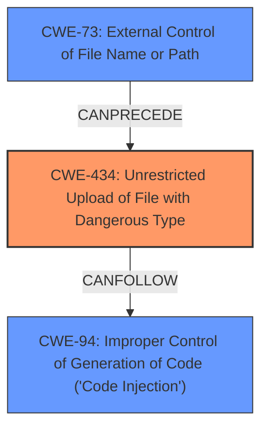

# Analysis Report for CVE-2025-4333

# Vulnerability Analysis Report: CVE-2025-4333

## Description

A vulnerability was found in feng_ha_ha/megagao ssm-erp and production_ssm up to 0.0.1. It has been classified as critical. This affects the function uploadFile of the file src/main/java/com/megagao/production/ssm/service/impl/FileServiceImpl.java. The manipulation of the argument uploadFile leads to **unrestricted upload**. It is possible to initiate the attack remotely. The exploit has been disclosed to the public and may be used. This product is distributed under two entirely different names.

## Vulnerability Description Key Phrases

- **Component:** src/main/java/com/megagao/production/ssm/service/impl/FileServiceImpl.java
- **Weakness:** unrestricted upload
- **Product:** feng_ha_ha/megagao ssm-erp, production_ssm
- **Version:** up to 0.0.1

## Analysis (with Relationship Data)

# Summary
| CWE ID | CWE Name | Confidence | CWE Abstraction Level | CWE Vulnerability Mapping Label | CWE-Vulnerability Mapping Notes |
|---|---|---|---|---|---|
| CWE-434 | Unrestricted Upload of File with Dangerous Type | 1.0 | Base | Allowed | Primary CWE. Root cause is the lack of restrictions on uploaded file types. |
| CWE-73 | External Control of File Name or Path | 0.7 | Base | Allowed | Secondary CWE. The filename can influence the path. |
| CWE-94 | Improper Control of Generation of Code ('Code Injection') | 0.6 | Base | Allowed-with-Review | Secondary CWE. The end result of uploading a malicious file is code execution. |

## Evidence and Confidence

*   **Confidence Score:** 0.8
*   **Evidence Strength:** HIGH

## Relationship Analysis
The primary weakness is CWE-434 [CWE-434: Unrestricted Upload of File with Dangerous Type], because the application does not restrict the types of files that can be uploaded. This can lead to CWE-94 [CWE-94: Improper Control of Generation of Code ('Code Injection')] because a malicious file (e.g., a JSP file) can be uploaded and then executed by the server. CWE-73 [CWE-73: External Control of File Name or Path] is related because the filename is not sanitized and can be used to influence the path where the file is stored.



## Vulnerability Chain
The vulnerability chain starts with the **unrestricted upload** of files (CWE-434). The lack of input validation on the filename allows for external control of the file name or path (CWE-73). This leads to the ability to upload and execute malicious code (CWE-94), resulting in Remote Code Execution (RCE).

## Summary of Analysis
The primary CWE is CWE-434 [CWE-434: Unrestricted Upload of File with Dangerous Type] because the root cause of the vulnerability is the lack of restrictions on the types of files that can be uploaded. The **Vulnerability Description** mentions "**unrestricted upload**" and the **CVE Reference Links Content Summary** states that the file upload function does not filter or process the filename, allowing the upload of script files.

CWE-73 [CWE-73: External Control of File Name or Path] is a secondary CWE because the filename can be manipulated to influence the path where the file is stored. The **CVE Reference Links Content Summary** mentions the lack of filename sanitization could potentially lead to path traversal vulnerabilities.

CWE-94 [CWE-94: Improper Control of Generation of Code ('Code Injection')] is also a secondary CWE, representing the potential impact of the vulnerability. The **CVE Reference Links Content Summary** states that successful exploitation allows for arbitrary code execution (RCE) on the server.

Other CWEs considered but not used:

*   CWE-22 [CWE-22: Improper Limitation of a Pathname to a Restricted Directory ('Path Traversal')] - While the lack of filename sanitization could potentially lead to path traversal, it is not explicitly stated in the vulnerability description.
*   CWE-79 [CWE-79: Improper Neutralization of Input During Web Page Generation ('Cross-site Scripting')] - This CWE is not relevant because the vulnerability does not involve the generation of web pages.
*   CWE-89 [CWE-89: Improper Neutralization of Special Elements used in an SQL Command ('SQL Injection')] - This CWE is not relevant because the vulnerability does not involve SQL commands.


## CWE Relationship Analysis

Current CWEs represent these abstraction levels: .


### Vulnerability Chain Analysis

**Chain starting from CWE-89:**
- 89 (Improper Neutralization of Special Elements used in an SQL Command ('SQL Injection')) - ROOT


**Chain starting from CWE-94:**
- 94 (Improper Control of Generation of Code ('Code Injection')) - ROOT


### CWE Relationship Diagram

```mermaid
graph TD
    classDef primary fill:#f96,stroke:#333,stroke-width:2px
    classDef secondary fill:#69f,stroke:#333
    classDef tertiary fill:#9e9,stroke:#333
```


*Report generated on 2025-07-14 23:51:10*
