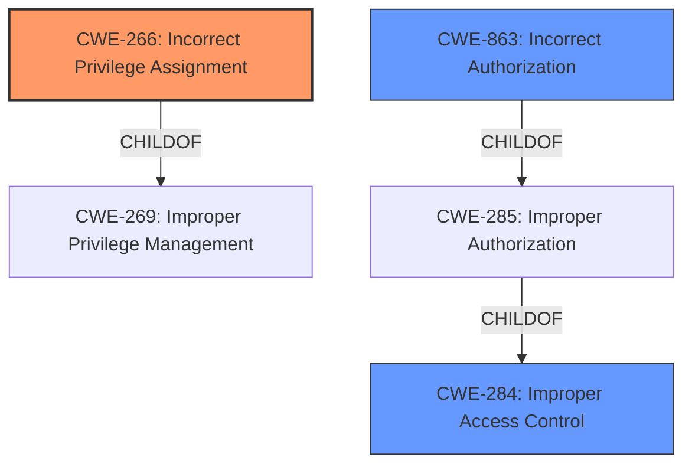

# Raw Analyzer Response for CVE-2025-4335

# Summary

| CWE ID | CWE Name | Confidence | CWE Abstraction Level | CWE Vulnerability Mapping Label | CWE-Vulnerability Mapping Notes |
|---|---|---|---|---|---|
| CWE-266 | Incorrect Privilege Assignment | 0.9 | Base | Allowed | Primary CWE: **Insufficient restrictions on user meta** lead to incorrect privilege assignment, enabling privilege escalation. |
| CWE-863 | Incorrect Authorization | 0.7 | Class | Allowed-with-Review | Secondary Candidate: Authorization check exists but is flawed, leading to privilege escalation. |
| CWE-284 | Improper Access Control | 0.6 | Pillar | Discouraged | Secondary Candidate: A broader category that applies if no specific privilege or permission issue can be identified. |

## Evidence and Confidence

*   **Confidence Score:** 0.8
*   **Evidence Strength:** HIGH

## Relationship Analysis
The primary relationship influencing the decision is the hierarchical relationship, specifically choosing a more specific **Base** level CWE over a general **Class** or **Pillar** level CWE when the evidence supports it. CWE-266 is a more precise classification than CWE-863 and CWE-284 because the vulnerability description clearly states that the issue stems from **incorrect privilege assignment** due to **insufficient restrictions on user meta**.

## Vulnerability Chain
The vulnerability chain starts with **insufficient restrictions on user meta**, leading to **incorrect privilege assignment**, and ultimately resulting in **privilege escalation**.

*   Root Cause: **Insufficient restrictions on user meta**
*   Weakness: **Incorrect Privilege Assignment (CWE-266)**
*   Impact: Privilege Escalation

## Summary of Analysis
The analysis is strongly based on the evidence provided in the vulnerability description, particularly the key phrase indicating **insufficient restrictions on user meta**. This directly translates to an **incorrect privilege assignment**, making CWE-266 the most appropriate primary classification. The retriever results and CWE specifications support this decision, with CWE-266 being a **Base** level CWE that accurately reflects the root cause. While CWE-863 and CWE-284 were considered, they are less specific and do not fully capture the essence of the vulnerability, which is the **incorrect assignment of privileges** rather than a general authorization or access control failure. The provided guidance on privileges vs. permissions further reinforces this decision, emphasizing the importance of identifying the root cause and choosing the most specific CWE.

Relevant CWE Information:

# Enhanced Context (25 CWEs)
The following CWEs were identified as potentially relevant to this vulnerability:

## CWE-266: Incorrect Privilege Assignment
**Abstraction Level**: Base
**Similarity Score**: 0.79
**Source**: dense

**Description**:
A product incorrectly assigns a privilege to a particular actor, creating an unintended sphere of control for that actor.

**Mapping Guidance**:
- Usage: Allowed
- Rationale: This CWE entry is at the Base level of abstraction, which is a preferred level of abstraction for mapping to the root causes of vulnerabilities.

## CWE-863: Incorrect Authorization
**Abstraction Level**: Class
**Similarity Score**: 1405.22
**Source**: sparse

**Description**:
The product performs an authorization check when an actor attempts to access a resource or perform an action, but it does not correctly perform the check.

**Mapping Guidance**:
- Usage: Allowed-with-Review
- Rationale: This CWE entry is a Class and might have Base-level children that would be more appropriate

## CWE-284: Improper Access Control
**Abstraction Level**: Pillar
**Similarity Score**: 1353.92
**Source**: sparse

**Description**:
The product does not perform or incorrectly performs an authorization check when an actor attempts to access a resource or perform an action.

**Mapping Guidance**:
- Usage: Discouraged
- Rationale: CWE-285 is high-level and lower-level CWEs can frequently be used instead. It is a level-1 Class (i.e., a child of a Pillar).

## Technical Explanation for Selected CWEs:

### CWE-266: Incorrect Privilege Assignment
- **How the vulnerability's details match the CWE's characteristics:** The vulnerability description explicitly states that the issue is due to **insufficient restrictions on user meta**, leading to the possibility of authenticated attackers elevating their privileges. This aligns with the CWE-266 description, which focuses on the **incorrect assignment of privileges** to an actor.
- **The security implications and potential impact:** The security implication is privilege escalation, where an attacker with low-level access can gain administrative control over the WordPress site.
- **Any parent-child relationships or chain patterns that influenced your mapping:** CWE-266 is a child of CWE-269 (**Improper Privilege Management**), which is a more general category. However, CWE-266 is more specific and accurately reflects the root cause.
- **Whether the weakness is primary or secondary in the vulnerability:** This is the primary weakness in the vulnerability.
- **How the official MITRE mapping guidance influenced your decision:** The MITRE mapping guidance explicitly encourages the use of CWE-266 when there is a misconfigured role.

### CWE-863: Incorrect Authorization
- **How the vulnerability's details match the CWE's characteristics:** An authorization check is present, but is **insufficient**.
- **The security implications and potential impact:** The security implication is privilege escalation, where an attacker with low-level access can gain administrative control over the WordPress site.
- **Any parent-child relationships or chain patterns that influenced your mapping:** CWE-863 is a child of CWE-285 (**Improper Authorization**)
- **Whether the weakness is primary or secondary in the vulnerability:** This is a secondary weakness in the vulnerability.
- **How the official MITRE mapping guidance influenced your decision:** The MITRE mapping guidance allows usage with review as the CWE entry is a Class and might have Base-level children that would be more appropriate

### CWE-284: Improper Access Control
- **How the vulnerability's details match the CWE's characteristics:** This CWE serves as a broad categorization when the specific issue cannot be pinpointed to a privilege or permission problem.
- **The security implications and potential impact:** The security implication is privilege escalation, where an attacker with low-level access can gain administrative control over the WordPress site.
- **Any parent-child relationships or chain patterns that influenced your mapping:** This is a general category.
- **Whether the weakness is primary or secondary in the vulnerability:** This is a secondary weakness in the vulnerability.
- **How the official MITRE mapping guidance influenced your decision:** The MITRE mapping guidance discourages use of this CWE.

## CWEs Considered But Not Used:

- CWE-269 (**Improper Privilege Management**): This CWE is too general and doesn't accurately reflect the specific root cause. The guidance discourages its use and encourages identifying more specific issues.
- CWE-285 (**Improper Authorization**): While related to authorization, the vulnerability stems from an incorrect assignment of privileges, making CWE-266 a better fit.
- CWE-862 (**Missing Authorization**): This CWE doesn't apply because the issue isn't a complete lack of authorization, but rather an **incorrect** assignment of privileges.
- CWE-306 (**Missing Authentication for Critical Function**): The vulnerability is about authorization after authentication has occurred.
- CWE-472 (**External Control of Assumed-Immutable Web Parameter**): This CWE is related to web parameter manipulation and doesn't directly apply to the **incorrect privilege assignment**.
- CWE-352 (**Cross-Site Request Forgery (CSRF)**): This vulnerability does not stem from a CSRF attack.