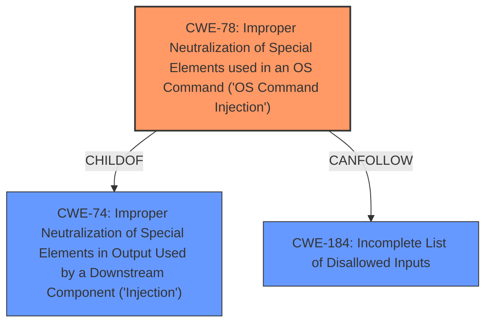

# Enhanced Analysis for CVE-2025-4341

# Summary
| CWE ID | CWE Name | Confidence | CWE Abstraction Level | CWE Vulnerability Mapping Label | CWE-Vulnerability Mapping Notes |
|---|---|---|---|---|---|
| CWE-78 | Improper Neutralization of Special Elements used in an OS Command ('OS Command Injection') | 1.0 | Base | Primary CWE | Allowed |

## Evidence and Confidence

*   **Confidence Score:** 1.0
*   **Evidence Strength:** HIGH

## Relationship Analysis
The primary CWE is CWE-78, which is a Base level CWE. CWE-78 is a child of CWE-74, which is a more general Class-level CWE for Injection. CWE-78 is also related to other CWEs through chain relationships, such as CANFOLLOW CWE-184 (Incomplete List of Disallowed Inputs). The selection of CWE-78 is based on the direct evidence of **command injection** and its specific context within the operating system command execution.



## Vulnerability Chain
The vulnerability chain starts with the **improper neutralization** of special elements within the request header, leading to **OS command injection**. The lack of proper input validation allows an attacker to inject arbitrary commands into the system. The chain is:
1.  **Improper Neutralization**: User-supplied input is not properly sanitized.
2.  **OS Command Injection**: The unsanitized input is used to construct an OS command.
3.  **Remote Code Execution**: The injected command is executed by the system.

## Summary of Analysis
The analysis is based on the vulnerability description, which explicitly states that the vulnerability is a **command injection** vulnerability. The vulnerability description key phrases also mention "command injection" as the weakness. The retriever results also lists CWE-78 as a possible match.

The selection of CWE-78 is at the optimal level of specificity because it directly addresses the root cause of the vulnerability, which is the **improper neutralization** of special elements used in an OS command. The confidence in this mapping is high due to the direct evidence from the vulnerability description.

CWE-77 was considered, as it is a Class-level CWE that is a parent of CWE-78. However, CWE-78 is more specific and accurately represents the nature of the vulnerability, which involves OS commands. Other CWEs like CWE-89 (SQL Injection) and CWE-79 (Cross-site Scripting) were not selected because the vulnerability is not related to SQL or web page generation.


## CWE Relationship Analysis

Current CWEs represent these abstraction levels: .


### Vulnerability Chain Analysis

**Chain starting from CWE-89:**
- 89 (Improper Neutralization of Special Elements used in an SQL Command ('SQL Injection')) - ROOT


**Chain starting from CWE-77:**
- 77 (Improper Neutralization of Special Elements used in a Command ('Command Injection')) - ROOT


### CWE Relationship Diagram

```mermaid
graph TD
    classDef primary fill:#f96,stroke:#333,stroke-width:2px
    classDef secondary fill:#69f,stroke:#333
    classDef tertiary fill:#9e9,stroke:#333
```