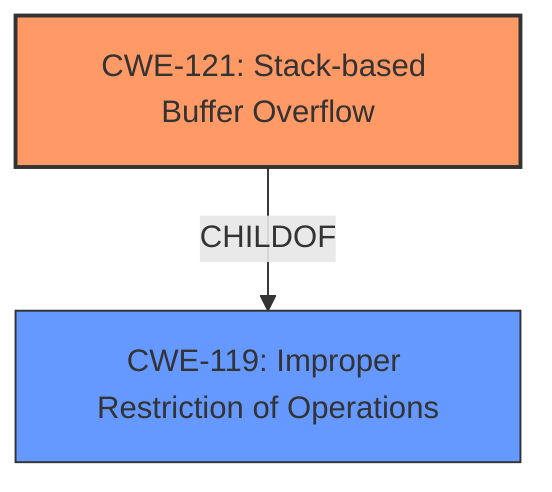

# Enhanced Analysis for CVE-2025-4354

# Summary
| CWE ID | CWE Name | Confidence | CWE Abstraction Level | CWE Vulnerability Mapping Label | CWE-Vulnerability Mapping Notes |
|---|---|---|---|---|---|
| CWE-121 | Stack-based Buffer Overflow | 1.0 | Variant | Primary | Allowed |
| CWE-119 | Improper Restriction of Operations within the Bounds of a Memory Buffer | 0.5 | Class | Secondary | Discouraged |

## Evidence and Confidence

*   **Confidence Score:** 1.0
*   **Evidence Strength:** HIGH

## Relationship Analysis
The primary relationship that influenced the decision was the child-of relationship between CWE-121 and CWE-119. CWE-121 is a variant of CWE-119, providing a more specific classification for stack-based buffer overflows. The description clearly indicates a stack-based buffer overflow, thus making CWE-121 the more appropriate choice.



## Vulnerability Chain
The vulnerability chain consists of a **stack-based buffer overflow** (CWE-121) due to **improper restriction of operations within the bounds of a memory buffer** (CWE-119). The root cause is the **buffer overflow** itself which can lead to arbitrary code execution or other security impacts.

## Summary of Analysis
The vulnerability description explicitly states "**stack-based buffer overflow**". This directly corresponds to CWE-121, which is a Variant-level CWE specifically designed for this type of vulnerability.

The Retriever Results also list CWE-121 as a candidate, further supporting this classification. While CWE-119 is also listed and is a parent of CWE-121, choosing CWE-121 provides a more specific and accurate representation of the vulnerability.

Relevant CWE Information:

# Enhanced Context (25 CWEs)
The following CWEs were identified as potentially relevant to this vulnerability:

## CWE-121: Stack-based Buffer Overflow
**Abstraction Level**: Variant
**Similarity Score**: 0.75
**Source**: dense

**Description**:
A stack-based buffer overflow condition is a condition where the buffer being overwritten is allocated on the stack (i.e., is a local variable or, rarely, a parameter to a function).

**Mapping Guidance**:
- Usage: Allowed
- Rationale: This CWE entry is at the Variant level of abstraction, which is a preferred level of abstraction for mapping to the root causes of vulnerabilities.

## CWE-119: Improper Restriction of Operations within the Bounds of a Memory Buffer
**Abstraction Level**: Class
**Similarity Score**: 0.71
**Source**: dense

**Description**:
The product performs operations on a memory buffer, but it reads from or writes to a memory location outside the buffer's intended boundary. This may result in read or write operations on unexpected memory locations that could be linked to other variables, data structures, or internal program data.

**Mapping Guidance**:
- Usage: Discouraged
- Rationale: CWE-119 is commonly misused in low-information vulnerability reports when lower-level CWEs could be used instead, or when more details about the vulnerability are available.

**CWE-121: Stack-based Buffer Overflow**
*   The vulnerability description explicitly states a **stack-based buffer overflow**.
*   CWE-121 is a Variant level CWE, offering a more specific classification than its parent CWE-119.
*   The description of CWE-121 perfectly aligns with the vulnerability: "A stack-based buffer overflow condition is a condition where the buffer being overwritten is allocated on the stack".
*   This leads to a high confidence in selecting CWE-121.

**CWE-119: Improper Restriction of Operations within the Bounds of a Memory Buffer**
*   CWE-119 is a Class-level CWE that describes a general case of memory buffer issues.
*   While technically applicable, it is less specific than CWE-121.
*   The MITRE mapping guidance discourages using CWE-119 when lower-level CWEs provide more detail.
*   Therefore, CWE-119 is considered a secondary candidate due to its generality.

Other CWEs Considered and Rejected:

*   CWE-190, CWE-89, CWE-79, CWE-674, CWE-125, CWE-122, CWE-78, CWE-128: These CWEs were considered based on retriever results, but they did not accurately reflect the specific nature of the **stack-based buffer overflow** vulnerability. They were either too general or related to different types of weaknesses.


## CWE Relationship Analysis

Current CWEs represent these abstraction levels: .


### Vulnerability Chain Analysis

**Chain starting from CWE-89:**
- 89 (Improper Neutralization of Special Elements used in an SQL Command ('SQL Injection')) - ROOT


**Chain starting from CWE-121:**
- 121 (Stack-based Buffer Overflow) - ROOT


### CWE Relationship Diagram

```mermaid
graph TD
    classDef primary fill:#f96,stroke:#333,stroke-width:2px
    classDef secondary fill:#69f,stroke:#333
    classDef tertiary fill:#9e9,stroke:#333
```