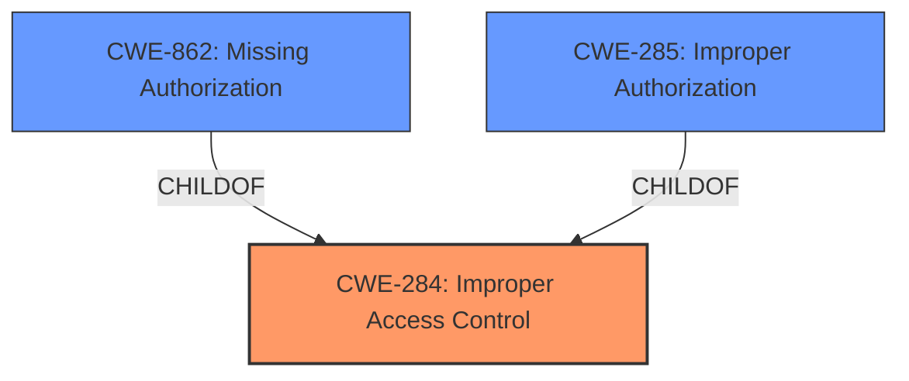

# Raw Analyzer Response for CVE-2025-43563

# Summary
| CWE ID | CWE Name | Confidence | CWE Abstraction Level | CWE Vulnerability Mapping Label | CWE-Vulnerability Mapping Notes |
|---|---|---|---|---|---|
| CWE-284 | Improper Access Control | 0.9 | Pillar | Primary | Allowed-with-Review |
| CWE-862 | Missing Authorization | 0.7 | Class | Secondary | Allowed-with-Review |
| CWE-285 | Improper Authorization | 0.6 | Class | Secondary | Discouraged |

## Evidence and Confidence

*   **Confidence Score:** 0.9
*   **Evidence Strength:** HIGH

## Relationship Analysis
The primary CWE is CWE-284, a high-level category. CWE-862 (Missing Authorization) and CWE-285 (Improper Authorization) are child CWEs of CWE-284, offering more specific classifications if the evidence supports them. The vulnerability description indicates an "Improper Access Control" issue leading to file system read, and the "CVE Reference Links Content Summary" confirms this as a root cause. While 'Improper Access Control' could point to either missing or incorrect authorization, the initial description doesn't give enough information to differentiate, making CWE-284 a reasonable starting point. Given the potential for more specific authorization-related issues, CWE-862 and CWE-285 are considered as secondary candidates.

## Vulnerability Chain
The vulnerability chain starts with **Improper Access Control** (CWE-284), which allows an attacker to perform arbitrary file system reads. The root cause is the **improper** control, leading to unauthorized data access.

## Summary of Analysis
Initially, the vulnerability was assessed as CWE-284 (Improper Access Control) based on the description and the "CVE Reference Links Content Summary" section. The key phrase "Improper Access Control" directly supports this classification. However, further analysis considered the possibility of more specific authorization-related CWEs like CWE-862 (Missing Authorization) and CWE-285 (Improper Authorization).

The decision to primarily classify this as CWE-284 stems from the high-level nature of the initial description. Although the "CVE Reference Links Content Summary" section also mentions "Improper Access Control," it doesn't provide specific details about whether authorization checks are missing or implemented incorrectly. If the description had explicitly stated that there were missing authorization checks, CWE-862 would have been a better primary choice. If the description stated that the authorization checks were flawed, CWE-285 or CWE-863 would have been more appropriate.

The graph relationships emphasize that CWE-284 is a parent to both CWE-862 and CWE-285. This influenced the decision to keep CWE-284 as the primary classification due to its broader scope. The chosen CWEs are at the optimal level of specificity given the available evidence.

Relevant CWE Information:

# Enhanced Context (25 CWEs)
The following CWEs were identified as potentially relevant to this vulnerability:

## CWE-807: Reliance on Untrusted Inputs in a Security Decision
**Abstraction Level**: Base
**Similarity Score**: 0.75
**Source**: dense

**Description**:
The product uses a protection mechanism that relies on the existence or values of an input, but the input can be modified by an untrusted actor in a way that bypasses the protection mechanism.
**Rationale for not selecting:** This CWE does not align closely with the vulnerability description, which focuses on access control issues rather than reliance on untrusted inputs.

## CWE-41: Improper Resolution of Path Equivalence
**Abstraction Level**: Base
**Similarity Score**: 0.74
**Source**: dense

**Description**:
The product is vulnerable to file system contents disclosure through path equivalence. Path equivalence involves the use of special characters in file and directory names. The associated manipulations are intended to generate multiple names for the same object.
**Rationale for not selecting:** While the vulnerability leads to file system read, this CWE is about path manipulation vulnerabilities, which are not explicitly mentioned in the description.

## CWE-274: Improper Handling of Insufficient Privileges
**Abstraction Level**: Base
**Similarity Score**: 0.74
**Source**: dense

**Description**:
The product does not handle or incorrectly handles when it has insufficient privileges to perform an operation, leading to resultant weaknesses.
**Rationale for not selecting:** The description focuses on access control, not the handling of insufficient privileges, so this CWE is not a good fit.

## CWE-280: Improper Handling of Insufficient Permissions or Privileges
**Abstraction Level**: Base
**Similarity Score**: 0.74
**Source**: dense

**Description**:
The product does not handle or incorrectly handles when it has insufficient privileges to access resources or functionality as specified by their permissions. This may cause it to follow unexpected code paths that may leave the product in an invalid state.
**Rationale for not selecting:** The description focuses on access control, not the handling of insufficient permissions or privileges, so this CWE is not a good fit.

## CWE-639: Authorization Bypass Through User-Controlled Key
**Abstraction Level**: Base
**Similarity Score**: 0.74
**Source**: dense

**Description**:
The system's authorization functionality does not prevent one user from gaining access to another user's data or record by modifying the key value identifying the data.
**Rationale for not selecting:** The vulnerability description does not mention user-controlled keys, making this CWE less relevant.

## CWE-668: Exposure of Resource to Wrong Sphere
**Abstraction Level**: Class
**Similarity Score**: 0.74
**Source**: dense

**Description**:
The product exposes a resource to the wrong control sphere, providing unintended actors with inappropriate access to the resource.
**Rationale for not selecting:** While the impact is resource exposure, the root cause is in access control, making CWE-284 a better fit.

## CWE-267: Privilege Defined With Unsafe Actions
**Abstraction Level**: Base
**Similarity Score**: 0.73
**Source**: dense

**Description**:
A particular privilege, role, capability, or right can be used to perform unsafe actions that were not intended, even when it is assigned to the correct entity.
**Rationale for not selecting:** The description focuses on access control, not unsafe actions performed with defined privileges, so this CWE is not a good fit.

## CWE-703: Improper Check or Handling of Exceptional Conditions
**Abstraction Level**: Pillar
**Similarity Score**: 0.73
**Source**: dense

**Description**:
The product does not properly anticipate or handle exceptional conditions that rarely occur during normal operation of the product.
**Rationale for not selecting:** This is a very high-level CWE and not specific to access control issues.

## CWE-472: External Control of Assumed-Immutable Web Parameter
**Abstraction Level**: Base
**Similarity Score**: 0.73
**Source**: dense

**Description**:
The web application does not sufficiently verify inputs that are assumed to be immutable but are actually externally controllable, such as hidden form fields.
**Rationale for not selecting:** The description doesn't mention external control of parameters, making this CWE irrelevant.

## CWE-345: Insufficient Verification of Data Authenticity
**Abstraction Level**: Class
**Similarity Score**: 0.73
**Source**: dense

**Description**:
The product does not sufficiently verify the origin or authenticity of data, in a way that causes it to accept invalid data.
**Rationale for not selecting:** This CWE relates to data authenticity, not access control, so it's not a suitable match.

## CWE-863: Incorrect Authorization
**Abstraction Level**: Class
**Similarity Score**: 1447.70
**Source**: sparse

**Description**:
The product performs an authorization check when an actor attempts to access a resource or perform an action, but it does not correctly perform the check.
**Rationale for not selecting:** Included as secondary candidate. A possibility if the checks were incorrectly performed, but there is no supporting evidence.

## CWE-285: Improper Authorization
**Abstraction Level**: Class
**Similarity Score**: 1438.00
**Source**: sparse

**Description**:
The product does not perform or incorrectly performs an authorization check when an actor attempts to access a resource or perform an action.
**Rationale for not selecting:** Included as secondary candidate. A possibility if the checks were improperly performed, but there is no supporting evidence.

## CWE-306: Missing Authentication for Critical Function
**Abstraction Level**: Base
**Similarity Score**: 1370.94
**Source**: sparse

**Description**:
The product does not perform any