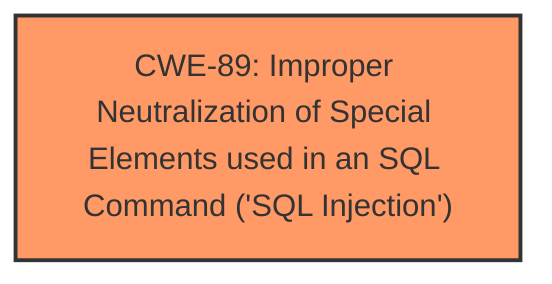

# Analysis Report for CVE-2025-4363

# Vulnerability Analysis Report: CVE-2025-4363

## Description

A vulnerability, which was classified as critical, has been found in itsourcecode Gym Management System 1.0. This issue affects some unknown processing of the file /ajax.php?action=end_membership. The manipulation of the argument rid leads to **sql injection**. The attack may be initiated remotely. The exploit has been disclosed to the public and may be used.

## Vulnerability Description Key Phrases

- **Weakness:** sql injection
- **Vector:** rid argument
- **Product:** Gym Management System
- **Version:** 1
- **Component:** /ajax.php?action=end_membership

## Analysis (with Relationship Data)

# Summary
| CWE ID | CWE Name | Confidence | CWE Abstraction Level | CWE Vulnerability Mapping Label | CWE-Vulnerability Mapping Notes |
|---|---|---|---|---|---|
| CWE-89 | Improper Neutralization of Special Elements used in an SQL Command ('SQL Injection') | 1.0 | Base | Allowed | Primary CWE. The manipulation of the `rid` argument leads directly to SQL injection due to **insufficient input validation**. |

## Evidence and Confidence

*   **Confidence Score:** 1.0
*   **Evidence Strength:** HIGH

## Relationship Analysis
The primary relationship influencing the decision is the direct correlation between **improper neutralization of special elements** and the resulting **SQL injection**.



## Vulnerability Chain
The vulnerability chain is straightforward:

1.  **Root Cause:** **Insufficient input validation** of the `rid` parameter.
2.  **Weakness:** CWE-89 Improper Neutralization of Special Elements used in an SQL Command ('SQL Injection').
3.  **Impact:** Unauthorized database access, sensitive data leakage, data tampering, comprehensive system control, and service interruption.

## Summary of Analysis
The analysis is based on the clear evidence of **SQL injection** stemming from the **improper handling** of the `rid` argument. The CVE description and reference link content summary both point to the **lack of input validation** as the root cause. The Retriever results also strongly suggest CWE-89 as the primary weakness.

The decision to select CWE-89 is based on the following evidence:

*   Vulnerability Description Key Phrases: "**weakness: sql injection**", "**vector: rid argument**"
*   CVE Reference Links Content Summary: "Insufficient user input validation of the 'rid' parameter in `/ajax.php?action=end_membership`. The parameter is directly used in SQL queries without proper cleaning or validation."
*   Retriever Results: CWE-89 has the highest similarity score (1.000).

CWEs considered but not used:

*   CWE-79 (Improper Neutralization of Input During Web Page Generation ('Cross-site Scripting')): While input neutralization is a general concern, the specific vulnerability is directly related to SQL injection, making CWE-89 a more precise fit.
*   CWE-117 (Improper Output Neutralization for Logs): Not relevant, as the vulnerability doesn't involve logging.
*   CWE-434 (Unrestricted Upload of File with Dangerous Type): Not relevant, as the vulnerability doesn't involve file uploads.
*   CWE-1336 (Improper Neutralization of Special Elements Used in a Template Engine): Not relevant as the vulnerability doesn't involve template engines.
*   CWE-93 (Improper Neutralization of CRLF Sequences ('CRLF Injection')): Not relevant, as the vulnerability doesn't involve CRLF sequences.


## CWE Relationship Analysis

Current CWEs represent these abstraction levels: .


### Vulnerability Chain Analysis

**Chain starting from CWE-89:**
- 89 (Improper Neutralization of Special Elements used in an SQL Command ('SQL Injection')) - ROOT


**Chain starting from CWE-93:**
- 93 (Improper Neutralization of CRLF Sequences ('CRLF Injection')) - ROOT


### CWE Relationship Diagram

```mermaid
graph TD
    classDef primary fill:#f96,stroke:#333,stroke-width:2px
    classDef secondary fill:#69f,stroke:#333
    classDef tertiary fill:#9e9,stroke:#333
```


*Report generated on 2025-07-15 00:01:01*
