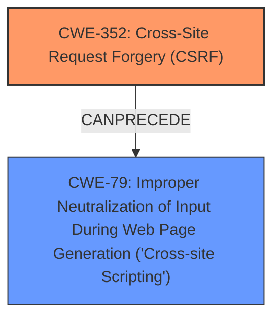

# Raw Analyzer Response for CVE-2025-43840

# Summary
| CWE ID | CWE Name | Confidence | CWE Abstraction Level | CWE Vulnerability Mapping Label | CWE-Vulnerability Mapping Notes |
|---|---|---|---|---|---|
| CWE-352 | Cross-Site Request Forgery (CSRF) | 1.0 | Compound | Primary | Allowed |
| CWE-79 | Improper Neutralization of Input During Web Page Generation ('Cross-site Scripting') | 0.75 | Base | Secondary | Allowed |

## Evidence and Confidence

*   **Confidence Score:** 0.85
*   **Evidence Strength:** MEDIUM

## Relationship Analysis
The primary weakness is CWE-352 [CWE-352: Cross-Site Request Forgery (CSRF)], which can lead to other vulnerabilities if successfully exploited. In this case, the CSRF leads to Stored XSS (CWE-79 [CWE-79: Improper Neutralization of Input During Web Page Generation ('Cross-site Scripting')]). CWE-352 is a compound weakness. There isn't a direct parent-child relationship between CWE-352 and CWE-79, but there is a chain relationship in that a lack of CSRF protection can lead to XSS. CWE-79 is at the Base level and is a more specific result of the **lack of CSRF protection**.

## Vulnerability Chain
The vulnerability chain starts with the **lack of CSRF protection** (CWE-352), which allows an attacker to forge requests on behalf of a user. This leads to the ability to inject malicious input that is then stored and executed as XSS (CWE-79) when other users view the content.

## Summary of Analysis
The initial assessment identified two potential CWEs: CWE-352 and CWE-79. The vulnerability description explicitly mentions both Cross-Site Request Forgery and Stored XSS. The **rootcause** is the **lack of CSRF protection**, which is CWE-352. The resulting Stored XSS is CWE-79. The retriever results also list CWE-79 with a high score.

The selection of CWE-352 as the primary weakness is based on the evidence from the "Vulnerability Description Key Phrases" which mentions "**rootcause: lack of CSRF protection**". The "CVE Reference Links Content Summary" also states "The WordPress CheckBot Plugin is vulnerable to Cross Site Request Forgery (CSRF)".

CWE-79 is selected as a secondary weakness because the CSRF leads to Stored XSS.

The selected CWEs are at the optimal level of specificity. CWE-352 is a Compound weakness, and CWE-79 is a Base weakness.

Relevant CWE Information:
- Vulnerability Description Key Phrases:
  - **rootcause:** **lack of CSRF protection**
  - **weakness:** **Cross-Site Request Forgery, stored XSS**
- CVE Reference Links Content Summary:
  - Root cause of vulnerability:
    The WordPress CheckBot Plugin is vulnerable to Cross Site Request Forgery (CSRF).
  - Weaknesses/vulnerabilities present:
    Cross Site Request Forgery (CSRF) vulnerability.