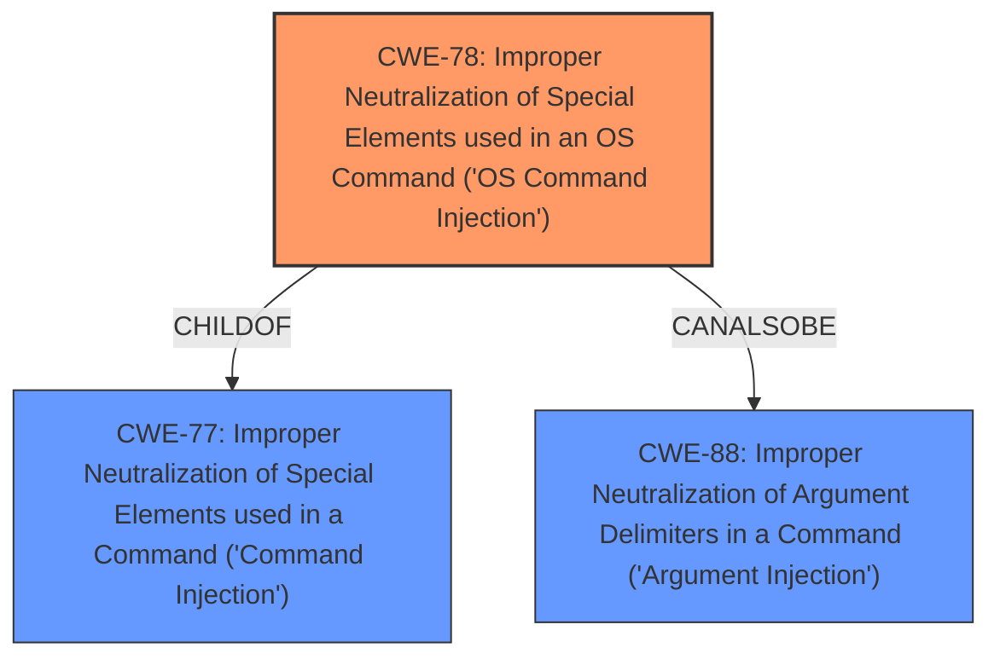

# Enhanced Analysis for CVE-2025-43858

# Summary

| CWE ID  | CWE Name                                                                               | Confidence | CWE Abstraction Level | CWE Vulnerability Mapping Label | CWE-Vulnerability Mapping Notes |
| :-------- | :------------------------------------------------------------------------------------- | :--------- | :---------------------- | :------------------------------ | :-------------------------------- |
| CWE-78  | Improper Neutralization of Special Elements used in an OS Command ('OS Command Injection') | 1.0        | Base                    | Primary                         | Allowed                           |
| CWE-88  | Improper Neutralization of Argument Delimiters in a Command ('Argument Injection')          | 0.7        | Base                    | Secondary                       | Allowed                           |

## Evidence and Confidence

*   **Confidence Score:** 0.9
*   **Evidence Strength:** HIGH

## Relationship Analysis

The primary CWE selected is CWE-78, which is a base-level CWE and a specific type of command injection. CWE-78 is a `CHILDOF` CWE-77 (Improper Neutralization of Special Elements used in a Command ('Command Injection')), which is a more general Class-level CWE. CWE-88 (Improper Neutralization of Argument Delimiters in a Command ('Argument Injection')) is a `CANALSOBE` CWE-78, indicating a peer relationship and an alternative, but potentially less precise, classification. The choice of CWE-78 reflects the OS command context, making it more accurate than CWE-77.



## Vulnerability Chain

The vulnerability chain starts with the **unsafe conversion of arguments** within YoutubeDLSharp when starting `yt-dlp` on Windows, leading to **command injection** (CWE-78). The initial flaw allows attackers to inject malicious commands via user-controlled input, which are then executed by the system shell. The chain progresses from initial input to command execution, making CWE-78 a direct consequence of the improper neutralization.

## Summary of Analysis

The primary assessment is based on the provided evidence, specifically the "**unsafe conversion of arguments**" that leads to "**command injection**." The CVE Reference Links Content Summary confirms this by stating, "Unsanitized user input is directly incorporated into a command executed by the system shell (cmd.exe)." This strongly supports the selection of CWE-78 as the primary weakness because the root cause is the **improper neutralization** of special elements used in an OS command.

The graph relationships influenced the decision to choose CWE-78 over CWE-77 because CWE-78 is a more specific instance of command injection related to OS commands. The retriever scores also support this, with CWE-77 and CWE-78 being top candidates.

The selected CWEs are at the optimal level of specificity because CWE-78 accurately describes the nature of the vulnerability, while CWE-88 provides additional context regarding argument delimiters, which is a contributing factor.

Relevant CWE Information:

# Enhanced Context (25 CWEs)

## CWE-116: Improper Encoding or Escaping of Output
**Abstraction Level**: Class
**Similarity Score**: 0.74
**Source**: dense

**Description**:
The product prepares a structured message for communication with another component, but encoding or escaping of the data is either missing or done incorrectly. As a result, the intended structure of the message is not preserved.

**Mapping Guidance**:
- Usage: Allowed-with-Review
- Rationale: This CWE entry is a Class and might have Base-level children that would be more appropriate

*Not Used:* This CWE is related to output encoding, but the vulnerability is due to improper input handling and neutralization of special elements in a command, not output encoding issues.

## CWE-88: Improper Neutralization of Argument Delimiters in a Command ('Argument Injection')
**Abstraction Level**: Base
**Similarity Score**: 0.73
**Source**: dense

**Description**:
The product constructs a string for a command to be executed by a separate component
in another control sphere, but it does not properly delimit the
intended arguments, options, or switches within that command string.

**Mapping Guidance**:
- Usage: Allowed
- Rationale: This CWE entry is at the Base level of abstraction, which is a preferred level of abstraction for mapping to the root causes of vulnerabilities.

*Used:* This CWE is relevant because the vulnerability involves the improper handling of arguments passed to the `yt-dlp` command. The **unsafe conversion of arguments** can lead to delimiters being misinterpreted, resulting in command injection.

## CWE-59: Improper Link Resolution Before File Access ('Link Following')
**Abstraction Level**: Base
**Similarity Score**: 0.72
**Source**: dense

**Description**:
The product attempts to access a file based on the filename, but it does not properly prevent that filename from identifying a link or shortcut that resolves to an unintended resource.

**Mapping Guidance**:
- Usage: Allowed
- Rationale: This CWE entry is at the Base level of abstraction, which is a preferred level of abstraction for mapping to the root causes of vulnerabilities.

*Not Used:* This CWE is not relevant, as the vulnerability does not involve improper link resolution.

## CWE-138: Improper Neutralization of Special Elements
**Abstraction Level**: Class
**Similarity Score**: 0.72
**Source**: dense

**Description**:
The product receives input from an upstream component, but it does not neutralize or incorrectly neutralizes special elements that could be interpreted as control elements or syntactic markers when they are sent to a downstream component.

**Mapping Guidance**:
- Usage: Discouraged
- Rationale: This CWE entry is a level-1 Class (i.e., a child of a Pillar). It might have lower-level children that would be more appropriate

*Not Used:* This CWE is a high-level class and more specific CWEs like CWE-78 are more appropriate.

## CWE-451: User Interface (UI) Misrepresentation of Critical Information
**Abstraction Level**: Class
**Similarity Score**: 0.72
**Source**: dense

**Description**:
The user interface (UI) does not properly represent critical information to the user, allowing the information - or its source - to be obscured or spoofed. This is often a component in phishing attacks.

**Mapping Guidance**:
- Usage: Allowed-with-Review
- Rationale: This CWE entry is a Class and might have Base-level children that would be more appropriate

*Not Used:* This vulnerability does not involve UI misrepresentation.

## CWE-184: Incomplete List of Disallowed Inputs
**Abstraction Level**: Base
**Similarity Score**: 0.72
**Source**: dense

**Description**:
The product implements a protection mechanism that relies on a list of inputs (or properties of inputs) that are not allowed by policy or otherwise require other action to neutralize before additional processing takes place, but the list is incomplete.

**Mapping Guidance**:
- Usage: Allowed
- Rationale: This CWE entry is at the Base level of abstraction, which is a preferred level of abstraction for mapping to the root causes of vulnerabilities.

*Not Used:* While input validation is a factor, there isn't an explicit mechanism based on a list of disallowed inputs, making this less applicable than command injection CWEs.

## CWE-74: Improper Neutralization of Special Elements in Output Used by a Downstream Component ('Injection')
**Abstraction Level**: Class
**Similarity Score**: 0.71
**Source**: dense

**Description**:
The product constructs all or part of a command, data structure, or record using externally-influenced input from an upstream component, but it does not neutralize or incorrectly neutralizes special elements that could modify how it is parsed or interpreted when it is sent to a downstream component.

**Mapping Guidance**:
- Usage: Discouraged
- Rationale: CWE-74 is high-level and often misused when lower-level weaknesses are more appropriate.

*Not Used:* This is a high-level class, and more specific CWEs such as CWE-78 are a better fit.

## CWE-125: Out-of-bounds Read
**Abstraction Level**: Base
**Similarity Score**: 0.71
**Source**: dense

**Description**:
The product reads data past the end, or before the beginning, of the intended buffer.

**Mapping Guidance**:
- Usage: Allowed
- Rationale: This CWE entry is at the Base level of abstraction, which is a preferred level of abstraction for mapping to the root causes of vulnerabilities.

*Not Used:* This vulnerability does not involve out-of-bounds reads.

## CWE-427: Uncontrolled Search Path Element
**Abstraction Level**: Base
**Similarity Score**: 0.71


## CWE Relationship Analysis

Current CWEs represent these abstraction levels: .


### Vulnerability Chain Analysis

**Chain starting from CWE-427:**
- 427 (Uncontrolled Search Path Element) - ROOT


**Chain starting from CWE-116:**
- 116 (Improper Encoding or Escaping of Output) - ROOT


### CWE Relationship Diagram

```mermaid
graph TD
    classDef primary fill:#f96,stroke:#333,stroke-width:2px
    classDef secondary fill:#69f,stroke:#333
    classDef tertiary fill:#9e9,stroke:#333
```