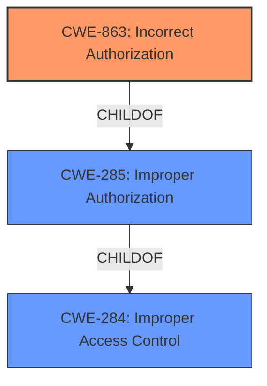

# Raw Analyzer Response for CVE-2025-43862

# Summary
| CWE ID | CWE Name | Confidence | CWE Abstraction Level | CWE Vulnerability Mapping Label | CWE-Vulnerability Mapping Notes |
|---|---|---|---|---|---|
| CWE-863 | Incorrect Authorization | 1.0 | Class | Primary | Allowed-with-Review |
| CWE-285 | Improper Authorization | 0.8 | Class | Secondary | Discouraged |

## Evidence and Confidence

*   **Confidence Score:** 0.9
*   **Evidence Strength:** HIGH

## Relationship Analysis
The primary CWE selected is CWE-863, **Incorrect Authorization**, which is a Class-level CWE. It was chosen over its parent CWEs like CWE-285 (**Improper Authorization**) and CWE-284 (**Improper Access Control**) because it specifically describes a scenario where an authorization check is performed, but it's done incorrectly. CWE-285 is a more general term, and CWE-284 is even broader, encompassing both authentication and authorization issues where the root cause is unclear. The hierarchical relationship guided the selection towards the most specific applicable CWE.

## Vulnerability Chain
The vulnerability chain starts with an **access control flaw**, leading to **incorrect authorization**, and finally resulting in unauthorized access and changes to APPs.

*   **Root Cause:** **access control flaw** leading to **incorrect authorization** (CWE-863)
*   **Impact:** unauthorized access and changes on APPSs

## Summary of Analysis
The initial assessment, based on the provided evidence, indicates an authorization issue. The vulnerability description highlights that "a normal user is able to **access and modify APP orchestration**, even though the web UI of APP orchestration is not presented for a normal user". This points to a scenario where the application performs an authorization check, but it's not correctly implemented, allowing unauthorized access.

The retriever results also support this assessment, with CWE-863 (**Incorrect Authorization**) being the top candidate. The retriever scores, combined with the vulnerability description, solidify the choice of CWE-863 as the primary CWE.

The guidance also points to either CWE-862 or CWE-863. Since the description states the users can **access** the orchestration, it is likely the authorization check is in place but is flawed, therefore CWE-863 is chosen.

The selected CWE is at the optimal level of specificity, as it accurately represents the nature of the vulnerability. CWE-863 describes a scenario where an authorization check exists but is implemented incorrectly. This level of detail is more precise than the broader CWE-285 (**Improper Authorization**), which simply indicates a general authorization failure, or CWE-284 (**Improper Access Control**), which is an even higher-level classification.

The vulnerability description key phrases emphasize the "**access control flaw**" that allows normal users to "**access and modify APP orchestration**," leading to "**unauthorized access and changes on APPSs**." These phrases directly support the identification of CWE-863 as the most appropriate classification, with high confidence. The CVE Reference Links Content Summary mentions "CWE-284: Improper Access Control". But the report indicates the "**API Key Theft and Abuse**" and "**Application Misuse and Data Theft**" are caused by the "**insufficient access controls**" and "**lack of proper role-based access control (RBAC)**"

Relevant CWE Information:

**CWE-863: Incorrect Authorization**

The product performs an authorization check when an actor attempts to access a resource or perform an action, but it does not correctly perform the check. This aligns with the vulnerability description, where a normal user can access and modify APP orchestration despite not having the necessary privileges.

**CWE-285: Improper Authorization**

The product does not perform or incorrectly performs an authorization check when an actor attempts to access a resource or perform an action. This is a more general class of authorization issues. It was considered as a secondary candidate because it is a parent of CWE-863 and represents a higher-level abstraction of the same type of weakness.