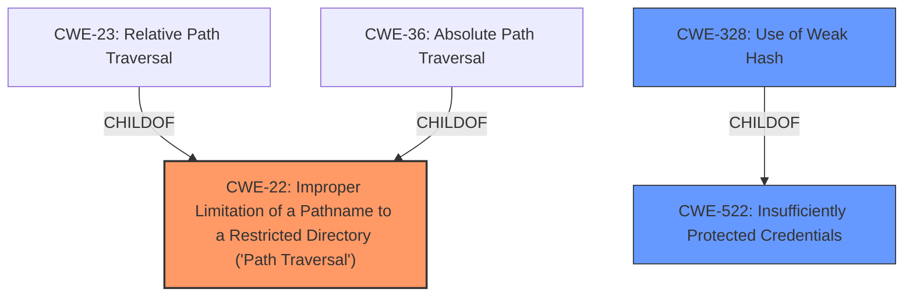

# Analysis Report for CVE-2025-43928

# Vulnerability Analysis Report: CVE-2025-43928

## Description

In Infodraw Media Relay Service (MRS) 7.1.0.0, the MRS web server (on port 12654) allows reading arbitrary files via **../ directory traversal** in the username field. Reading ServerParameters.xml may reveal administrator credentials in cleartext or with MD5 hashing.

## Vulnerability Description Key Phrases

- **Component:** MRS web server
- **Rootcause:** ../ directory traversal
- **Product:** Infodraw Media Relay Service
- **Impact:** ['arbitrary file read', 'reading arbitrary files']
- **Version:** MRS 7.1.0.0

## Analysis (with Relationship Data)

# Summary
| CWE ID | CWE Name | Confidence | CWE Abstraction Level | CWE Vulnerability Mapping Label | CWE-Vulnerability Mapping Notes |
|---|---|---|---|---|---|
| CWE-22 | Improper Limitation of a Pathname to a Restricted Directory ('Path Traversal') | 1.0 | Base | Allowed | Primary CWE: The vulnerability is a path traversal issue due to **improper limitation of pathname**. |
| CWE-522 | Insufficiently Protected Credentials | 0.7 | Class | Allowed-with-Review | Secondary Candidate: The vulnerability involves potentially revealing administrator credentials, which are stored with weak hashing, thus leading to **insufficiently protected credentials**. |
| CWE-328 | Use of Weak Hash | 0.6 | Base | Allowed | Secondary Candidate: The credentials found are using MD5 hashing which is considered a **weak hash**. |

## Evidence and Confidence

*   **Confidence Score:** 0.8
*   **Evidence Strength:** HIGH

## Relationship Analysis
The primary weakness is CWE-22, which is a base-level CWE describing improper limitation of a pathname to a restricted directory. The vulnerability description and the CVE reference summary both explicitly mention the presence of a path traversal (**../ directory traversal**) vulnerability. CWE-22 has parent-child relationships with CWE-23 (Relative Path Traversal) and CWE-36 (Absolute Path Traversal). Since the specific type of path traversal isn't specified, CWE-22 is more appropriate than either of its children. CWE-522 and CWE-328 are included as secondary candidate to cover the weak hashing of credentials.



## Vulnerability Chain
The vulnerability chain starts with the **improper input validation** of the username field, allowing for path traversal (CWE-22). This leads to the ability to read arbitrary files, including the ServerParameters.xml file. Reading this file exposes **insufficiently protected credentials** (CWE-522) due to the use of **weak hashing algorithms** (CWE-328) like MD5.

## Summary of Analysis
The primary assessment is strongly supported by the vulnerability description and the CVE reference summary, both of which clearly indicate a path traversal vulnerability. The selection of CWE-22 is based on the presence of **../ directory traversal** in the username field, which allows reading arbitrary files. The relationship analysis confirms that CWE-22 is the most appropriate base-level CWE for this type of vulnerability. The secondary CWEs (CWE-522 and CWE-328) are included to capture the additional weakness of exposing credentials stored with weak hashing.

The evidence from the Vulnerability Description is:
"In Infodraw Media Relay Service (MRS) 7.1.0.0, the MRS web server (on port 12654) allows reading arbitrary files via **../ directory traversal** in the username field. Reading ServerParameters.xml may reveal administrator credentials in cleartext or with MD5 hashing."

The evidence from the CVE Reference Links Content Summary is:
"*   **Path Traversal (Directory Traversal):** The primary vulnerability.
*   **Insufficient Input Validation:** The software does not properly validate the username input, allowing "../../../../" sequences.
*   **Insecure Password Handling:** MD5 hashing is used without salting, making password cracking easier."

CWEs Considered but Not Used:

*   CWE-23 (Relative Path Traversal) and CWE-36 (Absolute Path Traversal): While related to CWE-22, the description doesn't specify whether the traversal is relative or absolute, making the parent CWE-22 more suitable.
*   CWE-73 (External Control of File Name or Path): This CWE is too broad. CWE-22 is a more specific type of external control.
*   CWE-916 (Use of Password Hash With Insufficient Computational Effort): Similar to CWE-328 but focuses on the computational effort. CWE-328 more directly describes the use of a weak hash algorithm.
*   CWE-256 (Plaintext Storage of a Password): The description mentions MD5 hashing, so the passwords are not stored in plaintext.
*   CWE-611 (Improper Restriction of XML External Entity Reference): This CWE is related to XML, but the primary issue isn't related to XML entities.


## CWE Relationship Analysis

Current CWEs represent these abstraction levels: .


### Vulnerability Chain Analysis

**Chain starting from CWE-611:**
- 611 (Improper Restriction of XML External Entity Reference) - ROOT


**Chain starting from CWE-22:**
- 22 (Improper Limitation of a Pathname to a Restricted Directory ('Path Traversal')) - ROOT


### CWE Relationship Diagram

```mermaid
graph TD
    classDef primary fill:#f96,stroke:#333,stroke-width:2px
    classDef secondary fill:#69f,stroke:#333
    classDef tertiary fill:#9e9,stroke:#333
```


*Report generated on 2025-07-15 00:08:28*
