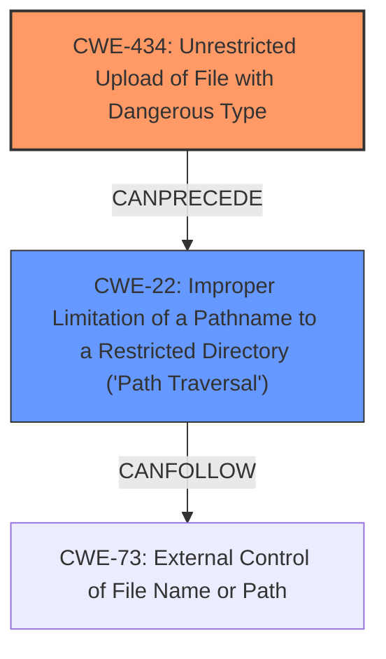

# Raw Analyzer Response for CVE-2025-43946

# Summary
| CWE ID | CWE Name | Confidence | CWE Abstraction Level | CWE Vulnerability Mapping Label | CWE-Vulnerability Mapping Notes |
|---|---|---|---|---|---|
| CWE-434 | Unrestricted Upload of File with Dangerous Type | 1.0 | Base | Allowed | Primary CWE: The vulnerability description explicitly states "**Unrestricted File Upload**" as the root cause.|
| CWE-22 | Improper Limitation of a Pathname to a Restricted Directory ('Path Traversal') | 1.0 | Base | Allowed | Secondary CWE: The vulnerability description also explicitly mentions "**Path Traversal**". |

## Evidence and Confidence

*   **Confidence Score:** 1.0
*   **Evidence Strength:** HIGH

## Relationship Analysis
The vulnerability involves two distinct weaknesses: **Unrestricted File Upload** (CWE-434) and **Path Traversal** (CWE-22). The **Unrestricted File Upload** allows an attacker to upload a file, and the **Path Traversal** allows the attacker to place the file in an arbitrary location, leading to Remote Code Execution.

## Vulnerability Chain
1.  The **Unrestricted File Upload** (CWE-434) acts as the initial point of entry.
2.  The **Path Traversal** (CWE-22) vulnerability allows placing the uploaded file in a location that leads to execution.
3.  This leads to Remote Code Execution.

## Summary of Analysis
The vulnerability description clearly states "**Unrestricted File Upload**" and "**Path Traversal**" as the root cause and weakness respectively, directly mapping to CWE-434 and CWE-22. The Retriever results also support these mappings, with high scores for both CWEs. The relationship analysis shows that CWE-434 can precede CWE-22, indicating that the file upload sets the stage for the path traversal. Both CWEs are at the Base level of abstraction, providing sufficient specificity.

Other CWEs Considered but Not Used:

*   CWE-73 (External Control of File Name or Path): While related to path traversal, CWE-22 is more specific in that it describes the improper limitation of a pathname to a restricted directory. Since the description mentions path traversal explicitly, CWE-22 is a better fit.
*   CWE-23 (Relative Path Traversal), CWE-25 (Path Traversal: '/../filedir'), CWE-28 (Path Traversal: '..\filedir'): These are variants of CWE-22, but the description does not provide enough information to determine the specific type of path traversal. Therefore, the base CWE-22 is more appropriate.
*   CWE-184 (Incomplete List of Disallowed Inputs) and CWE-183 (Permissive List of Allowed Inputs): These CWEs relate to the validation of inputs, but the core issue is the lack of restriction on file uploads and the improper handling of pathnames, making CWE-434 and CWE-22 more directly relevant.
Relevant CWE Information: