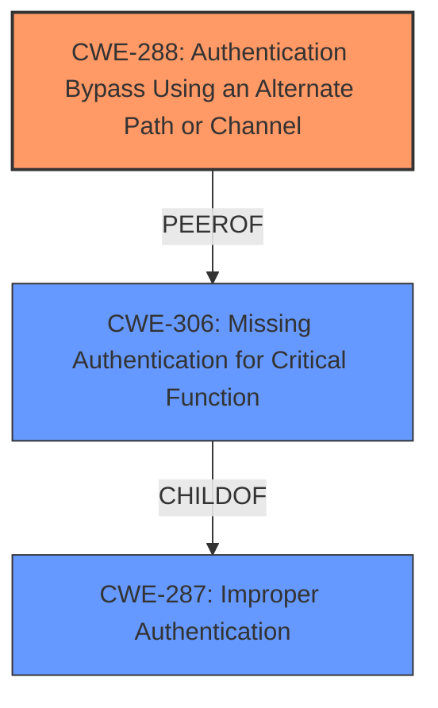

# Raw Analyzer Response for CVE-2025-44083

# Summary
| CWE ID | CWE Name | Confidence | CWE Abstraction Level | CWE Vulnerability Mapping Label | CWE-Vulnerability Mapping Notes |
|---|---|---|---|---|---|
| CWE-288 | Authentication Bypass Using an Alternate Path or Channel | 0.9 | Base | Allowed | Primary CWE |
| CWE-306 | Missing Authentication for Critical Function | 0.6 | Base | Allowed | Secondary Candidate |
| CWE-287 | Improper Authentication | 0.5 | Class | Discouraged | Secondary Candidate |

## Evidence and Confidence

*   **Confidence Score:** 0.9
*   **Evidence Strength:** MEDIUM

## Relationship Analysis
The primary CWE selected is CWE-288 (Authentication Bypass Using an Alternate Path or Channel), a Base level CWE. CWE-288 is related to CWE-306 (Missing Authentication for Critical Function) and CWE-287 (Improper Authentication). CWE-306 is a child of CWE-287, which suggests that a missing authentication can be seen as a specific instance of improper authentication. However, since the vulnerability description specifically mentions bypassing authentication, CWE-288 is chosen because it describes the bypass mechanism itself.

## Vulnerability Chain
The vulnerability chain starts with the existence of an alternate path or channel that lacks proper authentication checks, leading to the ability to bypass administrator login authentication.
  - **Root Cause:** CWE-288 Authentication Bypass Using an Alternate Path or Channel.
  - **Impact:** bypass administrator login authentication.

## Summary of Analysis
The analysis is based on the provided vulnerability description indicating a bypass of administrator login authentication. The Retriever Results suggest CWE-288 as a relevant candidate, supported by the "Authentication vs Authorization vs Access Control Guidance". The vulnerability description key phrase "bypass administrator login authentication" aligns well with the description of CWE-288, which involves bypassing authentication using an alternate path or channel. While other CWEs like CWE-306 (Missing Authentication for Critical Function) and CWE-287 (Improper Authentication) are also related to authentication issues, CWE-288 is more specific to the bypass mechanism described in the vulnerability. The choice of CWE-288 is at the Base level of abstraction, which is appropriate for mapping the root cause of the vulnerability.

Relevant CWE Information:

# Enhanced Context (25 CWEs)
The following CWEs were identified as potentially relevant to this vulnerability:

## CWE-288: Authentication Bypass Using an Alternate Path or Channel
**Abstraction Level**: Base
**Similarity Score**: 0.76
**Source**: dense

**Description**:
The product requires authentication, but the product has an alternate path or channel that does not require authentication.

**Mapping Guidance**:
- Usage: Allowed
- Rationale: This CWE entry is at the Base level of abstraction, which is a preferred level of abstraction for mapping to the root causes of vulnerabilities.

**CWE-306**: Missing Authentication for Critical Function
This CWE was considered because the vulnerability involves authentication. However, the description indicates that the authentication is being bypassed rather than completely missing, making CWE-288 a better fit.

**CWE-287**: Improper Authentication
This CWE was considered because it is a general authentication issue. However, the description indicates that there is a specific bypass mechanism, making CWE-288 a better fit.