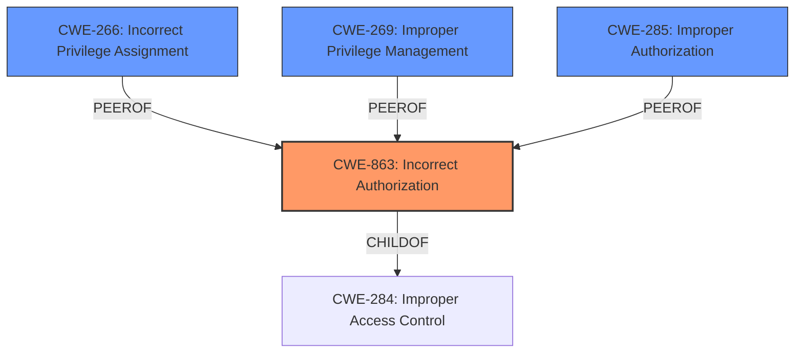

# Enhanced Analysis for CVE-2025-4433

# Summary
| CWE ID  | CWE Name                                            | Confidence | CWE Abstraction Level | CWE Vulnerability Mapping Label | CWE-Vulnerability Mapping Notes |
| :-------- | :-------------------------------------------------- | :--------- | :-------------------- | :------------------------------ | :------------------------------ |
| CWE-863   | Incorrect Authorization                             | 1          | Class                 | Allowed-with-Review             | Primary CWE                     |
| CWE-266   | Incorrect Privilege Assignment                      | 0.6        | Base                  | Allowed                         | Secondary Candidate             |
| CWE-269   | Improper Privilege Management                       | 0.5        | Class                 | Discouraged                     | Secondary Candidate             |
| CWE-285   | Improper Authorization                              | 0.5        | Class                 | Discouraged                     | Secondary Candidate             |

## Evidence and Confidence

*   **Confidence Score:** 0.8
*   **Evidence Strength:** HIGH

## Relationship Analysis

The primary relationship considered was the hierarchical structure of CWEs related to authorization and access control. CWE-863 (Incorrect Authorization) is a child of CWE-284 (Improper Access Control) and is more specific. Several peer relationships exist between authorization-related CWEs (e.g., CWE-862, CWE-285). The selection of CWE-863 reflects the understanding that the authorization check is present but flawed, as opposed to completely missing. The class level of CWE-863 is appropriate, given the available information. The relationship between privilege and authorization is considered in selecting the secondary candidate CWE-266.



## Vulnerability Chain

The vulnerability chain starts with **improper access control**, leading to privilege escalation:

1.  **Improper access control**: A non-administrative user with "User Management" and "User Group Management" permissions exists.
2.  **Incorrect Authorization (CWE-863)**: The system incorrectly authorizes this user to add users to groups with administrative privileges.
3.  **Privilege escalation**: The attacker successfully adds users to groups with administrative privileges, gaining administrative privileges.

## Summary of Analysis

The initial analysis considered several CWEs, especially those related to authorization and privilege management. The guidance on authentication vs. authorization helped to narrow down the selection to authorization-related CWEs.

The primary selection of CWE-863 is based on the vulnerability description indicating an **improper access control**, specifically that a non-admin user is able to add users to admin groups. This suggests the presence of an authorization check that is not functioning correctly. The retriever results also listed CWE-863 as the top candidate.

The secondary candidates like CWE-266, CWE-269, and CWE-285 are also considered. CWE-266 (Incorrect Privilege Assignment) could be a contributing factor, as the group to which the user is being added has incorrect privileges. CWE-269 and CWE-285, although related, are less specific than CWE-863 in this context.

The final decision is to primarily map to CWE-863, as it best captures the **incorrect authorization** mechanism that allows privilege escalation.

Relevant CWE Information:

*   **CWE-863: Incorrect Authorization**
    *   **Description**: The product performs an authorization check when an actor attempts to access a resource or perform an action, but it does not correctly perform the check.
    *   The vulnerability description explicitly states **"Improper access control"** which aligns with the description of CWE-863 which means the authorization check exists but is flawed.
*   **CWE-266: Incorrect Privilege Assignment**
    *   **Description**: A product incorrectly assigns a privilege to a particular actor, creating an unintended sphere of control for that actor.
    *   A non-administrative user with both User Management and User Group Management permissions to perform privilege escalation by adding users to groups with administrative privileges.
    *   This is not the root cause but can be a contributing factor.
*   **CWE-269: Improper Privilege Management**
    *   **Description**: The product does not properly assign, modify, track, or check privileges for an actor, creating an unintended sphere of control for that actor.
    *   This is a higher level CWE than CWE-863.
*   **CWE-285: Improper Authorization**
    *   **Description**: The product does not perform or incorrectly performs an authorization check when an actor attempts to access a resource or perform an action.
    *   This is a higher level CWE than CWE-863.

# Complete CWE Specifications

CWE-863: Incorrect Authorization
CWE-285: Improper Authorization
CWE-269: Improper Privilege Management
CWE-286: Incorrect User Management
CWE-284: Improper Access Control
CWE-732: Incorrect Permission Assignment for Critical Resource
CWE-862: Missing Authorization
CWE-256: Plaintext Storage of a Password
CWE-842: Placement of User into Incorrect Group
CWE-250: Execution with Unnecessary Privileges


## CWE Relationship Analysis

Current CWEs represent these abstraction levels: .


### Vulnerability Chain Analysis

**Chain starting from CWE-863:**
- 863 (Incorrect Authorization) - ROOT


**Chain starting from CWE-732:**
- 732 (Incorrect Permission Assignment for Critical Resource) - ROOT


### CWE Relationship Diagram

```mermaid
graph TD
    classDef primary fill:#f96,stroke:#333,stroke-width:2px
    classDef secondary fill:#69f,stroke:#333
    classDef tertiary fill:#9e9,stroke:#333
```