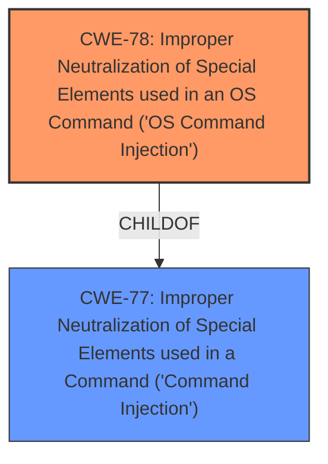

# Analysis for CVE-2025-4443

# Summary
| CWE ID | CWE Name | Confidence | CWE Abstraction Level | CWE Vulnerability Mapping Label | CWE-Vulnerability Mapping Notes |
|---|---|---|---|---|---|
| CWE-78 | Improper Neutralization of Special Elements used in an OS Command ('OS Command Injection') | 1.0 | Base | Primary CWE | Allowed |
| CWE-77 | Improper Neutralization of Special Elements used in a Command ('Command Injection') | 0.7 | Class | Secondary Candidate | Allowed-with-Review |

## Evidence and Confidence

*   **Confidence Score:** 1.0
*   **Evidence Strength:** HIGH

## Relationship Analysis
The primary relationship is that CWE-78 is a child of CWE-77. While CWE-77 is a more general case of command injection, the description explicitly mentions OS command injection. Therefore, the more specific CWE-78 is chosen.

## Vulnerability Chain
The vulnerability chain is: **Improper Neutralization of Special Elements used in an OS Command ('OS Command Injection')** (CWE-78) -> Execution of arbitrary OS commands.

## Summary of Analysis
The vulnerability description clearly states that the manipulation of the `sysCmd` argument leads to **command injection**. The "Retriever Results" list both CWE-77 and CWE-78 as top candidates. CWE-78 is a "Base" level weakness, while CWE-77 is a "Class" level weakness. Given that the description specifies that the **command injection** occurs at the OS level, CWE-78 is a more precise and appropriate mapping. The description explicitly mentions command injection and the vulnerable argument. No other CWEs are strongly indicated.

Relevant CWE Information:

# Enhanced Context (25 CWEs)
The following CWEs were identified as potentially relevant to this vulnerability:

## CWE-78: Improper Neutralization of Special Elements used in an OS Command ('OS Command Injection')
**Abstraction Level**: Base
**Similarity Score**: 0.76
**Source**: dense

**Description**:
The product constructs all or part of an OS command using externally-influenced input from an upstream component, but it does not neutralize or incorrectly neutralizes special elements that could modify the intended OS command when it is sent to a downstream component.

**Mapping Guidance**:
- Usage: Allowed
- Rationale: This CWE entry is at the Base level of abstraction, which is a preferred level of abstraction for mapping to the root causes of vulnerabilities.
## CWE-77: Improper Neutralization of Special Elements used in a Command ('Command Injection')
**Abstraction Level**: Class
**Similarity Score**: 0.73
**Source**: dense

**Description**:
The product constructs all or part of a command using externally-influenced input from an upstream component, but it does not neutralize or incorrectly neutralizes special elements that could modify the intended command when it is sent to a downstream component.

**Mapping Guidance**:
- Usage: Allowed-with-Review
- Rationale: CWE-77 is often misused when OS command injection (CWE-78) was intended instead [REF-1287].

### Detailed Analysis of Selected CWEs

*   **CWE-78: Improper Neutralization of Special Elements used in an OS Command ('OS Command Injection')**

    *   **Match:** The vulnerability description explicitly states "**command injection**". This aligns perfectly with CWE-78, which describes the improper neutralization of special elements in OS commands.
    *   **Security Implications:** This vulnerability allows an attacker to execute arbitrary OS commands on the target system, potentially leading to complete system compromise.
    *   **Relationships:** CWE-78 is a child of CWE-77, but since the description specifies an OS command, the more specific CWE-78 is preferred.
    *   **Mapping Guidance:** The usage is "Allowed," and the rationale states that it's a preferred level of abstraction.
    *   **Confidence:** 1.0

*   **CWE-77: Improper Neutralization of Special Elements used in a Command ('Command Injection')**

    *   **Match:** The vulnerability description mentions **command injection**, which aligns with CWE-77.
    *   **Security Implications:** Allows execution of arbitrary commands, potentially compromising the system.
    *   **Relationships:** Parent of CWE-78.
    *   **Mapping Guidance:** Allowed-with-Review, suggesting more specific child CWEs should be considered first. Since the vulnerability specifies "OS command," CWE-78 is more specific.
    *   **Confidence:** 0.7

### Detailed Analysis of Rejected CWEs

*   **CWE-89: Improper Neutralization of Special Elements used in an SQL Command ('SQL Injection')**: This was rejected because the description refers to "**command injection**" and not SQL injection.
*   **CWE-79: Improper Neutralization of Input During Web Page Generation ('Cross-site Scripting')**: This was rejected because the description refers to "**command injection**" and not Cross-site Scripting.
*   **CWE-426: Untrusted Search Path**: This was rejected because the description refers to "**command injection**", which is different than an untrusted search path issue.
*   **CWE-1336: Improper Neutralization of Special Elements Used in a Template Engine**: This was rejected because the description refers to "**command injection**" and not template engine injection.
*   **CWE-98: Improper Control of Filename for Include/Require Statement in PHP Program ('PHP Remote File Inclusion')**: This was rejected because the description refers to "**command injection**" and not file inclusion.
*   **CWE-790: Improper Filtering of Special Elements**: This was rejected because it is a class level CWE, and the description points to command injection.
*   **CWE-306: Missing Authentication for Critical Function**: While it is possible that authentication is missing, the description highlights the presence of **command injection**.
*   **CWE-121: Stack-based Buffer Overflow**: There is no evidence to suggest a buffer overflow vulnerability.