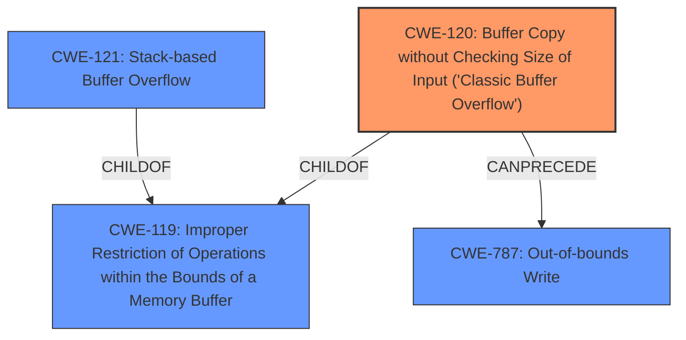

# Enhanced Analysis for CVE-2025-4446

# Summary
| CWE ID | CWE Name | Confidence | CWE Abstraction Level | CWE Vulnerability Mapping Label | CWE-Vulnerability Mapping Notes |
|---|---|---|---|---|---|
| CWE-120 | Buffer Copy without Checking Size of Input ('Classic Buffer Overflow') | 0.9 | Base | Allowed-with-Review | Primary CWE. The vulnerability description explicitly states a **buffer overflow** due to manipulation of the argument "param" in the function "Edit_List_SSID".  CWE-120 directly addresses this scenario of copying a buffer without proper size validation, leading to an overflow. |
| CWE-121 | Stack-based Buffer Overflow | 0.6 | Variant | Allowed | Secondary Candidate. While the description doesn't explicitly mention the stack, it's a common location for buffer overflows, making this a plausible but less certain mapping.  |
| CWE-787 | Out-of-bounds Write | 0.5 | Base | Allowed | Secondary Candidate. The description identifies a **buffer overflow**, which would lead to an out-of-bounds write. This is less descriptive than CWE-120 because it refers to the effect, rather than the cause.|

## Evidence and Confidence

*   **Confidence Score:** 0.7
*   **Evidence Strength:** MEDIUM

## Relationship Analysis
The primary relationship that influenced the decision was the hierarchical relationship between CWE-119, CWE-120 and CWE-787.
- CWE-120 (Buffer Copy without Checking Size of Input) is a more specific type of CWE-119 (Improper Restriction of Operations within the Bounds of a Memory Buffer)
- CWE-787 (Out-of-bounds Write) describes the effect of the **buffer overflow**
- CWE-121 (Stack-based Buffer Overflow) is a variant of CWE-119.



## Vulnerability Chain
The vulnerability chain starts with the **buffer overflow** in the `Edit_List_SSID` function due to the manipulation of the `param` argument. This leads to an out-of-bounds write, potentially causing a crash or allowing for arbitrary code execution.

Root Cause: CWE-120 (Buffer Copy without Checking Size of Input)
Impact: Out-of-bounds write, potential code execution

## Summary of Analysis
The primary selection of CWE-120 is based on the explicit mention of a **buffer overflow** in the vulnerability description and the function `Edit_List_SSID` of the file `/goform/aspForm`. The manipulation of the `param` argument directly aligns with the characteristics of CWE-120, which involves copying a buffer without proper size validation.

The evidence, while clear about the **buffer overflow**, lacks specifics about the memory region involved (stack vs. heap). The retriever results also support CWE-120 as a strong candidate. The hierarchical relationships guided the selection of the most specific CWE.

The selection is based on the provided evidence. CWE-120 is at the optimal level of specificity, as it describes the root cause of the **buffer overflow**.

Relevant CWE Information:
- **Vulnerability Description Key Phrases**
  - **weakness:** **buffer overflow**

CWE-119 was considered but deemed too general. While it encompasses the issue, CWE-120 provides a more precise characterization of the vulnerability as a buffer copy operation without checking the input size.
CWE-121 was considered since buffer overflows often occur on the stack, but the evidence does not specify where the buffer resides.
CWE-787 describes the effect of the **buffer overflow**, but not the cause.


## CWE Relationship Analysis

Current CWEs represent these abstraction levels: .


### Vulnerability Chain Analysis

**Chain starting from CWE-119:**
- 119 (Improper Restriction of Operations within the Bounds of a Memory Buffer) - ROOT


**Chain starting from CWE-121:**
- 121 (Stack-based Buffer Overflow) - ROOT


### CWE Relationship Diagram

```mermaid
graph TD
    classDef primary fill:#f96,stroke:#333,stroke-width:2px
    classDef secondary fill:#69f,stroke:#333
    classDef tertiary fill:#9e9,stroke:#333
```