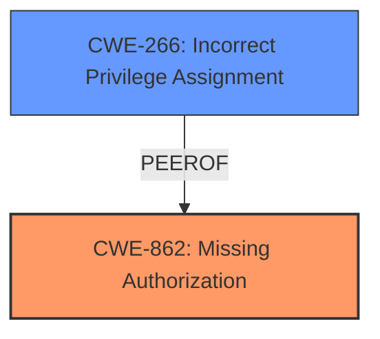

# Enhanced Analysis for CVE-2025-4473

# Summary
| CWE ID | CWE Name | Confidence | CWE Abstraction Level | CWE Vulnerability Mapping Label | CWE-Vulnerability Mapping Notes |
|---|---|---|---|---|---|
| CWE-862 | Missing Authorization | 1.0 | Class | Primary | Allowed-with-Review |
| CWE-266 | Incorrect Privilege Assignment | 0.7 | Base | Secondary | Allowed |

## Evidence and Confidence

*   **Confidence Score:** 0.9
*   **Evidence Strength:** HIGH

## Relationship Analysis
The primary relationship that influenced my decision was the parent-child relationship between CWE-862 (Missing Authorization) and its potential base-level children. Given the vulnerability description focuses on a **missing capability check**, CWE-862 serves as the most appropriate starting point. However, the guidance provided also highlighted privilege issues such as CWE-266 (Incorrect Privilege Assignment) so that was considered as well.



## Vulnerability Chain
The vulnerability chain starts with the **missing capability check** (CWE-862), which allows attackers with Subscriber-level access to manipulate outgoing email settings. This leads to the capture of password reset emails and ultimately results in privilege escalation for full site takeover.

## Summary of Analysis
The initial analysis identified CWE-862 (Missing Authorization) as the primary candidate due to the **missing capability check**. The vulnerability description clearly states that the Frontend Dashboard plugin lacks a proper authorization mechanism on the ajax_request() function. This allows authenticated attackers to bypass intended restrictions and perform unauthorized actions. The supporting evidence is the "Vulnerability Description Key Phrases" entry that shows the "**rootcause: missing capability check on ajax_request() function**".

Additionally, I considered CWE-266 (Incorrect Privilege Assignment) because the end result is privilege escalation. By **pointing SMTP to their own server, attackers could capture password reset emails intended for administrators, and elevate their privileges for full site takeover.** However, the root cause is the **missing authorization**, not an incorrect assignment of privileges. The elevated privileges are a consequence of exploiting the missing authorization.

The graph relationships influenced the decision by highlighting potential alternative classifications, particularly those related to privilege management.

The selected CWEs are at the optimal level of specificity because they accurately represent the root cause of the vulnerability (CWE-862) and an important contributing factor (CWE-266), without being overly generic or abstract.

Relevant CWE Information:

# Enhanced Context (25 CWEs)
The following CWEs were identified as potentially relevant to this vulnerability:

## CWE-266: Incorrect Privilege Assignment
**Abstraction Level**: Base
**Similarity Score**: 0.80
**Source**: dense

**Description**:
A product incorrectly assigns a privilege to a particular actor, creating an unintended sphere of control for that actor.

**Mapping Guidance**:
- Usage: Allowed
- Rationale: This CWE entry is at the Base level of abstraction, which is a preferred level of abstraction for mapping to the root causes of vulnerabilities.

### CWE-862: Missing Authorization
The product does not perform an authorization check when an actor attempts to access a resource or perform an action. This aligns directly with the vulnerability description, which states that there is a **missing capability check** on the ajax_request() function. This **missing check** is the root cause that allows attackers to perform unauthorized actions.

### CWE-266: Incorrect Privilege Assignment
A product incorrectly assigns a privilege to a particular actor, creating an unintended sphere of control for that actor.
While the vulnerability does lead to privilege escalation, the root cause is the missing authorization check, not an incorrect assignment of privileges. However, the fact that Subscriber-level access is sufficient to exploit the vulnerability means that the **privileges are not assigned correctly**, making this a secondary, contributing weakness.


## CWE Relationship Analysis

Current CWEs represent these abstraction levels: .


### Vulnerability Chain Analysis

**Chain starting from CWE-266:**
- 266 (Incorrect Privilege Assignment) - ROOT


**Chain starting from CWE-862:**
- 862 (Missing Authorization) - ROOT


### CWE Relationship Diagram

```mermaid
graph TD
    classDef primary fill:#f96,stroke:#333,stroke-width:2px
    classDef secondary fill:#69f,stroke:#333
    classDef tertiary fill:#9e9,stroke:#333
```