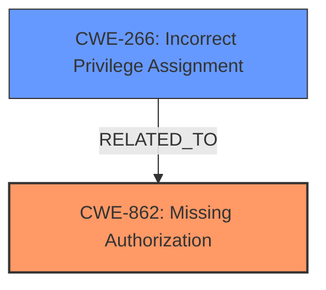

# Enhanced Analysis for CVE-2025-4474

# Summary
| CWE ID  | CWE Name                                                                            | Confidence | CWE Abstraction Level | CWE Vulnerability Mapping Label | CWE-Vulnerability Mapping Notes |
| :-------- | :---------------------------------------------------------------------------------- | :--------- | :-------------------- | :------------------------------ | :-------------------------------- |
| CWE-862   | Missing Authorization                                                               | 1.0        | Class                 | Primary                         | Allowed-with-Review                 |
| CWE-266   | Incorrect Privilege Assignment                                                      | 0.7        | Base                  | Secondary                       | Allowed                             |

## Evidence and Confidence

*   **Confidence Score:** 0.9
*   **Evidence Strength:** HIGH

## Relationship Analysis
The primary relationship that influenced my decision was the hierarchical relationship where CWE-862 (Missing Authorization) is a parent to more specific authorization flaws. The vulnerability description clearly states a **missing capability check**, indicating the absence of authorization. The presence of Privilege Escalation suggests a secondary weakness related to privilege management. I chose CWE-862 as the primary because the code lacks the initial authorization check, leading to the vulnerability. I then considered CWE-266 (Incorrect Privilege Assignment) because the impact is that an authenticated attacker can overwrite settings to assign administrator roles.



## Vulnerability Chain
The vulnerability chain starts with a **missing capability check** (CWE-862), which allows authenticated users to modify settings and incorrectly assign administrator privileges (CWE-266), ultimately leading to privilege escalation.
  - The root cause is the **missing authorization check**.
  - The impact is the ability to assign incorrect privileges.

## Summary of Analysis
Initially, the vulnerability description points to a **missing capability check** on the `fed_admin_setting_form_function()` function. This clearly indicates CWE-862 (Missing Authorization), which describes a scenario where a product does not perform an authorization check when an actor attempts to access a resource or perform an action. The impact, as stated in the description, is that authenticated attackers can overwrite the plugins register role setting to make new user registrations default to the administrator role, leading to an elevation of privileges.

Given the information, CWE-862 is the most appropriate primary mapping because it directly addresses the root cause. The retriever results also listed CWE-862 as the second-best match. While several other CWEs were considered, such as CWE-863 (Incorrect Authorization) and CWE-285 (Improper Authorization), these were deemed less suitable because they imply that an authorization check exists but is flawed, which is not the case here.

CWE-266 (Incorrect Privilege Assignment) is included as a secondary weakness. This accurately describes the impact of the **missing authorization check**, where roles are incorrectly assigned.

My assessment is strongly based on the provided evidence. The key phrase "**missing capability check**" directly supports the selection of CWE-862. The description of the impact, "overwrite the plugins register role setting to make new user registrations default to the administrator role," supports the inclusion of CWE-266.

The selected CWEs are at the optimal level of specificity. CWE-862 is a Class-level CWE, but it accurately reflects the absence of authorization, which is the root cause. More specific child CWEs would require more detailed information about the specific type of authorization that is missing. CWE-266 is a Base-level CWE, and describes the impact.

Relevant CWE Information:

# Enhanced Context (25 CWEs)
The following CWEs were identified as potentially relevant to this vulnerability:

## CWE-266: Incorrect Privilege Assignment
**Abstraction Level**: Base
**Similarity Score**: 0.79
**Source**: dense

**Description**:
A product incorrectly assigns a privilege to a particular actor, creating an unintended sphere of control for that actor.

**Mapping Guidance**:
- Usage: Allowed
- Rationale: This CWE entry is at the Base level of abstraction, which is a preferred level of abstraction for mapping to the root causes of vulnerabilities.

## CWE-862: Missing Authorization
**Abstraction Level**: Class
**Similarity Score**: 2134.73
**Source**: sparse

**Description**:
The product does not perform an authorization check when an actor attempts to access a resource or perform an action.

**Mapping Guidance**:
- Usage: Allowed-with-Review
- Rationale: This CWE entry is a Class and might have Base-level children that would be more appropriate


## CWE Relationship Analysis

Current CWEs represent these abstraction levels: .


### Vulnerability Chain Analysis

**Chain starting from CWE-266:**
- 266 (Incorrect Privilege Assignment) - ROOT


**Chain starting from CWE-863:**
- 863 (Incorrect Authorization) - ROOT


### CWE Relationship Diagram

```mermaid
graph TD
    classDef primary fill:#f96,stroke:#333,stroke-width:2px
    classDef secondary fill:#69f,stroke:#333
    classDef tertiary fill:#9e9,stroke:#333
```