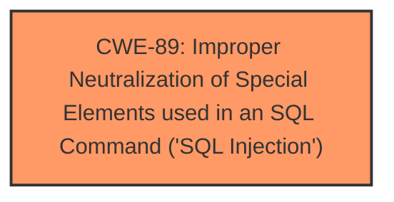

# Raw Analyzer Response for CVE-2025-4482

# Summary
| CWE ID | CWE Name | Confidence | CWE Abstraction Level | CWE Vulnerability Mapping Label | CWE-Vulnerability Mapping Notes |
|---|---|---|---|---|---|
| CWE-89 | Improper Neutralization of Special Elements used in an SQL Command ('SQL Injection') | 1.0 | Base | Allowed | Primary CWE. The root cause is the lack of proper neutralization of special elements in an SQL command. |

## Evidence and Confidence

*   **Confidence Score:** 1.0
*   **Evidence Strength:** HIGH

## Relationship Analysis
The primary CWE selected is CWE-89, which is a Base level CWE. The retriever results also included parent and peer CWEs. The selection of CWE-89 as the primary weakness is based on the clear evidence of SQL injection.

## Vulnerability Chain
The vulnerability chain consists of:
1.  **Root Cause:** CWE-89 - Improper Neutralization of Special Elements used in an SQL Command ('SQL Injection') due to **lack of proper input validation and sanitization**.
2.  **Impact:** Unauthorized database access, sensitive data leakage, data tampering, system control, and service interruption.

## Summary of Analysis
The initial analysis clearly points to a SQL Injection vulnerability. The provided vulnerability description and CVE reference link content summary provide sufficient evidence to support this assessment. The vulnerability lies in the **/change_pass/forgot_password_sql.php** file, where the **Pat_BloodGroup1** argument is vulnerable to SQL injection due to **lack of proper input validation and sanitization**. The CVE reference link content summary confirms this by stating "Root cause of vulnerability: Lack of proper input validation and sanitization of the 'id' parameter in the /forgot_password_sql.php file. The parameter is directly used in SQL queries without appropriate cleaning."

The selection of CWE-89 is based on the following:

*   **Clear Evidence:** The vulnerability description explicitly mentions "sql injection" and the CVE reference links content summary further clarifies that the root cause is due to **lack of proper input validation and sanitization** of the 'id' parameter.
*   **Retriever Results:** CWE-89 is the top result with a score of 1.000, indicating a strong match.
*   **CWE Definition:** The definition of CWE-89 perfectly aligns with the vulnerability where externally-influenced input is used to construct an SQL command without proper neutralization.
*   **Abstraction Level:** CWE-89 is a Base level CWE, which is the preferred level of abstraction.
*   **Mapping Guidance:** The usage for CWE-89 is "Allowed," and the rationale states that it is at the Base level of abstraction, which is preferred.

Other CWEs Considered but Not Used:

*   CWE-79 (Improper Neutralization of Input During Web Page Generation ('Cross-site Scripting')): While the application uses web pages, the primary issue is with the SQL query, not the web page generation.
*   CWE-434 (Unrestricted Upload of File with Dangerous Type): There is no mention of file uploads in the description.
*   CWE-352 (Cross-Site Request Forgery (CSRF)): There is no mention of CSRF in the description.
*   CWE-73 (External Control of File Name or Path): There is no mention of file name or path manipulation in the description.
*   CWE-425 (Direct Request ('Forced Browsing')): While authorization issues might exist, the core weakness is the SQL injection.
*   CWE-113 (Improper Neutralization of CRLF Sequences in HTTP Headers ('HTTP Request/Response Splitting')): There is no evidence of HTTP header manipulation.
*   CWE-94 (Improper Control of Generation of Code ('Code Injection')): The description focuses on SQL injection, not general code injection.
*   CWE-78 (Improper Neutralization of Special Elements used in an OS Command ('OS Command Injection')): The description focuses on SQL injection, not OS command injection.
*   CWE-190 (Integer Overflow or Wraparound): There is no mention of integer overflow issues.
*   CWE-472 (External Control of Assumed-Immutable Web Parameter): While this could be a contributing factor, the main issue is the SQL injection itself.