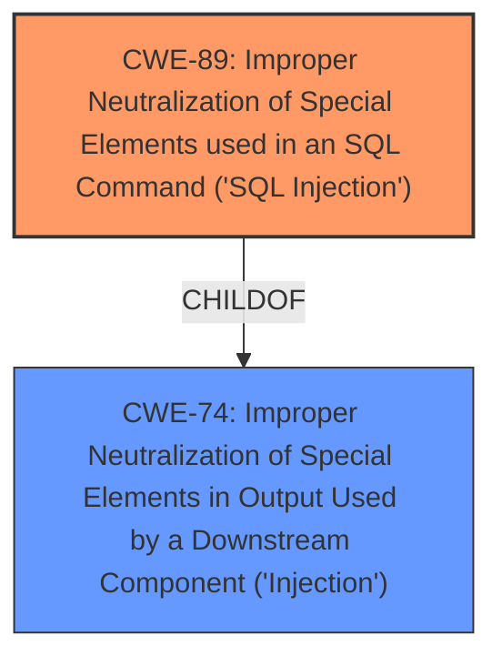

# Analysis for CVE-2025-4483

# Summary
| CWE ID | CWE Name | Confidence | CWE Abstraction Level | CWE Vulnerability Mapping Label | CWE-Vulnerability Mapping Notes |
|---|---|---|---|---|---|
| CWE-89 | Improper Neutralization of Special Elements used in an SQL Command ('SQL Injection') | 1.0 | Base | Allowed | Primary CWE. The **root cause** of the vulnerability is the **improper neutralization of special elements used in an SQL command**. |

## Evidence and Confidence

*   **Confidence Score:** 1.0
*   **Evidence Strength:** HIGH

## Relationship Analysis
The primary identified CWE is CWE-89, which is a base level CWE. CWE-89 is a child of the class level CWE-74 (Improper Neutralization of Special Elements in Output Used by a Downstream Component ('Injection')). This relationship indicates that CWE-89 is a specific type of injection vulnerability. The base level is the preferred level of abstraction, and since the description explicitly states "sql injection," CWE-89 is an appropriate and specific classification.

## Vulnerability Chain
The vulnerability chain starts with the **improper neutralization** of input, specifically the 'id' parameter, leading to **SQL injection**. This allows attackers to manipulate SQL queries, potentially leading to unauthorized database access, data leakage, data tampering, system control, and service interruption.

## Summary of Analysis
The analysis is strongly based on the provided evidence from the vulnerability description and the CVE reference links content summary. The key phrase "sql injection" and the explanation of how the 'id' parameter is used directly in SQL queries without proper validation provide strong evidence for selecting CWE-89.

The retriever results also strongly support this classification, with CWE-89 being the top-ranked CWE. The fact that the attack involves manipulating the 'id' parameter to inject malicious code into SQL queries confirms that CWE-89 is the most appropriate CWE at the optimal level of specificity (Base). The mitigation steps provided (prepared statements, input validation, minimizing database permissions) are all standard practices to prevent SQL injection, further reinforcing the accuracy of this classification.

Other CWEs Considered but Not Used:

*   CWE-79 (Improper Neutralization of Input During Web Page Generation ('Cross-site Scripting')): While injection is present, it is specifically SQL injection, not cross-site scripting.
*   CWE-434 (Unrestricted Upload of File with Dangerous Type): This CWE is not relevant as the vulnerability does not involve file uploads.
*   CWE-74 (Improper Neutralization of Special Elements in Output Used by a Downstream Component ('Injection')): This is a class-level CWE. CWE-89 is a more specific base-level CWE and thus a better fit.
*   CWE-1336 (Improper Neutralization of Special Elements Used in a Template Engine): This is not relevant as the vulnerability does not involve template engines.
*   CWE-425 (Direct Request ('Forced Browsing')): This is not relevant as the vulnerability does not involve authorization bypass via direct requests.