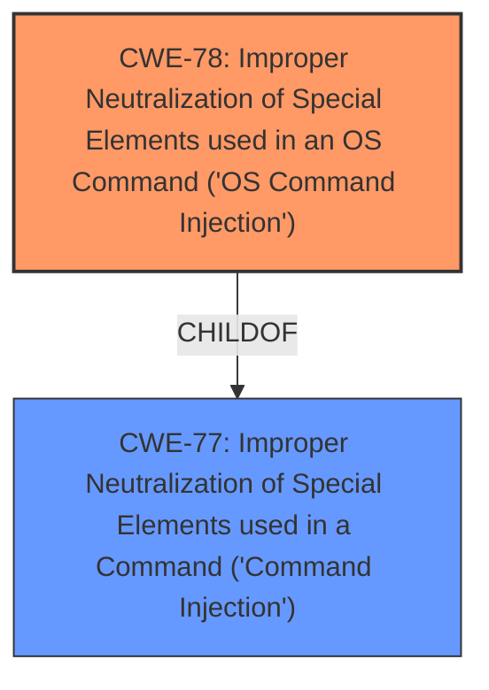

# Analysis for CVE-2025-44836

# Summary
| CWE ID | CWE Name | Confidence | CWE Abstraction Level | CWE Vulnerability Mapping Label | CWE-Vulnerability Mapping Notes |
|---|---|---|---|---|---|
| CWE-78 | Improper Neutralization of Special Elements used in an OS Command ('OS Command Injection') | 1.0 | Base | Allowed | Primary CWE. The vulnerability description clearly states a **command injection** vulnerability. |

## Evidence and Confidence

*   **Confidence Score:** 1.0
*   **Evidence Strength:** HIGH

## Relationship Analysis
The primary relationship that influenced the decision was the hierarchical relationship between CWE-77 (Class) and CWE-78 (Base). CWE-78 is a more specific child of CWE-77, detailing OS command injection, which aligns precisely with the vulnerability description.

## Vulnerability Chain
The vulnerability chain starts with the **improper neutralization** of special elements within the `setApRebootScheCfg` function, leading to OS command injection and ultimately resulting in arbitrary command execution.

## Summary of Analysis
The vulnerability description explicitly states a **command injection** vulnerability in the `setApRebootScheCfg` function of TOTOLINK CPE CP900. The most appropriate CWE is CWE-78, which is the base level entry for "Improper Neutralization of Special Elements used in an OS Command ('OS Command Injection')". This aligns perfectly with the vulnerability description. The retriever results also list CWE-78 as the second most relevant.

CWE-77 "Improper Neutralization of Special Elements used in a Command ('Command Injection')" was considered but not selected as the primary CWE. While the vulnerability is indeed a command injection, CWE-78 provides more specificity by identifying it as an OS Command Injection, which is more descriptive and accurate given the context.