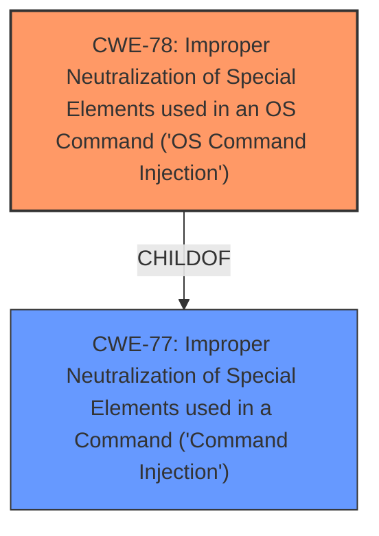

# Analysis for CVE-2025-44837

# Summary
| CWE ID | CWE Name | Confidence | CWE Abstraction Level | CWE Vulnerability Mapping Label | CWE-Vulnerability Mapping Notes |
|---|---|---|---|---|---|
| CWE-78 | Improper Neutralization of Special Elements used in an OS Command ('OS Command Injection') | 1.0 | Base | Allowed | Primary CWE: The vulnerability allows attackers to execute arbitrary commands due to improper neutralization of special elements in an OS command. |

## Evidence and Confidence

*   **Confidence Score:** 1.0
*   **Evidence Strength:** HIGH

## Relationship Analysis
The primary relationship that influenced the decision was the ChildOf relationship between CWE-78 and CWE-77. While CWE-77 is a broader class, CWE-78 is more specific as it directly involves OS commands, aligning precisely with the vulnerability description. This direct match makes CWE-78 the most appropriate choice.

## Vulnerability Chain
The vulnerability chain starts with the **improper neutralization** of input, leading directly to **command injection** and ultimately resulting in the ability to **execute arbitrary commands**.

## Summary of Analysis
The initial assessment strongly points to CWE-78 as the primary weakness. The vulnerability description explicitly states that the TOTOLINK device is susceptible to **command injection** via a crafted request. The **root cause** is the **improper neutralization** of special elements within the OS command, allowing attackers to inject and execute arbitrary commands.

The evidence is strong. The "Vulnerability Description Key Phrases" section explicitly mentions "**command injection**" and the impact is the ability to "**execute arbitrary commands**".

CWE-77 was considered but not used because CWE-78 is a more specific case of command injection that directly applies to operating system commands. Other CWEs like SQL Injection or Cross-site Scripting were irrelevant given the context of OS command execution.
The chosen CWE-78 is at the optimal level of specificity as it clearly describes the **root cause** of the vulnerability.