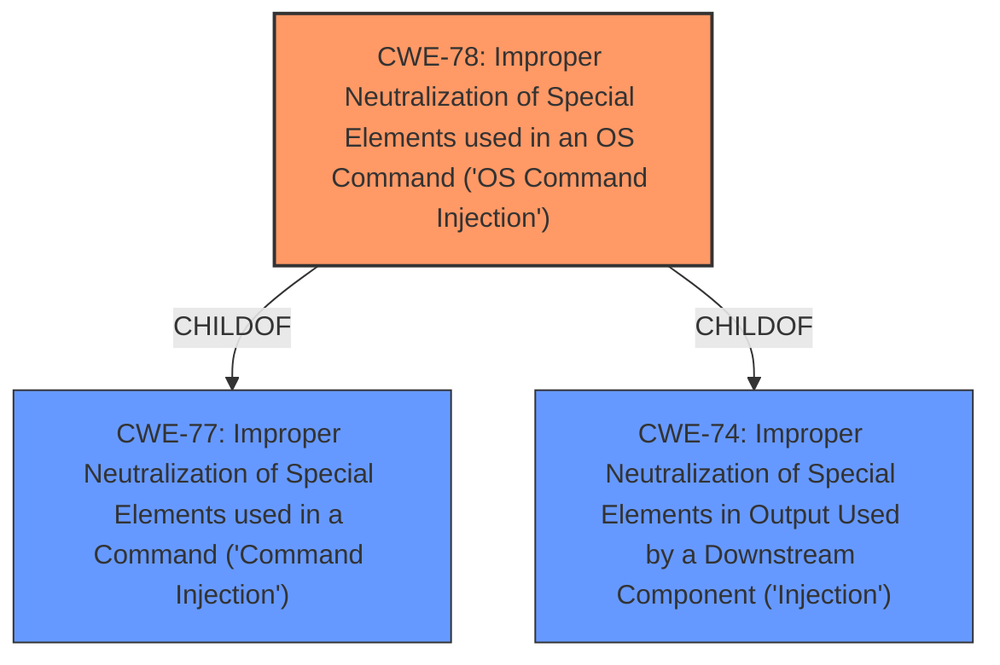

# Analysis for CVE-2025-44845

# Summary
| CWE ID | CWE Name | Confidence | CWE Abstraction Level | CWE Vulnerability Mapping Label | CWE-Vulnerability Mapping Notes |
|---|---|---|---|---|---|
| CWE-78 | Improper Neutralization of Special Elements used in an OS Command ('OS Command Injection') | 1.0 | Base | Allowed | Primary CWE |

## Evidence and Confidence

*   **Confidence Score:** 1.0
*   **Evidence Strength:** HIGH

## Relationship Analysis
The primary CWE selected is CWE-78, which is a Base level CWE and provides a specific description of the vulnerability. CWE-78 is a child of CWE-77 (Class) and CWE-74 (Class), but CWE-78 is more specific, describing OS Command Injection. There are no complex chain relationships to consider here.

## Vulnerability Chain
The vulnerability chain is simple:
1.  **Improper Neutralization** of input to NTPSyncWithHost function (**ROOT CAUSE**: CWE-78)
2.  Execution of arbitrary commands on the system (**IMPACT**)

## Summary of Analysis
The vulnerability description clearly states that there is a **command injection** vulnerability in the NTPSyncWithHost function due to **improper neutralization** of the hostTime parameter. This allows attackers to execute arbitrary commands.

The retriever results also list CWE-78 as a highly relevant CWE. CWE-77 is listed as the top result, however, CWE-77 is a class level CWE.

CWE-78 (Improper Neutralization of Special Elements used in an OS Command ('OS Command Injection')) is the most appropriate because it directly addresses the **root cause** of the vulnerability - the **improper neutralization** of special elements within an OS command, leading to **command injection**. The description mentions the vulnerable function (NTPSyncWithHost) and the affected parameter (hostTime). This confirms the injection point and the ability to execute arbitrary commands, matching the CWE-78 description perfectly. The "Usage: Allowed" mapping guidance further supports this choice.

I considered CWE-77 (Improper Neutralization of Special Elements used in a Command ('Command Injection')), but it is a class-level CWE and less specific than CWE-78.
I considered CWE-74 (Improper Neutralization of Special Elements in Output Used by a Downstream Component ('Injection')), but it is a class level CWE and less specific than CWE-78.
I considered CWE-89 (Improper Neutralization of Special Elements used in an SQL Command ('SQL Injection')), but this is not an SQL command.
I considered CWE-94 (Improper Control of Generation of Code ('Code Injection')), but this is not code injection.
I considered CWE-1336 (Improper Neutralization of Special Elements Used in a Template Engine), but the vulnerability does not involve a template engine.
I considered CWE-88 (Improper Neutralization of Argument Delimiters in a Command ('Argument Injection')), but this is not argument injection.
I considered CWE-93 (Improper Neutralization of CRLF Sequences ('CRLF Injection')), but this is not CRLF injection.
I considered CWE-434 (Unrestricted Upload of File with Dangerous Type), but this is not a file upload.
I considered CWE-79 (Improper Neutralization of Input During Web Page Generation ('Cross-site Scripting')), but this is not related to web page generation.
I considered CWE-117 (Improper Output Neutralization for Logs), but this is not related to logging.
I considered CWE-113 (Improper Neutralization of CRLF Sequences in HTTP Headers ('HTTP Request/Response Splitting')), but this is not related to HTTP headers.
I considered CWE-184 (Incomplete List of Disallowed Inputs), but there is no evidence to suggest an incomplete list of disallowed inputs.