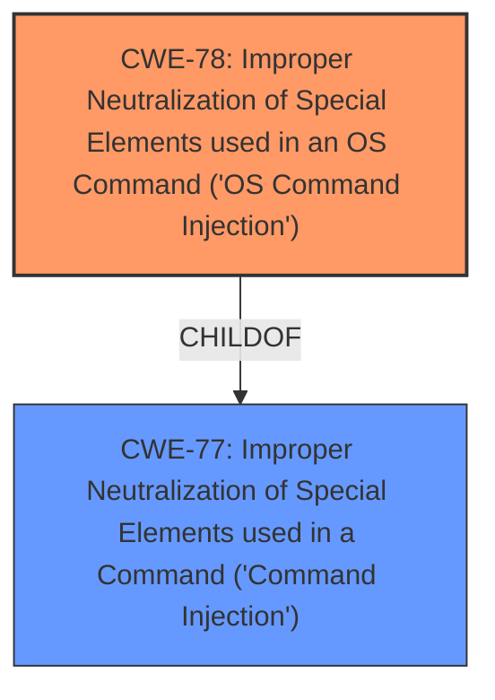

# Analysis for CVE-2025-44866

# Summary
| CWE ID | CWE Name | Confidence | CWE Abstraction Level | CWE Vulnerability Mapping Label | CWE-Vulnerability Mapping Notes |
|---|---|---|---|---|---|
| CWE-78 | Improper Neutralization of Special Elements used in an OS Command ('OS Command Injection') | 1.0 | Base | Allowed | Primary CWE - The vulnerability description explicitly states a **command injection vulnerability**. CWE-78 directly addresses this weakness by describing the **improper neutralization** of special elements in OS commands. |

## Evidence and Confidence

*   **Confidence Score:** 1.0
*   **Evidence Strength:** HIGH

## Relationship Analysis
The primary relationship to consider is that CWE-78 is a child of CWE-77 (Improper Neutralization of Special Elements used in a Command ('Command Injection')). While CWE-77 is more general, the vulnerability description specifies that the **command injection** occurs at the OS level, making CWE-78 a more precise and appropriate choice. There are no other relationships that significantly impact the selection of CWE-78.

## Vulnerability Chain
The vulnerability chain starts with the **improper neutralization** of special elements within the `formSetDebugCfg` function, leading to the ability to execute arbitrary commands.

1.  **Root Cause:** CWE-78 - Improper Neutralization of Special Elements used in an OS Command ('OS Command Injection')
2.  **Impact:** Arbitrary command execution.

## Summary of Analysis
The vulnerability description clearly indicates a **command injection vulnerability** in the `formSetDebugCfg` function of the Tenda W20E router. The core issue is the **improper neutralization** of special elements, allowing attackers to execute arbitrary commands.

The selection of CWE-78 is primarily based on the following evidence:

*   Vulnerability Description: "Tenda W20E V15.11.0.6 was found to contain a **command injection vulnerability** in the formSetDebugCfg function via the level parameter."

This statement directly points to **command injection**.

*   CWE-78 Description: "The product constructs all or part of an OS command using externally-influenced input from an upstream component, but it does not neutralize or incorrectly neutralizes special elements that could modify the intended OS command when it is sent to a downstream component."

This description aligns perfectly with the vulnerability, where the `formSetDebugCfg` function constructs an OS command without properly neutralizing special elements, leading to command execution.

Other CWEs Considered:

*   CWE-77 (Improper Neutralization of Special Elements used in a Command ('Command Injection')): This is a broader class of command injection. Since the vulnerability specifically involves OS commands, CWE-78 is a more precise choice.
*   CWE-89 (Improper Neutralization of Special Elements used in an SQL Command ('SQL Injection')): This is specific to SQL injection, which is not relevant to the described vulnerability.
*   CWE-79 (Improper Neutralization of Input During Web Page Generation ('Cross-site Scripting')): This is specific to Cross-site Scripting, which is not relevant to the described vulnerability.

The provided evidence strongly supports the selection of CWE-78 as the primary CWE. The vulnerability description explicitly mentions **command injection**, and the CWE-78 description aligns perfectly with the technical details of the vulnerability.