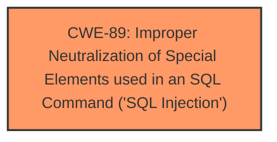

# Enhanced Analysis for CVE-2025-4487

# Summary
| CWE ID | CWE Name | Confidence | CWE Abstraction Level | CWE Vulnerability Mapping Label | CWE-Vulnerability Mapping Notes |
|---|---|---|---|---|---|
| CWE-89 | Improper Neutralization of Special Elements used in an SQL Command ('SQL Injection') | 1.0 | Base | Allowed | Primary CWE. The vulnerability description and CVE summary clearly indicate an SQL Injection vulnerability due to **improper neutralization** of input in SQL commands. |

## Evidence and Confidence

*   **Confidence Score:** 1.0
*   **Evidence Strength:** HIGH

## Relationship Analysis
The primary relationship that influences this decision is that CWE-89 is a **Base** level CWE, making it a good fit for directly representing the root cause of the vulnerability. Other relationships, such as those involving XSS (CWE-79), file upload (CWE-434), and code injection (CWE-94), are not directly relevant based on the provided information.



## Vulnerability Chain
The vulnerability chain consists of:
1.  **Root Cause:** **Improper neutralization** of input within the SQL query in `/ajax.php?action=delete_member`.
2.  **Weakness:** SQL Injection vulnerability (CWE-89).
3.  **Impact:** Unauthorized database access, sensitive data leakage, data tampering, comprehensive system control, and even service interruption.

## Summary of Analysis
The initial assessment strongly points to CWE-89 as the primary weakness. The vulnerability description explicitly mentions "sql injection" and the CVE summary details that the **root cause** is the **injection** of malicious code into SQL queries due to a lack of proper cleaning or validation of the 'id' parameter. This aligns perfectly with the CWE-89 description: "The product constructs all or part of an SQL command using externally-influenced input... but it does not neutralize or incorrectly neutralizes special elements."

The evidence is compelling, and the suggested mitigations (prepared statements, input validation, minimizing database permissions) directly address SQL injection vulnerabilities. The confidence in this mapping is very high (1.0) because the provided information directly supports the classification.

CWE-79 (Cross-Site Scripting) and CWE-434 (Unrestricted Upload of File with Dangerous Type) were considered due to their presence in the Retriever Results. However, these are not applicable because the vulnerability is specifically related to SQL injection rather than script injection or file uploads. CWE-1336 (Improper Neutralization of Special Elements Used in a Template Engine) was also considered, but it does not align with the provided description, which focuses on SQL queries rather than template engine usage.


## CWE Relationship Analysis

Current CWEs represent these abstraction levels: .


### Vulnerability Chain Analysis

**Chain starting from CWE-89:**
- 89 (Improper Neutralization of Special Elements used in an SQL Command ('SQL Injection')) - ROOT


**Chain starting from CWE-94:**
- 94 (Improper Control of Generation of Code ('Code Injection')) - ROOT


### CWE Relationship Diagram

```mermaid
graph TD
    classDef primary fill:#f96,stroke:#333,stroke-width:2px
    classDef secondary fill:#69f,stroke:#333
    classDef tertiary fill:#9e9,stroke:#333
```