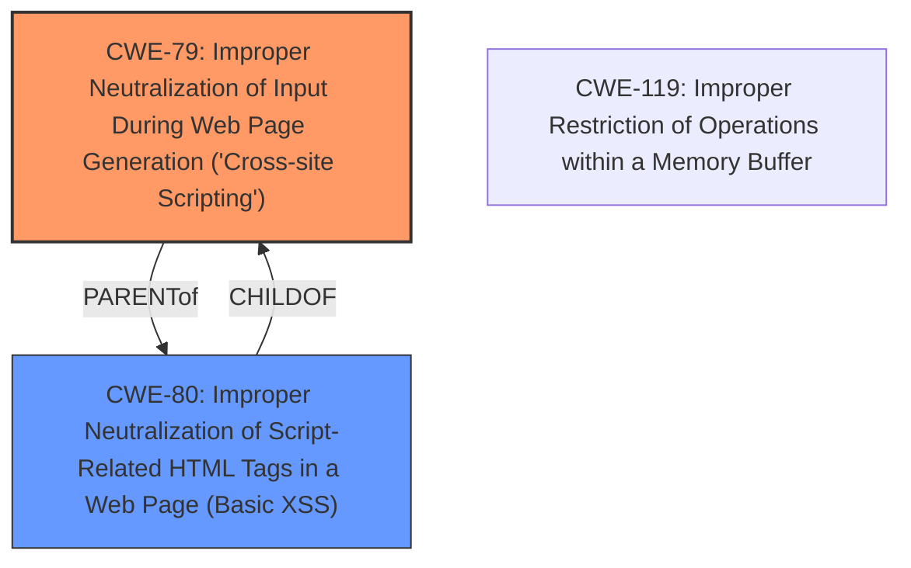

# Enhanced Analysis for CVE-2025-45010

# Summary
| CWE ID | CWE Name | Confidence | CWE Abstraction Level | CWE Vulnerability Mapping Label | CWE-Vulnerability Mapping Notes |
|---|---|---|---|---|---|
| CWE-79 | Improper Neutralization of Input During Web Page Generation ('Cross-site Scripting') | 1.0 | Base | Primary | Allowed |
| CWE-80 | Improper Neutralization of Script-Related HTML Tags in a Web Page (Basic XSS) | 0.7 | Variant | Secondary | Allowed |

## Evidence and Confidence

*   **Confidence Score:** 1.0
*   **Evidence Strength:** HIGH

## Relationship Analysis
The primary CWE is CWE-79, which represents the **improper neutralization of input during web page generation ('Cross-site Scripting')**. CWE-80 is a variant of Cross-Site Scripting (XSS) that focuses on script-related HTML tags. The description indicates a general HTML injection vulnerability, making CWE-79 a better fit as the primary weakness. While CWE-80 is more specific, the lack of explicit mention of script tags makes it a secondary consideration.



## Vulnerability Chain
The vulnerability chain begins with **HTML injection** via the fromdate and todate POST request parameters. This leads to the execution of arbitrary code. The root cause is the **improper neutralization** of input, leading to the impact of arbitrary code execution.

## Summary of Analysis
The initial analysis identified CWE-79 as the most relevant due to the **HTML injection** vulnerability. The retriever results and the description of the vulnerability support this selection. The relationship analysis further confirms that CWE-79 is a suitable primary CWE, with CWE-80 as a more specific variant that could be applicable depending on the specific nature of the injected HTML. The final decision is based on the vulnerability description, which points to a general HTML injection issue rather than a specific focus on script-related tags. The evidence from the "Vulnerability Description Key Phrases" section supports this by highlighting the "**weakness: HTML injection**". The retriever results also support CWE-79 as the top match. The selected CWE is at the optimal level of specificity, as it accurately represents the weakness without being overly specific (like focusing solely on script tags).

Relevant CWE Information:

# Enhanced Context (25 CWEs)
The following CWEs were identified as potentially relevant to this vulnerability:

## CWE-80: Improper Neutralization of Script-Related HTML Tags in a Web Page (Basic XSS)
**Abstraction Level**: Variant
**Similarity Score**: 0.79
**Source**: dense

**Description**:
The product receives input from an upstream component, but it does not neutralize or incorrectly neutralizes special characters such as "<", ">", and "&" that could be interpreted as web-scripting elements when they are sent to a downstream component that processes web pages.

**Mapping Guidance**:
- Usage: Allowed
- Rationale: This CWE entry is at the Variant level of abstraction, which is a preferred level of abstraction for mapping to the root causes of vulnerabilities.

## CWE-79: Improper Neutralization of Input During Web Page Generation ('Cross-site Scripting')
**Abstraction Level**: Base
**Similarity Score**: 1.00
**Source**: alternate_terms

**Description**:
The product does not neutralize or incorrectly neutralizes user-controllable input before it is placed in output that is used as a web page that is served to other users.

**Mapping Guidance**:
- Usage: Allowed
- Rationale: This CWE entry is at the Base level of abstraction, which is a preferred level of abstraction for mapping to the root causes of vulnerabilities.

CWE-79 is selected because the vulnerability involves **HTML injection**, where the product **does not neutralize** user-controllable input before placing it in a web page. This allows attackers to inject arbitrary HTML code, leading to potential cross-site scripting attacks. The security implication is that an attacker can inject malicious scripts or content into the web page, which can then be executed by other users who view the page. This can lead to information disclosure, session hijacking, or other malicious activities. The relationship is that CWE-79 is a parent of CWE-80, but CWE-79 is more general and appropriate in this case.

CWE-80 was considered as a secondary option because it is a specific type of XSS that focuses on script-related HTML tags. However, the vulnerability description only mentions **HTML injection** and doesn't specify whether the injected HTML contains script tags. Therefore, CWE-79 is the more appropriate primary CWE. Other CWEs like SQL Injection or OS Command Injection were considered but ruled out because the vulnerability is specifically related to **HTML injection**.


## CWE Relationship Analysis

Current CWEs represent these abstraction levels: .


### Vulnerability Chain Analysis

**Chain starting from CWE-119:**
- 119 (Improper Restriction of Operations within the Bounds of a Memory Buffer) - ROOT


**Chain starting from CWE-79:**
- 79 (Improper Neutralization of Input During Web Page Generation ('Cross-site Scripting')) - ROOT


### CWE Relationship Diagram

```mermaid
graph TD
    classDef primary fill:#f96,stroke:#333,stroke-width:2px
    classDef secondary fill:#69f,stroke:#333
    classDef tertiary fill:#9e9,stroke:#333
```