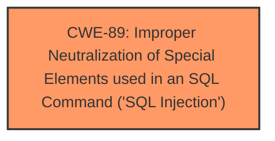

# Analysis for CVE-2025-4504

# Summary
| CWE ID | CWE Name | Confidence | CWE Abstraction Level | CWE Vulnerability Mapping Label | CWE-Vulnerability Mapping Notes |
|---|---|---|---|---|---|
| CWE-89 | Improper Neutralization of Special Elements used in an SQL Command ('SQL Injection') | 1.0 | Base | Allowed | Primary CWE. The vulnerability is a direct result of failing to neutralize special elements in SQL commands. |

## Evidence and Confidence

*   **Confidence Score:** 1.0
*   **Evidence Strength:** HIGH

## Relationship Analysis
The primary relationship to consider is the hierarchical structure. CWE-89 is a base-level CWE, which is the preferred level. While there may be parent or child relationships, CWE-89 is the most accurate and specific representation of the vulnerability based on the provided information.

## Vulnerability Chain
The vulnerability chain is straightforward:
1.  **Root Cause:** **Improper Neutralization of Special Elements used in an SQL Command ('SQL Injection')** (CWE-89) due to the **lack of** input validation on the `category` parameter.
2.  Impact: This leads to unauthorized database access, sensitive data leakage, data tampering, comprehensive system control, and service interruption.

## Summary of Analysis
The initial analysis, supported by the "CVE Reference Links Content Summary", points to a SQL injection vulnerability due to **insufficient user input validation of the `category` parameter**. The "Vulnerability Description Key Phrases" also highlights the **weakness** as **SQL injection** due to manipulation of the Category argument.

The Retriever Results strongly suggest CWE-89 as the primary candidate, which aligns perfectly with the vulnerability description and the content summary. The description clearly states that the manipulation of the "Category" argument leads to **SQL injection**.

CWE-89 is at the Base level of abstraction, making it an ideal choice. The mapping guidance for CWE-89 explicitly allows its use, further strengthening the rationale for its selection.

I considered other CWEs, particularly those related to input validation and neutralization, such as CWE-79 (Cross-site Scripting) and CWE-434 (Unrestricted Upload of File with Dangerous Type). However, these do not accurately represent the specific vulnerability, which is **SQL injection**. CWE-79 is related to web page generation, and CWE-434 pertains to file uploads, neither of which is applicable here.

Relevant CWE Information:

# Enhanced Context (25 CWEs)
The following CWEs were identified as potentially relevant to this vulnerability:

## CWE-89: Improper Neutralization of Special Elements used in an SQL Command ('SQL Injection')
**Abstraction Level**: Base
**Similarity Score**: 0.79
**Source**: dense

**Description**:
The product constructs all or part of an SQL command using externally-influenced input from an upstream component, but it does not neutralize or incorrectly neutralizes special elements that could modify the intended SQL command when it is sent to a downstream component. Without sufficient removal or quoting of SQL syntax in user-controllable inputs, the generated SQL query can cause those inputs to be interpreted as SQL instead of ordinary user data.

**Mapping Guidance**:
- Usage: Allowed
- Rationale: This CWE entry is at the Base level of abstraction, which is a preferred level of abstraction for mapping to the root causes of vulnerabilities.